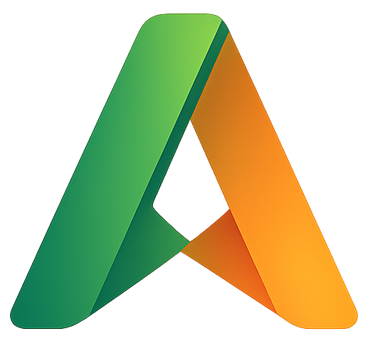

<p align="center">
  
</p>

<h1 align="center">Astra Deck</h1>

<p align="center">
  
  
  
  
</p>

<p align="center">
  Premium YouTube enhancement extension for Chrome and Firefox with 200+ features — SponsorBlock, DeArrow, Return YouTube Dislike, BlockTube-grade filtering, downloads with format/quality controls, transcript viewer + IndexedDB search, AI summary (BYO key or Chrome built-in), subscription groups, theater split, OLED token-bridge theming, and 10 bundled UI locales. Beats every public-OSS competitor on at least one axis per the competitive matrix in ROADMAP.md.
</p>

<p align="center">
  <a href="https://github.com/SysAdminDoc/Astra-Deck/releases/latest"><strong>Download Latest Release</strong></a>
</p>

---

## Installation

### Chrome / Edge / Brave

**Option A — Load unpacked from ZIP:**
1. Download `astra-deck-chrome-v*.zip` from the [latest release](https://github.com/SysAdminDoc/Astra-Deck/releases/latest)
2. Extract it to a permanent folder
3. Open `chrome://extensions/`, enable **Developer mode**
4. Click **Load unpacked** and select the extracted folder

**Option B — Local folder:**
1. Download or clone the `extension/` folder
2. Open `chrome://extensions/`, enable **Developer mode**
3. Click **Load unpacked** and select the `extension/` folder

The CRX is still attached for enterprise or tooling flows, but modern Chromium blocks normal drag-and-drop installs from self-hosted CRX files.

### Firefox

1. Download `astra-deck-firefox-v*.xpi` from the [latest release](https://github.com/SysAdminDoc/Astra-Deck/releases/latest)
2. Open `about:addons`, click the gear icon, select **Install Add-on From File**
3. Select the `.xpi` file

Requires Firefox 128+.

### Userscript (Tampermonkey / Violentmonkey)

A userscript build is also available. Install [Tampermonkey](https://www.tampermonkey.net/) or [Violentmonkey](https://violentmonkey.github.io/), then **[click here to install](https://github.com/SysAdminDoc/Astra-Deck/raw/refs/heads/main/YTKit.user.js)**.

> Some features (SharedAudio, Return YouTube Dislike, SponsorBlock per-category, Cobalt downloads) are only available in the userscript. The extension uses a MediaDL-only download path.

---

## Features

### Core

| Feature | Default |
|---------|---------|
| Theater Split — fullscreen video, scroll to reveal comments side-by-side | On |
| Video Hider — hide videos/channels from feeds with X buttons, keyword filter, regex, duration filter | On |
| Video Context Menu — right-click player for downloads, VLC/MPV streaming, transcript, screenshot | On |
| Settings Panel — searchable, categorized, instant-apply, export/import/reset | On |
| Comment Search — filter watch-page comments inline | Off |
| DeArrow — replace clickbait titles/thumbnails via crowdsourced database | Off |

### Interface

| Feature | Default |
|---------|---------|
| Logo Quick Links — hover dropdown with History, Watch Later, Playlists, Liked, Subs | On |
| Hide Sidebar / Hide Shorts / Hide Related / Hide Description | On |
| Subscriptions Grid / Homepage Grid Align / Videos Per Row | On |
| Styled Filter Chips / Compact Layout / Thin Scrollbar | On |
| Square Search Bar / Square Avatars | On |
| Compact Unfixed Header / Force Dark Everywhere | Off |

### Watch Page

| Feature | Default |
|---------|---------|
| Watch Page Restyle — glassmorphism accents, refined metadata | On |
| Native Comments Layout — keep YouTube comments clean without extension restyling | On |
| Expand Video Width / Disable Ambient Mode | On |
| Hide Merch, AI Summary, Hashtags, Pinned Comments, Info Panels | On |
| Clean Share URLs — strip tracking params | On |
| Auto-Expand Description / Sticky Chat / Scroll to Player | Off |

### Video Player

| Feature | Default |
|---------|---------|
| Always Best Quality — picks highest available stream, prefers 1080p Premium when offered | On |
| Auto-Resume Position (configurable threshold) | On |
| Custom Progress Bar Color (color picker) | Off |
| Remaining Time Display / Time in Tab Title | Off |
| A-B Loop / Fine Speed Control / Persistent Speed / Per-Channel Speed | Off |
| Speed Control Chip (in-chrome popup: 0.25× → 3×, 10 presets) | On |
| Codec Selector (H.264/VP9/AV1) / Force Standard FPS | Off |
| Video Screenshot / Video Zoom (Ctrl+scroll, up to 5x) | Off |
| Cinema Ambient Glow / Nyan Cat Progress Bar | Off |
| Speed Indicator Overlay / Custom Speed Buttons (0.5x-3x) | Off |
| Pop-Out Player (Document PiP) / PiP Button / Fullscreen on Double-Click | Off |

### Content Filtering

| Feature | Default |
|---------|---------|
| Remove Shorts / Redirect Shorts to Regular Player | On |
| Channels open on Videos Tab | On |
| Hide Collaborations / News / Playlists / Playables / Members Only | On |
| Hide Watched Videos (dim or hide) / Grayscale Thumbnails | Off |
| Anti-Translate / Not Interested Button / Open in New Tab | Off |
| Disable Infinite Scroll / Disable SPA Navigation | Off |

### Downloads

| Feature | Default |
|---------|---------|
| Download Options Popup — format, quality, and save directory per download | On |
| Video Formats — MP4, MKV, WebM | MP4 |
| Audio Formats — MP3, M4A, Opus, FLAC, WAV | MP3 |
| Quality Selector — Best, 4K, 1440p, 1080p, 720p, 480p | Best |
| Custom Save Directory — override per download or set globally | Downloads |
| Context Menu — quick "Download Video" and "Download Audio" on right-click | On |
| Auto-Download on Visit | Off |
| Download Thumbnail (maxres) | Off |

> Downloads use Astra Downloader, the bundled local yt-dlp + ffmpeg companion. The extension probes `9751` plus fallback ports (`9761`, `9771`, `9781`, `9791`, `9851`) and only accepts health responses that identify as the Astra downloader service.

### PO Token provider (optional but recommended)

YouTube binds PO tokens to video IDs in 2026; without a provider, the `web` client increasingly fails with "Sign in to confirm you're not a bot" on a subset of videos. Astra Downloader auto-detects a [bgutil-ytdlp-pot-provider](https://github.com/Brainicism/bgutil-ytdlp-pot-provider) HTTP server on `127.0.0.1:4416` and routes yt-dlp through it when available.

Quickest setup (Docker):

```bash
docker run --name bgutil-provider -d --restart unless-stopped -p 4416:4416 brainicism/bgutil-ytdlp-pot-provider
```

Then install the yt-dlp plugin so `yt-dlp.exe` knows to consult the provider:

```bash
pip install bgutil-ytdlp-pot-provider
```

Astra Downloader's `/health` endpoint will surface `poTokenProvider: { ok, port, version }` once the server is reachable. If absent, downloads still work on most videos — the provider is opt-in hardening, not a hard requirement.

### External JavaScript runtime (yt-dlp 2026+)

yt-dlp `>= 2026.04` ships an external n/sig solver for YouTube and requires an external JavaScript runtime on the system PATH (Deno is the documented option). Without it, recent yt-dlp builds return empty format lists on a growing share of YouTube videos.

Install Deno once:

```bash
# Windows
winget install DenoLand.Deno

# macOS / Linux
curl -fsSL https://deno.land/install.sh | sh
```

(Or grab the installer from `https://deno.com/`.)

Astra Downloader's `/health` endpoint surfaces `denoRuntime: { installed, version, path, ytdlpNeedsRuntime, advice }` (since v1.5.0). The Astra Deck `downloadHealthPanel` renders a "Deno: missing" pill next to the download button when the bundled yt-dlp.exe is recent enough to need the runtime but Deno isn't installed. On older yt-dlp builds (pre-2026.04, the in-field stable line) the pill stays quiet.

### Comments

| Feature | Default |
|---------|---------|
| Sort Comments Newest First | Off |
| Creator Comment Highlight | Off |
| Comment Handle Revealer — show original channel name next to @handle | Off |
| Preload Comments | Off |

### Live Chat

| Feature | Default |
|---------|---------|
| Premium Live Chat styling | On |
| Configurable element hiding (header, emoji, super chats, polls, etc.) | On |
| Chat Keyword Filter | Off |
| Adaptive Live Layout | Off |
| Reaction Spammer — opt-in floating panel, randomized emoji loop (500 ms floor) | Off |

### Automation & Behavior

| Feature | Default |
|---------|---------|
| Auto-Dismiss "Still Watching?" | Off |
| Auto Theater Mode / Auto Subtitles / Auto-Like Subscribed | Off |
| Auto-Pause on Tab Switch / Pause Other Tabs | Off |
| Auto-Open Chapters / Auto-Open Transcript | Off |
| Auto-Close Popups (cookie/survey/premium) | Off |
| Prevent Autoplay / Disable Autoplay Next | Off |
| Redirect Home to Subscriptions | Off |
| Remember Volume / Persistent Speed | Off |

### Power User

| Feature | Default |
|---------|---------|
| Resume Playback (500-entry cap, 15s save interval) | Off |
| Mini Player Bar (floating progress/play/pause on scroll-past) | Off |
| Playback Stats Overlay (codec, resolution, dropped frames, bandwidth) | Off |
| Watch Time Tracker (90-day retention) + Analytics Dashboard | Off |
| Timestamp Bookmarks (inline notes, persistent storage) | Off |
| Transcript Viewer (sidebar with clickable timestamps) + Export | Off |
| AI Video Summary (OpenAI / Anthropic / Gemini / Ollama, BYO key) | Off |
| Subtitle Styling (font, size, color, background, position) | Off |
| Blue Light Filter (adjustable 10-80%) | Off |
| Focused Mode (hide everything except video + comments) | Off |
| Custom CSS Injection | Off |
| CPU Tamer (background tab timer throttling) | Off |
| Settings Profiles / Statistics Dashboard / Debug Mode | Off |
| Fit Player to Window | Off |

### Configurable Element Managers

Toggle individual elements on/off through the settings panel:

- **Action Buttons** — Like, Dislike, Share, Ask/AI, Clip, Thanks, Save, Sponsor, More Actions
- **Player Controls** — Next, Autoplay, Subtitles, Captions, Miniplayer, PiP, Theater, Fullscreen
- **Watch Elements** — Join Button, Ask Button, Save Button, Ask AI Section, Podcast Section, Transcript Section
- **Chat Elements** — Header, Menu, Popout, Reactions, Timestamps, Polls, Ticker, Leaderboard, Super Chats, Emoji, Bots

---

## Settings Panel

Click the gear icon in the YouTube masthead or player controls, or use the toolbar popup's **Open Full Settings** action.

- Searchable sidebar with categorized feature groups
- Toggle switches with instant apply
- Sub-feature controls for granular element hiding
- Textarea editors for keyword filters, quick links, custom CSS
- Export / Import / Reset
- Conflict detection (auto-disables conflicting features with toast notification)

The toolbar popup provides the lightweight control surface: polished quick toggles, YouTube-tab context, storage stats, export/import/reset, diagnostics, and language selection.

---

## Architecture

```
document_start
  early.css          Anti-FOUC CSS (scoped to feature body classes)
  ytkit-main.js      MAIN world — canPlayType patching for codec/format filtering

document_idle
  core/*.js          ISOLATED world — env, storage, styles, url, page, navigation, player
  ytkit.js           ISOLATED world — all features, DOM manipulation, settings UI
  background.js      Service worker — fetch proxy, downloads, cookie bridge
```

- **Split-context model** — MAIN world for page API interception, ISOLATED world for extension APIs and DOM
- **SPA-aware** — hooks `yt-navigate-finish`, `yt-page-data-updated`, `popstate`, and `video-id` attribute changes
- **Tiered feature init** — critical features load synchronously, normal features in `requestAnimationFrame`, lazy features in `requestIdleCallback`
- **Crash recovery** — features that crash 3 times auto-disable with console warning
- **Conflict map** — 6 conflict pairs enforced at both toggle and init time
- **Trusted Types compliant** — all innerHTML via `TrustedHTML` policy wrapper
- **Safe mode** — append `?ytkit=safe` to any YouTube URL, or `ytkit.unsafe()` in console to exit

---

## Security

- **EXT_FETCH proxy** uses domain allowlist — blocks SSRF to private networks
- Request/response headers filtered (`Cookie`, `Set-Cookie`, etc. stripped globally; `Authorization` only forwarded to explicit BYO-key/local service origins such as OpenAI/Anthropic/Ollama/MediaDL)
- Response body capped at 10 MB, fetch timeout capped at 60s
- HTTP methods validated, download URLs protocol-checked (HTTP/S only)
- Quick Links blocks `javascript:`, `data:`, and `vbscript:` URIs
- Explicit CSP: `script-src 'self'; object-src 'self'; connect-src` allowlists the documented host_permissions (AI providers, SponsorBlock, six Astra Downloader fallback ports, Ollama) — no wildcards

---

## Reaction Spammer

The optional Reaction Spammer feature lets you pick a set of YouTube
live-chat reactions and fire them in a randomized loop at a chosen
interval. It ships in two forms:

- **Bundled** in the MV3 extension as a Live Chat feature toggle —
  surfaces a floating launcher on `live_chat` pages.
- **Standalone** as `YT_Reaction_Spammer.user.js`, a Tampermonkey /
  Violentmonkey userscript with no extension dependency.

**Default: OFF, opt-in only.** Rapid synthetic reactions could trigger
YouTube's automated-behavior heuristics and result in account rate-
limiting or flagging. The first time you open the launcher per profile,
an amber toast surfaces this warning. The minimum interval is clamped
to 500 ms in both the extension and the standalone userscript — faster
than ~2 Hz is unsafe.

Use at your own risk.

---

## Languages

Astra Deck ships with 10 bundled UI locales:

| Code | Language |
|------|----------|
| `en` | English (default) |
| `de` | Deutsch |
| `es` | Español |
| `fr` | Français |
| `it` | Italiano |
| `ja` | 日本語 |
| `ko` | 한국어 |
| `pt_BR` | Português (Brasil) |
| `ru` | Русский |
| `zh_CN` | 简体中文 |

The popup language dropdown's "Auto (browser default)" option shows the
detected language inline. The selection writes
`chrome.storage.local._localeOverride`; the in-page YouTube workspace
picks up the override on next page navigation. Feature-definition entries
inside `ytkit.js` resolve through generated locale keys with English fallbacks;
community translations welcome via PR against `extension/_locales/<lang>/messages.json`.

---

## Compatibility

| Browser | Method | Status |
|---------|--------|--------|
| Chrome / Edge / Brave | Extension (MV3) | Fully supported |
| Firefox 128+ | Extension (MV3) | Fully supported |
| Chrome / Firefox | Tampermonkey / Violentmonkey | Supported (userscript) |
| Safari | Userscripts app | Limited |

**Not supported:** Mobile browsers, YouTube Music, YouTube Studio, embedded players.

---

## Building

```bash
npm ci
npm test
npm run check
npm run build                             # Build store-safe + GitHub-full artifacts
npm run build:userscript                  # Include userscript artifact too
node build-extension.js --profile store-safe
node build-extension.js --profile github-full
node build-extension.js --bump patch      # Bump and build
node build-extension.js --bump minor --with-userscript
```

Outputs in `build/`:
- `astra-deck-store-safe-chrome-v*.zip` + `.crx` (Chrome Web Store posture)
- `astra-deck-store-safe-firefox-v*.zip` + `.xpi`
- `astra-deck-github-full-chrome-v*.zip` + `.crx` (AI, local companion, Cobalt)
- `astra-deck-github-full-firefox-v*.zip` + `.xpi`
- `ytkit-v*.user.js` (with `--with-userscript`)

Requires Node 22+ (the `crx3` packager dependency needs it).

---

## Power-User Console Helpers

Most controls live in the settings panel; a few advanced flows are exposed only on `window.*` for power users:

| Entry point | What it does |
|-------------|--------------|
| `?ytkit=safe` URL parameter | Append to any YouTube URL to load with all features disabled (recovery mode). |
| `ytkit.unsafe()` | Exit safe mode from the DevTools console. |
| `window.__ytkitOpenAnalytics()` | Open the Watch History Analytics modal (30-day bar chart of `watchTimeTracker` data). |
| `window.__ytkitSearchTranscripts(query)` | Full-text search over the local IndexedDB transcript index (`researchTranscriptIndex` setting). Returns up to 200 hits. |
| `window.__ytkitClearTranscriptIndex()` | Wipe the local transcript index. |
| `window.__ytkitDiagnostics.download()` | Download a JSON bug report containing the diagnostic log ring buffer, selector-health snapshot, and active feature list. |
| `window.__ytkitProfiles` | Settings profile manager — `.save(name)`, `.load(name)`, `.delete(name)`, `.export()`, `.import(json)`. |
| `window.__ytkitAnnounce(message)` | Push a string into the polite screen-reader live region (requires `globalAriaLiveRegion`). |

---

## Documentation

| Doc | Audience |
|-----|----------|
| [ROADMAP.md](ROADMAP.md) | Single source of truth for planned work — existing plans plus research-driven additions. The legacy v5.0.0 → v6.0.0 product plan, competitive matrix, and settings schema are archived at [docs/archive/roadmap-dossier-2026-05-21.md](docs/archive/roadmap-dossier-2026-05-21.md) |
| [COMPLETED.md](COMPLETED.md) | Shipped roadmap arcs and recent hardening/polish summaries |
| [RESEARCH_REPORT.md](RESEARCH_REPORT.md) | Research summary and archive index for prior feature-plan files |
| [CHANGELOG.md](CHANGELOG.md) | Per-version release notes |
| [HARDENING.md](HARDENING.md) | Cumulative hardening / audit log (H1 → H25) |
| [CONTRIBUTING.md](CONTRIBUTING.md) | Repo layout, build / test commands, "Adding a Feature" guide |
| [docs/architecture.md](docs/architecture.md) | Trust boundaries, data flow, where things live, conventions a new contributor needs |
| [docs/cws-submission-checklist.md](docs/cws-submission-checklist.md) | Chrome Web Store submission preflight (manifest, privacy policy, screenshots) |
| [docs/selector-fixture-workflow.md](docs/selector-fixture-workflow.md) | How to refresh MHTML captures when YouTube DOM changes |
| [docs/screen-reader-smoke.md](docs/screen-reader-smoke.md) | NVDA / JAWS / VoiceOver release-gate checklist |
| [docs/predicate-sandbox-investigation.md](docs/predicate-sandbox-investigation.md) | Threat model and design of the safe expression DSL for `advancedLocalPredicate` |
| [docs/signing-keys.md](docs/signing-keys.md) | CRX3 packaging key management |

---

## Related

| Project | Description |
|---------|-------------|
| [MediaDL](https://github.com/SysAdminDoc/MediaDL) | Local download server (yt-dlp + ffmpeg) with one-click installer |
| [YoutubeAdblock](https://github.com/SysAdminDoc/YoutubeAdblock) | Standalone aggressive ad blocker with deeper proxy hooks |
| [Chapterizer](https://github.com/SysAdminDoc/Chapterizer) | Offline AI chapter generation via NLP |

---

## License

[MIT](LICENSE) — Matthew Parker
