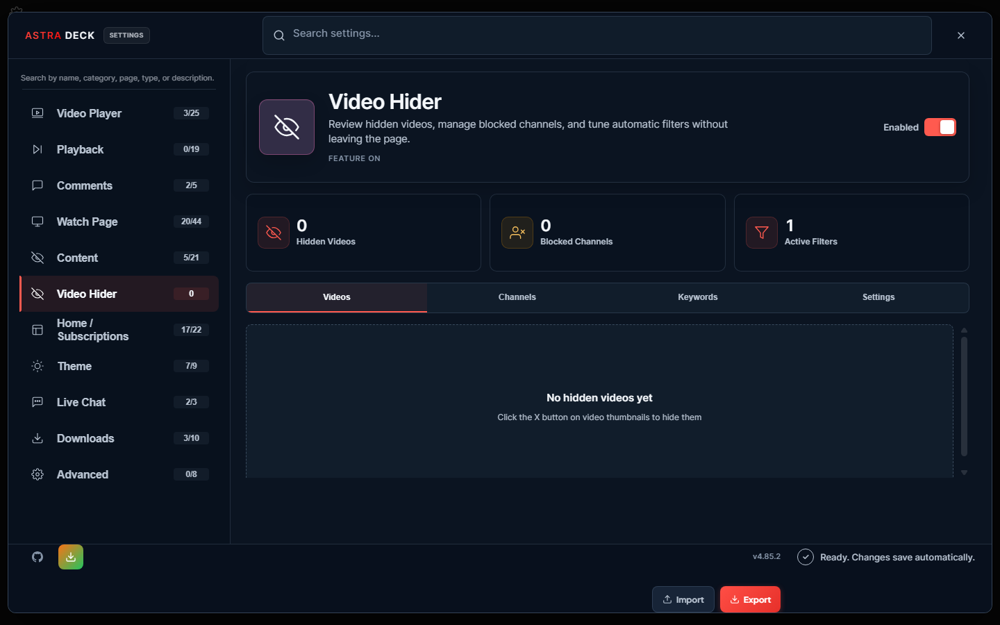
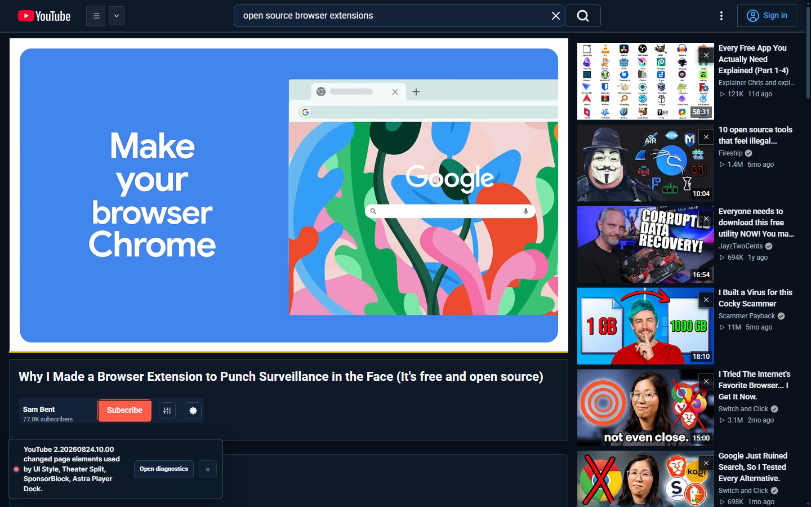
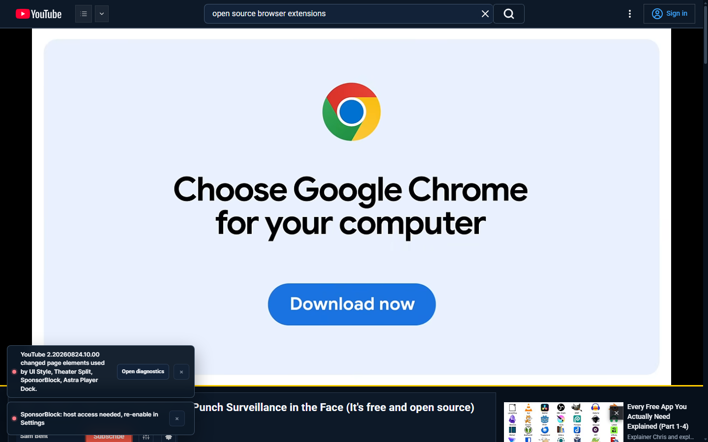
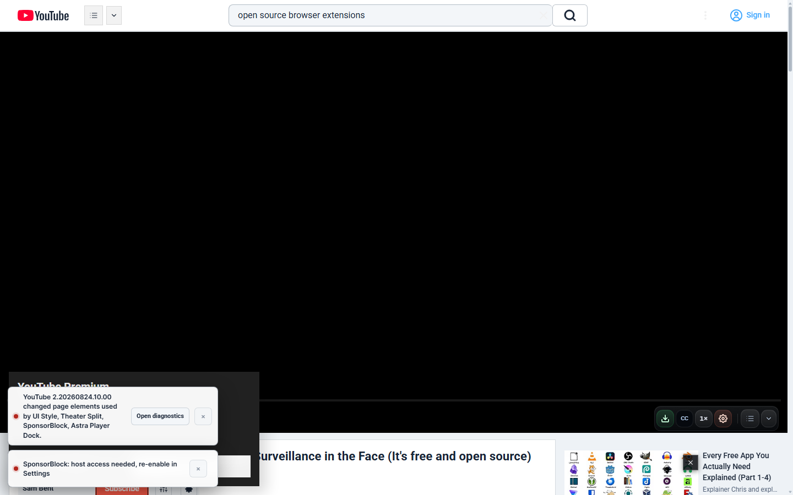
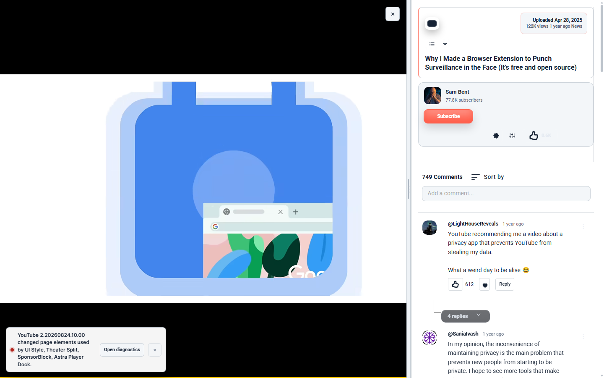

<p align="center">
  
</p>

<h1 align="center">Astra Deck</h1>

<p align="center">
  
  
  
  
</p>

<p align="center">
  A desktop YouTube toolkit for Chrome and Firefox with 200+ controls. It covers ad request filtering, SponsorBlock, DeArrow, video and channel filters, downloads, transcript search, local or BYO-key AI summaries, subscription groups, Theater Split, themes, and 11 extension locales. The userscript keeps the same core tools without bundling the locale catalogues.
</p>

<!-- BEGIN GENERATED PROJECT FACTS -->
### Source-derived project facts

| Fact | Current source value |
| --- | --- |
| Release | `v4.85.0` |
| Runtime floors | Node `>=24`; Chrome 120+ / equivalent Chromium release; Firefox 142+ |
| Extension locales | `11`: `ar`, `de`, `en`, `es`, `fr`, `it`, `ja`, `ko`, `pt_BR`, `ru`, `zh_CN` |
| Settings schema | `484` entries across `18` categories |
| Runtime graph | `115` modules, including `27` peeled feature modules and `293` declared feature IDs |
| Selector surfaces | `35` shipped surfaces from `33` selector packs (`2` aliases) |
| Build profiles | `store-safe`, `chromium-store`, `github-full`; github-full adds 6 full-only origins |
| Themes | `7` named color themes plus `oledTheme`, `denseMode`, `tokenThemeBridge` controls |
| Compatibility modes | Desktop YouTube extension; bounded YouTube Music theme/OLED/density compatibility; bounded /embed/:id player mode; mobile browsers and YouTube Studio; userscript follows the host desktop browser |
<!-- END GENERATED PROJECT FACTS -->

<p align="center">
  <a href="https://github.com/SysAdminDoc/Astra-Deck/releases/latest"><strong>Download Latest Release</strong></a>
  ·
  <a href="docs/privacy-policy.md"><strong>Privacy Policy</strong></a>
  ·
  <a href="SECURITY.md"><strong>Security Policy</strong></a>
</p>

---

## Installation

### Chrome / Edge / Brave

**Option A, Load unpacked from ZIP:**
1. Download `astra-deck-chromium-store-chrome-v*.zip` for a download-free Chrome Web Store/Edge-compatible package, or choose `astra-deck-store-safe-chrome-v*.zip` / `astra-deck-github-full-chrome-v*.zip` for companion-capable self-hosted installs, from the [latest release](https://github.com/SysAdminDoc/Astra-Deck/releases/latest)
2. Extract it to a permanent folder
3. Open `chrome://extensions/`, enable **Developer mode**
4. Click **Load unpacked** and select the extracted folder

**Option B, Local folder:**
1. Download or clone the `extension/` folder
2. Open `chrome://extensions/`, enable **Developer mode**
3. Click **Load unpacked** and select the `extension/` folder

Releases ship the ZIP, not a CRX. Self-hosted CRX installs are Linux-only on modern Chrome, so the ZIP + **Load unpacked** is the supported Chromium path.

### Firefox

**The released `.xpi` is unsigned.** Firefox Release and Beta install only
add-ons signed by Mozilla, and they reject an unsigned XPI with "This add-on
could not be installed because it appears to be corrupt", so `about:addons` →
**Install Add-on From File** does not work on the Firefox most people run. Pick
one of these instead:

Release builds also emit `updates.json`, and the companion-capable `store-safe`
Firefox manifest points at the stable latest-release update feed. That feed is
effective only after the XPI is signed; the currently released unsigned XPI
still requires one of the manual installation paths below.

**Easiest, the userscript.** Works on every Firefox edition, installs in one
click, and auto-updates. See [Userscript](#userscript-tampermonkey--violentmonkey)
below.

**Temporary, any Firefox edition.** The add-on is removed when Firefox restarts.

1. Download `astra-deck-chromium-store-firefox-v*.xpi` for the download-free package, or `astra-deck-store-safe-firefox-v*.xpi` / `astra-deck-github-full-firefox-v*.xpi` for companion-capable installs, from the [latest release](https://github.com/SysAdminDoc/Astra-Deck/releases/latest)
2. Open `about:debugging#/runtime/this-firefox`
3. Click **Load Temporary Add-on…** and select the `.xpi`

**Permanent, Developer Edition, Nightly, or ESR only.** These builds can be
told to accept unsigned add-ons; Release and Beta cannot.

1. Open `about:config` and set `xpinstall.signatures.required` to `false`
2. Open `about:addons` → gear icon → **Install Add-on From File**
3. Select the `.xpi`

Requires Firefox 142+ (set by `strict_min_version` in
[`scripts/manifest-patch.js`](scripts/manifest-patch.js), so Firefox's built-in
data-consent permissions cover the documented collection categories).

### Userscript (Tampermonkey / Violentmonkey)

A userscript build is also available. Install [Tampermonkey](https://www.tampermonkey.net/) or [Violentmonkey](https://violentmonkey.github.io/), then install the [current `YTKit.user.js` artifact](https://raw.githubusercontent.com/SysAdminDoc/Astra-Deck/main/YTKit.user.js). Its generated `@require` loads the separately versioned [Astra Deck YTKit Core Library](https://raw.githubusercontent.com/SysAdminDoc/Astra-Deck/main/YTKit-core.user.js) from the same repository, so a separate Greasy Fork core publication is not required.

The userscript starts at `document-start` and continuously collapses known ad shells, but a userscript manager cannot guarantee interception before the browser starts page requests. Use the extension when browser-level ad-request blocking is required. Its download cascade never calls public Cobalt/community APIs: after local and direct methods fail, an external web page opens only when the user has explicitly configured a valid HTTPS downloader URL. Without a `{url}` placeholder, the canonical watch URL is placed in the fragment rather than the navigation request.

> SharedAudio remains userscript-only. The `store-safe` and `github-full` extension profiles can use Astra Downloader; the `chromium-store` artifact is download-free. GitHub-full can also use a Cobalt instance the user operates or is authorized to use after an exact-origin browser grant; Astra Deck does not include Cobalt's public service.

### Astra Downloader Companion Setup

Video and audio downloads are handled by **[Astra Downloader](https://github.com/SysAdminDoc/AstraDownloader)**,
a separate program with its own repository, releases, and documentation. Astra
Deck and Astra Downloader are separate installs: the extension above works on
its own, and downloads need the companion running on this device.

Download `AstraDownloader.exe` from the
[latest Astra Downloader release](https://github.com/SysAdminDoc/AstraDownloader/releases/latest)
and run it, or use the in-page **Download setup** prompt, which points at the
same place. Then return to YouTube and choose **Check again**. The toolbar
popup also has recovery actions to re-enable the setup prompt and request an
on-demand companion update from a running service.

Everything about the companion, installing from source, building the
executable, the per-site sign-in store, subscriptions, the URL policy, and its
security model, is documented in
[its README](https://github.com/SysAdminDoc/AstraDownloader#readme). It
downloads from any site yt-dlp supports, not only YouTube.

Two details matter on this side of the boundary:

- **Discovery is by port, not configuration.** The extension probes
  `127.0.0.1` across the ports in `scripts/companion-port-catalogue.json`.
  That file is duplicated byte-for-byte in the Astra Downloader repository and
  checked in both, so changing the ports is a two-repository change.
- **Releases here never carry `AstraDownloader.exe`.** Publishing a second,
  independently versioned copy behind the same update check is how installs
  previously ended up four versions stale, so `npm run release:readiness`
  fails if the executable is staged in `build/` or listed in the release
  manifest.

The PO-token provider and Deno sections below are companion prerequisites. They
improve downloader reliability after Astra Downloader itself is running; they
are not browser extension install steps.

## Features

### Core

| Feature | Default |
|---------|---------|
| Zero-Ad Desktop Surface, static MV3 request blocking plus document-start ad-shell collapse; userscript provides shell collapse only | Built in |
| Theater Split, responsive video and comments panes with matching dark and light themes | On |
| Video Hider, hide videos/channels from feeds with X buttons, keyword filter, regex, duration filter | On |
| Video Context Menu, right-click player for downloads, VLC/MPV streaming, transcript, screenshot | On |
| Settings Panel, searchable, categorized, instant-apply, export/import/reset | On |
| Known-Breakage Notices, pause features YouTube has broken until a fix ships | On |
| Comment Search, filter watch-page comments inline | Off |
| DeArrow, replace clickbait titles/thumbnails via crowdsourced database | Off |

YouTube changes its layout without warning, and when it does, some features
stop working. Cutting a release is a slow answer to that, so Known-Breakage
Notices reads a short list from this repository at most once every six hours
and pauses the features that list names for the versions they are broken in.
The card in Settings says so and links the issue. The list can pause a feature
and nothing else: it cannot switch anything on, cannot read or change a
setting, carries no code and no links, and cannot name anything the extension
does not already ship. Your own toggle is left exactly as you set it. It is on
by default, under Advanced, and with it off no request is made.

GitHub-full builds can optionally follow one user-selected HTTPS Video Hider
filter list after an exact-origin browser prompt. Remote lists are anonymous,
data-only requests capped at 1 MiB: unknown fields and malformed payloads are
rejected, publisher predicate code is discarded, and the exact response is
recorded with SHA-256 plus ETag/Last-Modified validators. The popup shows the
source host, format, verification age, and active/stale state; users can choose
daily, weekly, or manual checks and pause last-known-good rules whenever a
refresh fails or the last verification becomes older than seven days.

### Interface

| Feature | Default |
|---------|---------|
| Logo Quick Links, hover dropdown with History, Watch Later, Playlists, Liked, Subs | On |
| Hide Sidebar / Hide Shorts / Hide Related / Hide Description | On |
| Subscriptions Grid / Homepage Grid Align / Videos Per Row | On |
| Styled Filter Chips / Compact Layout / Thin Scrollbar | On |
| Square Search Bar / Square Avatars | On |
| Compact Unfixed Header / Force Dark Everywhere | Off |

### Watch Page

| Feature | Default |
|---------|---------|
| Watch Page Restyle, matched dark and light canvas, search, metadata, actions, and comments | On |
| Native Comments Layout, keep YouTube comments clean without extension restyling | On |
| Expand Video Width / Disable Ambient Mode | On |
| Hide Merch, AI Summary, Hashtags, Pinned Comments, Info Panels | On |
| Clean Share URLs, strip tracking params | On |
| Return YouTube Dislike, estimated dislike count with `est.` disclosure + ratio | Off |
| Auto-Expand Description / Sticky Chat / Scroll to Player | Off |

### Video Player

| Feature | Default |
|---------|---------|
| Always Best Quality, picks highest available stream, prefers 1080p Premium when offered | On |
| Auto-Resume Position (configurable threshold) | On |
| Custom Progress Bar Color (color picker) | Off |
| Remaining Time Display / Time in Tab Title | Off |
| A-B Loop / Fine Speed Control / Persistent Speed / Per-Channel Speed | Off |
| Speed Control Chip (in-chrome popup: 0.25× → 3×, 10 presets) | On |
| Codec Selector (H.264/VP9/AV1) / Force Standard FPS | Off |
| Video Screenshot / Video Zoom (Ctrl+scroll, up to 5x) | Off |
| Cinema Ambient Glow / Nyan Cat Progress Bar | Off |
| Speed Indicator Overlay / Custom Speed Buttons (0.5x-3x) | Off |
| Pop-Out Player (Document PiP) / PiP Button / Fullscreen on Double-Click | Off |

### Content Filtering

| Feature | Default |
|---------|---------|
| Remove Shorts / Redirect Shorts to Regular Player | On |
| Channels open on Videos Tab | On |
| Hide Collaborations / News / Playlists / Playables / Members Only | On |
| Hide Watched Videos (dim or hide) / Grayscale Thumbnails | Off |
| Anti-Translate / Not Interested Button / Open in New Tab | Off |
| Disable Infinite Scroll / Disable SPA Navigation | Off |

### Downloads

| Feature | Default |
|---------|---------|
| Download Options Popup, format, quality, and save directory per download | On |
| Video Formats, MP4, MKV, WebM | MP4 |
| Audio Formats, MP3, M4A, Opus, FLAC, WAV | MP3 |
| Quality Selector, Best, 4K, 1440p, 1080p, 720p, 480p | Best |
| Custom Save Directory, override per download or set globally | Downloads |
| Context Menu, quick "Download Video" and "Download Audio" on right-click | On |
| Auto-Download on Visit | Off |
| Download Thumbnail (maxres) | Off |

> Downloads use Astra Downloader, the bundled local yt-dlp + ffmpeg companion. Both profiles probe `9751` plus fallback ports (`9761`, `9771`, `9781`, `9791`, `9851`) and only accept health responses that identify as the Astra downloader service. The store-safe ceiling keeps the companion handoff but excludes AI, Ollama, and Cobalt. GitHub-full can show the fallback after the user enters the root HTTPS origin of a self-hosted Cobalt instance and grants access to that one host; `api.cobalt.tools` is deliberately unavailable. See [Astra Downloader Companion Setup](#astra-downloader-companion-setup) for the current install and release-asset state.

The GitHub-full popup maintenance actions are recoverable. yt-dlp updates run
against a staged sibling executable; companion updates must pass checksum and
hidden startup checks. Each path retains one verified last-known-good binary,
activates atomically, and restores that backup automatically when the new
binary fails its post-update check. The popup and `/health.updateRecovery`
identify the active and rollback versions without exposing local paths or
digests.

### PO Token provider (optional but recommended)

YouTube binds PO tokens to video IDs in 2026; without a provider, the `web` client increasingly fails with "Sign in to confirm you're not a bot" on a subset of videos. Astra Downloader auto-detects a [bgutil-ytdlp-pot-provider](https://github.com/Brainicism/bgutil-ytdlp-pot-provider) HTTP server on `127.0.0.1:4416` and routes yt-dlp through it when available.

Quickest setup (Docker):

```bash
docker run --name bgutil-provider -d --restart unless-stopped -p 4416:4416 brainicism/bgutil-ytdlp-pot-provider
```

Then install the yt-dlp plugin so `yt-dlp.exe` knows to consult the provider:

```bash
pip install bgutil-ytdlp-pot-provider
```

Astra Downloader's `/health` endpoint will surface `poTokenProvider: { ok, port, version }` once the server is reachable. If absent, downloads still work on most videos, the provider is opt-in hardening, not a hard requirement.

### External JavaScript runtime (yt-dlp 2026+)

yt-dlp `>= 2026.04` uses external EJS challenge solvers for YouTube. Astra
Downloader defaults to Deno `>=2.3` and can fall back to Node `>=22`; choose
Auto, Deno, or Node in companion Settings. Runtime presence alone is not
enough: the companion verifies the version and executes a bounded JavaScript
capability probe before allowing a runtime-required download.

Install Deno once:

```bash
# Windows
winget install DenoLand.Deno

# macOS / Linux
curl -fsSL https://deno.land/install.sh | sh
```

(Or grab the installer from `https://deno.com/`. To use Node instead, install
Node 24 or newer and select **Node 24+** in companion Settings.)

Astra Downloader's `/health` endpoint surfaces `javascriptRuntime: { runtime, version, supported, ejsReady, reason }` while retaining `denoRuntime` as a compatibility alias. The download health panel names the selected runtime and offers one-click Deno provisioning only when Deno is an eligible choice. Unknown versions, probe failures, and unsupported runtimes stop with actionable errors; older pre-runtime yt-dlp builds remain allowed.

yt-dlp and its pins live in the
[Astra Downloader repository](https://github.com/SysAdminDoc/AstraDownloader), which runs the bounded media smoke against a
stable public fixture before accepting extractor dependency bumps.

### Comments

| Feature | Default |
|---------|---------|
| Sort Comments Newest First | Off |
| Creator Comment Highlight | Off |
| Comment Handle Revealer, show original channel name next to @handle | Off |
| Preload Comments | Off |

### Live Chat

| Feature | Default |
|---------|---------|
| Premium Live Chat styling | On |
| Configurable element hiding (header, emoji, super chats, polls, etc.) | On |
| Chat Keyword Filter | Off |
| Adaptive Live Layout | Off |
| Reaction Spammer, opt-in floating panel, randomized emoji loop (500 ms floor) | Off |

### Automation & Behavior

| Feature | Default |
|---------|---------|
| Auto-Dismiss "Still Watching?" | Off |
| Auto Theater Mode / Auto Subtitles / Auto-Like Subscribed | Off |
| Auto-Pause on Tab Switch / Pause Other Tabs | Off |
| Auto-Open Chapters / Auto-Open Transcript | Off |
| Auto-Close Popups (cookie/survey/premium) | Off |
| Prevent Autoplay / Disable Autoplay Next | Off |
| Redirect Home to Subscriptions | Off |
| Remember Volume / Persistent Speed | Off |

### Power User

| Feature | Default |
|---------|---------|
| Resume Playback (500-entry cap, 15s save interval) | Off |
| Mini Player Bar (floating progress/play/pause on scroll-past) | Off |
| Playback Stats Overlay (codec, resolution, dropped frames, bandwidth) | Off |
| Watch Time Tracker (90-day retention) + Analytics Dashboard | Off |
| Timestamp Bookmarks (inline notes, persistent storage) | Off |
| Transcript Viewer (sidebar with clickable timestamps) + Export | Off |
| AI Video Summary (OpenAI / Anthropic / Gemini / Ollama, BYO key) | Off |
| Subtitle Styling (font, size, color, background, position) | Off |
| Blue Light Filter (adjustable 10-80%) | Off |
| Focused Mode (hide everything except video + comments) | Off |
| Custom CSS Injection | Off |
| CPU Tamer (background tab timer throttling) | Off |
| Settings Profiles / Statistics Dashboard / Debug Mode | Off |
| Fit Player to Window | Off |

### Configurable Element Managers

Toggle individual elements on/off through the settings panel:

- **Action Buttons**, Like, Dislike, Share, Ask/AI, Clip, Thanks, Save, Sponsor, More Actions
- **Player Controls**, Next, Autoplay, Subtitles, Captions, Miniplayer, PiP, Theater, Fullscreen
- **Watch Elements**, Join Button, Ask Button, Save Button, Ask AI Section, Podcast Section, Transcript Section
- **Chat Elements**, Header, Menu, Popout, Reactions, Timestamps, Polls, Ticker, Leaderboard, Super Chats, Emoji, Bots

---

## Settings Panel

Click the gear icon in the YouTube masthead or player controls, or use the toolbar popup's **Open Full Settings** action.

<p align="center">
  
</p>

### YouTube Watch Themes

<p align="center">
  
  
</p>

<p align="center">
  
  
</p>

<p align="center"><sub>Normal YouTube, native Theater, and Theater Split share the same dark and light page themes while the video canvas stays black.</sub></p>

- Command Deck workspace with a mission card and three live preference summaries on every category
- Searchable sidebar spanning eleven destinations, including the dedicated Video Hider workflow
- Full-width semantic control sections with dependency rails for nested settings
- Toggle switches with instant apply
- Sub-feature controls for granular element hiding
- Textarea editors for keyword filters, quick links, custom CSS
- Schema-validated Export / Import / Reset with credential scrub
- Conflict detection (auto-disables conflicting features with toast notification)
- Verified dark/light and RTL layouts at supported desktop viewports, including normal YouTube, native Theater, and Theater Split. The live browser check measures metadata, comments, related videos or chat, scrolling, and player geometry across repeated mode changes. The mobile light state is exercised in the settings fixture; mobile browser support remains host-dependent.

The toolbar popup provides the lightweight control surface: polished quick toggles, YouTube-tab context, storage stats, schema-validated backups, diagnostics, and language selection.


<!-- BEGIN GENERATED SETTINGS REFERENCE -->
### Complete settings reference

This generated knowledgebase documents all **479 user-facing settings** in the canonical schema. The remaining 5 schema entries are internal migration/profile metadata, not user controls. Defaults, accepted values, build availability, scope, apply behavior, capability requirements, and introduction version are source-derived; purpose copy comes from the shipped feature definition or an audited subordinate-field description.

> `Extension only` settings are unavailable in the standalone userscript. `GitHub-full only` settings require a compatible GitHub-full build/profile and any permission shown in the UI. `Deferred apply` means the value is consumed on the next relevant render or navigation rather than rebuilding the current surface immediately.

<details>
<summary><strong>Shell and appearance</strong>: 48 settings</summary>

| Setting | Purpose | Default and accepted values | Availability and behavior |
| --- | --- | --- | --- |
| <a id="setting-widenSearchBar"></a><strong>Widen Search Bar</strong><br><code>widenSearchBar</code> | Expand the search bar to use more available space | Default: On | Extension + userscript<br>Store-safe + GitHub-full<br>Global<br>Live apply + reversible teardown<br>Since <code>v0.1.0</code> |
| <a id="setting-squareSearchBar"></a><strong>Square Search Bar</strong><br><code>squareSearchBar</code> | Remove rounded corners from the search bar | Default: On | Extension + userscript<br>Store-safe + GitHub-full<br>Global<br>Live apply + reversible teardown<br>Since <code>v0.1.0</code> |
| <a id="setting-squareAvatars"></a><strong>Square Avatars</strong><br><code>squareAvatars</code> | Make channel avatars square instead of round | Default: On | Extension + userscript<br>Store-safe + GitHub-full<br>Global<br>Live apply + reversible teardown<br>Since <code>v0.1.0</code> |
| <a id="setting-subscriptionsGrid"></a><strong>Subscriptions Grid</strong><br><code>subscriptionsGrid</code> | Use a denser grid layout on the subscriptions page | Default: On | Extension + userscript<br>Store-safe + GitHub-full<br>Global<br>Live apply + reversible teardown<br>Since <code>v0.1.0</code> |
| <a id="setting-homepageGridAlign"></a><strong>Homepage Grid Align</strong><br><code>homepageGridAlign</code> | Force a uniform thumbnail grid on the homepage. Prevents misaligned rows caused by variable title and metadata heights. | Default: On | Extension + userscript<br>Store-safe + GitHub-full<br>Global<br>Live apply + reversible teardown<br>Since <code>v0.1.0</code> |
| <a id="setting-styledFilterChips"></a><strong>Styled Filter Chips</strong><br><code>styledFilterChips</code> | Compact, native-feeling filter chips on home and subscriptions | Default: On | Extension + userscript<br>Store-safe + GitHub-full<br>Global<br>Live apply + reversible teardown<br>Since <code>v0.1.0</code> |
| <a id="setting-hideSidebar"></a><strong>Hide Sidebar</strong><br><code>hideSidebar</code> | Remove the left navigation sidebar completely | Default: On | Extension + userscript<br>Store-safe + GitHub-full<br>Global<br>Live apply + reversible teardown<br>Since <code>v0.1.0</code> |
| <a id="setting-uiStyle"></a><strong>UI style</strong><br><code>uiStyle</code> | Selects the global corner treatment: square applies Astra's squaring rules, while rounded preserves rounded surfaces. | Default: <code>square</code><br>Values: <code>square</code>, <code>rounded</code> | Extension + userscript<br>Store-safe + GitHub-full<br>Global<br>Live apply<br>Since <code>v0.1.0</code> |
| <a id="setting-noAmbientMode"></a><strong>Disable Ambient Mode</strong><br><code>noAmbientMode</code> | Turn off the glowing background effect that matches video colors | Default: On | Extension + userscript<br>Store-safe + GitHub-full<br>Global<br>Live apply + reversible teardown<br>Since <code>v0.1.0</code> |
| <a id="setting-compactLayout"></a><strong>Compact Layout</strong><br><code>compactLayout</code> | Reduce spacing and padding for a denser interface | Default: On | Extension + userscript<br>Store-safe + GitHub-full<br>Global<br>Live apply + reversible teardown<br>Since <code>v0.1.0</code> |
| <a id="setting-thinScrollbar"></a><strong>Thin Scrollbar</strong><br><code>thinScrollbar</code> | Use a slim, unobtrusive scrollbar | Default: On | Extension + userscript<br>Store-safe + GitHub-full<br>Global<br>Live apply + reversible teardown<br>Since <code>v0.1.0</code> |
| <a id="setting-watchPageRestyle"></a><strong>Watch Page Restyle</strong><br><code>watchPageRestyle</code> | Premium watch-page layout for title, description, and metadata without hiding native controls | Default: On | Extension + userscript<br>Store-safe + GitHub-full<br>Global<br>Live apply + reversible teardown<br>Since <code>v0.1.0</code> |
| <a id="setting-chatStyleComments"></a><strong>Studio Comments</strong><br><code>chatStyleComments</code> | Premium comment layout that preserves pinned comments, creator hearts, replies, and native actions | Default: Off | Extension + userscript<br>Store-safe + GitHub-full<br>Global<br>Live apply + reversible teardown<br>Since <code>v0.1.0</code> |
| <a id="setting-fullWidthSubscriptions"></a><strong>Full-Width Subscriptions</strong><br><code>fullWidthSubscriptions</code> | Expand the subscription grid to fill the page | Default: On | Extension + userscript<br>Store-safe + GitHub-full<br>Global<br>Live apply + reversible teardown<br>Since <code>v0.1.0</code> |
| <a id="setting-redirectToVideosTab"></a><strong>Channels → Videos Tab</strong><br><code>redirectToVideosTab</code> | Open channel pages directly on the Videos tab | Default: On | Extension + userscript<br>Store-safe + GitHub-full<br>Global<br>Live apply + reversible teardown<br>Since <code>v0.1.0</code> |
| <a id="setting-expandVideoWidth"></a><strong>Expand Video Width</strong><br><code>expandVideoWidth</code> | Stretch the video to fill the space when sidebar is hidden | Default: On | Extension + userscript<br>Store-safe + GitHub-full<br>Global<br>Live apply + reversible teardown<br>Since <code>v0.1.0</code> |
| <a id="setting-floatingLogoOnWatch"></a><strong>Astra Player Dock</strong><br><code>floatingLogoOnWatch</code> | Replace native player right-controls with Astra quick links, local tools, and settings | Default: On | Extension + userscript<br>Store-safe + GitHub-full<br>Global<br>Live apply + reversible teardown<br>Since <code>v0.1.0</code> |
| <a id="setting-colorTheme"></a><strong>Color theme</strong><br><code>colorTheme</code> | Applies a built-in dark-mode color palette across YouTube; none leaves the native palette unchanged. | Default: <code>none</code><br>Values: <code>none</code>, <code>catppuccin-mocha</code>, <code>styled-dark</code>, <code>dracula</code>, <code>nord</code>, <code>gruvbox</code>, <code>tokyo-night</code>, <code>nyan-cat</code> | Extension + userscript<br>Store-safe + GitHub-full<br>Global<br>Live apply<br>Since <code>v0.1.0</code> |
| <a id="setting-customProgressBarColor"></a><strong>Custom Progress Bar Color</strong><br><code>customProgressBarColor</code> | Change the red progress bar to any color | Default: <code>#ff0000</code><br>Hex color | Extension + userscript<br>Store-safe + GitHub-full<br>Global<br>Live apply<br>Since <code>v0.1.0</code> |
| <a id="setting-compactUnfixedHeader"></a><strong>Compact / Unfixed Header</strong><br><code>compactUnfixedHeader</code> | Reduce header height and let it scroll away instead of staying fixed | Default: Off | Extension + userscript<br>Store-safe + GitHub-full<br>Global<br>Live apply + reversible teardown<br>Since <code>v0.1.0</code> |
| <a id="setting-thumbnailPreviewSize"></a><strong>Large Thumbnail Previews</strong><br><code>thumbnailPreviewSize</code> | Increase the size of thumbnail hover previews for easier viewing on large screens | Default: Off | Extension + userscript<br>Store-safe + GitHub-full<br>Global<br>Live apply + reversible teardown<br>Since <code>v0.1.0</code> |
| <a id="setting-thumbnailQualityUpgrade"></a><strong>HD Thumbnails</strong><br><code>thumbnailQualityUpgrade</code> | Upgrades video thumbnails to maximum resolution where available | Default: Off | Extension + userscript<br>Store-safe + GitHub-full<br>Global<br>Live apply + reversible teardown<br>Since <code>v0.1.0</code> |
| <a id="setting-forceDarkEverywhere"></a><strong>Force Dark on All YouTube Pages</strong><br><code>forceDarkEverywhere</code> | Applies dark theme to YouTube pages that may not respect dark mode (settings, about, etc.) | Default: Off | Extension + userscript<br>Store-safe + GitHub-full<br>Global<br>Live apply + reversible teardown<br>Since <code>v0.1.0</code> |
| <a id="setting-customCssInjection"></a><strong>Custom CSS</strong><br><code>customCssInjection</code> | Inject your own custom CSS rules into YouTube pages | Default: Off | Extension + userscript<br>GitHub-full only<br>Global<br>Live apply + reversible teardown<br>Store-sensitive<br>Since <code>v0.1.0</code> |
| <a id="setting-customCssCode"></a><strong>Custom CSS code</strong><br><code>customCssCode</code> | Stores the local stylesheet injected into YouTube pages while Custom CSS is enabled. | Default: Empty | Extension + userscript<br>GitHub-full only<br>Global<br>Live apply<br>Store-sensitive<br>Since <code>v0.1.0</code> |
| <a id="setting-grayscaleThumbnails"></a><strong>Grayscale Thumbnails</strong><br><code>grayscaleThumbnails</code> | Shows thumbnails in grayscale to reduce visual distraction. Color comes back on hover. | Default: Off | Extension + userscript<br>Store-safe + GitHub-full<br>Global<br>Live apply + reversible teardown<br>Since <code>v0.1.0</code> |
| <a id="setting-noFrostedGlass"></a><strong>Disable Frosted Glass</strong><br><code>noFrostedGlass</code> | Remove blur effects from UI elements | Default: Off | Extension + userscript<br>Store-safe + GitHub-full<br>Global<br>Live apply + reversible teardown<br>Since <code>v0.1.0</code> |
| <a id="setting-themeAccentColor"></a><strong>Accent Color</strong><br><code>themeAccentColor</code> | Custom accent color for highlights, progress bar, and active UI elements | Default: Empty | Extension + userscript<br>Store-safe + GitHub-full<br>Global<br>Live apply<br>Since <code>v0.1.0</code> |
| <a id="setting-nyanCatProgressBar"></a><strong>Nyan Cat Progress Bar</strong><br><code>nyanCatProgressBar</code> | Replace the video progress bar with a Nyan Cat animation | Default: Off | Extension + userscript<br>Store-safe + GitHub-full<br>Global<br>Live apply + reversible teardown<br>Since <code>v0.1.0</code> |
| <a id="setting-oledTheme"></a><strong>OLED Theme</strong><br><code>oledTheme</code> | True OLED black (#000) backgrounds via the --yt-sys-color-baseline tokens. Survives YouTube's native theme switches because we hook the tokens themselves, not the surface classes. | Default: Off | Extension + userscript<br>Store-safe + GitHub-full<br>Global<br>Live apply + reversible teardown<br>Since <code>v0.1.0</code> |
| <a id="setting-denseMode"></a><strong>Dense Mode</strong><br><code>denseMode</code> | Tightens row spacing, padding, and font metrics across Astra-injected surfaces. It doesn't change YouTube's native layout, only our own panels, chips, pills, and toolbars. | Default: Off | Extension + userscript<br>Store-safe + GitHub-full<br>Global<br>Live apply + reversible teardown<br>Since <code>v0.1.0</code> |
| <a id="setting-rectangularizeYouTube"></a><strong>Rectangularize UI</strong><br><code>rectangularizeYouTube</code> | Strips YouTube's pill / stadium / fully-rounded backdrops. Any backdrop with border-radius > 12px gets clamped to 8px. Avatars and progress rings stay circular. | Default: Off | Extension + userscript<br>Store-safe + GitHub-full<br>Global<br>Live apply + reversible teardown<br>Since <code>v0.1.0</code> |
| <a id="setting-classicLayoutProfile"></a><strong>Layout Profile</strong><br><code>classicLayoutProfile</code> | Pick a layout profile. Modern keeps YouTube's 2025 layout. Classic 2020 restores tighter spacing and the smaller masthead. Classic 2016 restores the older watch page proportions. | Default: <code>modern</code><br>Values: <code>modern</code>, <code>classic-2020</code>, <code>classic-2016</code> | Extension + userscript<br>Store-safe + GitHub-full<br>Global<br>Live apply<br>Experimental<br>Since <code>v0.1.0</code> |
| <a id="setting-newPlayerUiRestore"></a><strong>Restore Classic Player Chrome</strong><br><code>newPlayerUiRestore</code> | Hides YouTube's new-player chrome elements (Delhi modern overflow panel, pill action surfaces). Restores a tighter progress bar and original-style controls. | Default: Off | Extension + userscript<br>Store-safe + GitHub-full<br>Global<br>Live apply + reversible teardown<br>Experimental<br>Since <code>v0.1.0</code> |
| <a id="setting-classicPlayerChrome"></a><strong>Classic Player Chrome</strong><br><code>classicPlayerChrome</code> | One-toggle restoration of the pre-Delhi/Liquid Glass player look: opaque square controls, classic progress bar, original time display. CSS-only, no DOM rebuild. | Default: Off | Extension only<br>Store-safe + GitHub-full<br>Watch page<br>Live apply + reversible teardown<br>Since <code>v4.47.0</code> |
| <a id="setting-tokenThemeBridge"></a><strong>Native Token Theme Bridge</strong><br><code>tokenThemeBridge</code> | Pipes the user's themeAccentColor into YouTube's native --yt-sys-color-* tokens so native badges, hover states, and primary buttons follow the Astra accent without restyling each surface. | Default: Off | Extension + userscript<br>Store-safe + GitHub-full<br>Global<br>Live apply + reversible teardown<br>Since <code>v0.1.0</code> |
| <a id="setting-hideAirplayButton"></a><strong>Hide Airplay Button</strong><br><code>hideAirplayButton</code> | Remove the Airplay icon from the player controls | Default: Off | Extension + userscript<br>Store-safe + GitHub-full<br>Global<br>Live apply + reversible teardown<br>Since <code>v0.1.0</code> |
| <a id="setting-hideQueueOnThumbnails"></a><strong>Hide &quot;Add to Queue&quot; on Thumbnails</strong><br><code>hideQueueOnThumbnails</code> | Remove the "Add to queue" overlay button that appears on thumbnail hover | Default: Off | Extension + userscript<br>Store-safe + GitHub-full<br>Global<br>Live apply + reversible teardown<br>Since <code>v0.1.0</code> |
| <a id="setting-fullTitles"></a><strong>Show Full Video Titles</strong><br><code>fullTitles</code> | Remove the 2-line clamp on thumbnail titles so long titles show in full | Default: Off | Extension + userscript<br>Store-safe + GitHub-full<br>Global<br>Live apply + reversible teardown<br>Since <code>v0.1.0</code> |
| <a id="setting-titleCaseTransform"></a><strong>Transform Video Title Case</strong><br><code>titleCaseTransform</code> | Override YouTube's clickbait UPPERCASE titles with a casing style of your choice | Default: Off | Extension + userscript<br>Store-safe + GitHub-full<br>Global<br>Live apply + reversible teardown<br>Since <code>v0.1.0</code> |
| <a id="setting-titleCaseMode"></a><strong>Title case mode</strong><br><code>titleCaseMode</code> | Chooses how Transform Video Title Case rewrites visible video-title capitalization. | Default: <code>none</code><br>Values: <code>none</code>, <code>uppercase</code>, <code>lowercase</code>, <code>capitalize</code> | Extension + userscript<br>Store-safe + GitHub-full<br>Global<br>Live apply<br>Since <code>v0.1.0</code> |
| <a id="setting-customSelectionColor"></a><strong>Custom Text Selection Color</strong><br><code>customSelectionColor</code> | Override the default text-selection background with your chosen color | Default: Off | Extension + userscript<br>Store-safe + GitHub-full<br>Global<br>Live apply + reversible teardown<br>Since <code>v0.1.0</code> |
| <a id="setting-selectionColor"></a><strong>Selection color</strong><br><code>selectionColor</code> | Sets the hex color used by Custom Selection Color for selected text. | Default: <code>#2dd36f</code><br>Hex color | Extension + userscript<br>Store-safe + GitHub-full<br>Global<br>Live apply<br>Since <code>v0.1.0</code> |
| <a id="setting-restoreNativeYouTubeUi"></a><strong>Restore Native YouTube UI</strong><br><code>restoreNativeYouTubeUi</code> | Show the channel/comment avatars and home-feed shelves that Astra Deck hides by default. Toggles the early.css opt-out class so YouTube renders its own styling. | Default: Off | Extension + userscript<br>Store-safe + GitHub-full<br>Global<br>Live apply + reversible teardown<br>Since <code>v4.46.0</code> |
| <a id="setting-cleanUiPreset"></a><strong>Compact Clean UI</strong><br><code>cleanUiPreset</code> | Owner preset: hides panel branding, search, and category headers, compresses navigation, silences toast notifications, and hides the subscriptions resume banner. Off by default. | Default: Off | Extension + userscript<br>Store-safe + GitHub-full<br>Global<br>Live apply + reversible teardown<br>Since <code>v4.46.3</code> |
| <a id="setting-hideSearchSidebar"></a><strong>Hide Search Sidebar</strong><br><code>hideSearchSidebar</code> | Remove the right-hand sidebar on search results pages | Default: Off | Extension + userscript<br>Store-safe + GitHub-full<br>Global<br>Live apply + reversible teardown<br>Since <code>v4.49.0</code> |
| <a id="setting-uiFontFamily"></a><strong>UI Font</strong><br><code>uiFontFamily</code> | Override the interface typeface. A short curated list rather than a free-text field, because an arbitrary font-family string is a CSS injection surface, and Custom CSS already exists for that. | Default: <code>default</code><br>Values: <code>default</code>, <code>system</code>, <code>serif</code>, <code>mono</code>, <code>readable</code> | Extension + userscript<br>Store-safe + GitHub-full<br>Global<br>Live apply + reversible teardown<br>Since <code>v4.54.0</code> |
| <a id="setting-uiFontSize"></a><strong>UI Font Size</strong><br><code>uiFontSize</code> | Override the base interface font size (0 = YouTube default, otherwise 8 to 20px) | Default: <code>0</code><br>Values: <code>0</code>, <code>8</code>, <code>9</code>, <code>10</code>, <code>11</code>, <code>12</code>, <code>13</code>, <code>14</code>, <code>15</code>, <code>16</code>, <code>17</code>, <code>18</code>, <code>19</code>, <code>20</code> | Extension + userscript<br>Store-safe + GitHub-full<br>Global<br>Live apply + reversible teardown<br>Since <code>v4.49.0</code> |

</details>

<details>
<summary><strong>Navigation and Guide</strong>: 17 settings</summary>

| Setting | Purpose | Default and accepted values | Availability and behavior |
| --- | --- | --- | --- |
| <a id="setting-hideCreateButton"></a><strong>Hide Create Button</strong><br><code>hideCreateButton</code> | Remove the "Create" button from the header toolbar | Default: On | Extension + userscript<br>Store-safe + GitHub-full<br>Global<br>Live apply + reversible teardown<br>Since <code>v0.1.0</code> |
| <a id="setting-hideVoiceSearch"></a><strong>Hide Voice Search</strong><br><code>hideVoiceSearch</code> | Remove the microphone icon from the search bar | Default: On | Extension + userscript<br>Store-safe + GitHub-full<br>Global<br>Live apply + reversible teardown<br>Since <code>v0.1.0</code> |
| <a id="setting-logoToSubscriptions"></a><strong>Logo Click → Subscriptions</strong><br><code>logoToSubscriptions</code> | Point the native YouTube home mark to your subscriptions feed | Default: On | Extension + userscript<br>Store-safe + GitHub-full<br>Global<br>Live apply + reversible teardown<br>Since <code>v0.1.0</code> |
| <a id="setting-cleanShareUrls"></a><strong>Clean Share URLs</strong><br><code>cleanShareUrls</code> | Strip tracking params (si, pp, feature) from copied/shared YouTube links | Default: On | Extension + userscript<br>Store-safe + GitHub-full<br>Global<br>Live apply + reversible teardown<br>Since <code>v0.1.0</code> |
| <a id="setting-quickLinkMenu"></a><strong>Quick Links</strong><br><code>quickLinkMenu</code> | Adds a compact quick-links menu in the masthead with customizable links | Default: On | Extension + userscript<br>Store-safe + GitHub-full<br>Global<br>Live apply + reversible teardown<br>Since <code>v0.1.0</code> |
| <a id="setting-quickLinkItems"></a><strong>Quick link items</strong><br><code>quickLinkItems</code> | Defines up to ten masthead quick links, one Label and YouTube path per line; unsafe schemes and non-YouTube destinations are rejected. | Default: 6 preset lines | Extension + userscript<br>Store-safe + GitHub-full<br>Global<br>Live apply<br>Since <code>v0.1.0</code> |
| <a id="setting-titleNormalization"></a><strong>Normalize Clickbait Titles</strong><br><code>titleNormalization</code> | Convert ALL CAPS titles to Title Case. Reduces clickbait without changing meaning. | Default: Off | Extension + userscript<br>Store-safe + GitHub-full<br>Global<br>Live apply + reversible teardown<br>Since <code>v0.1.0</code> |
| <a id="setting-redirectHomeToSubs"></a><strong>Redirect Home to Subscriptions</strong><br><code>redirectHomeToSubs</code> | Automatically redirect the YouTube homepage to your subscriptions feed | Default: Off | Extension + userscript<br>Store-safe + GitHub-full<br>Global<br>Live apply + reversible teardown<br>Since <code>v0.1.0</code> |
| <a id="setting-shareMenuCleaner"></a><strong>Clean Share Menu</strong><br><code>shareMenuCleaner</code> | Removes social media buttons from the share dialog, leaving only the URL copy option | Default: Off | Extension + userscript<br>Store-safe + GitHub-full<br>Global<br>Live apply + reversible teardown<br>Since <code>v0.1.0</code> |
| <a id="setting-openInNewTab"></a><strong>Open Videos in New Tab</strong><br><code>openInNewTab</code> | Makes video links on the home/subscriptions page open in a new tab instead of navigating away | Default: Off | Extension + userscript<br>Store-safe + GitHub-full<br>Global<br>Live apply + reversible teardown<br>Since <code>v0.1.0</code> |
| <a id="setting-searchWhileWatching"></a><strong>Search While Watching</strong><br><code>searchWhileWatching</code> | Show YouTube search results in a lightweight watch-page panel without interrupting playback. | Default: Off | Extension only<br>Store-safe + GitHub-full<br>Watch page<br>Live apply + reversible teardown<br>Since <code>v4.49.0</code> |
| <a id="setting-openInAlternativeFrontend"></a><strong>Open In Alternative Frontend</strong><br><code>openInAlternativeFrontend</code> | Adds a button next to the player to open the current video in your configured alternative frontend (Invidious / Piped / FreeTube). Default instance is yewtu.be; change via alternativeFrontendInstance setting. | Default: Off | Extension + userscript<br>GitHub-full only<br>Global<br>Live apply + reversible teardown<br>Store-sensitive<br>Since <code>v0.1.0</code> |
| <a id="setting-alternativeFrontendInstance"></a><strong>Alternative frontend instance</strong><br><code>alternativeFrontendInstance</code> | Sets the HTTPS frontend origin used when Open in Alternative Frontend builds an external video link. | Default: <code>https://yewtu.be</code> | Extension + userscript<br>GitHub-full only<br>Global<br>Live apply<br>Store-sensitive<br>Since <code>v0.1.0</code> |
| <a id="setting-bypassPlaylistMode"></a><strong>Bypass Playlist Mode on Clicks</strong><br><code>bypassPlaylistMode</code> | Strip the &list= parameter from clicked thumbnails so you don't get stuck inside someone's playlist | Default: Off | Extension + userscript<br>Store-safe + GitHub-full<br>Global<br>Live apply + reversible teardown<br>Since <code>v0.1.0</code> |
| <a id="setting-hiddenGuideElementsManager"></a><strong>Hide Guide Elements</strong><br><code>hiddenGuideElementsManager</code> | Choose individual left-navigation (Guide) entries to hide | Default: Off | Extension + userscript<br>Store-safe + GitHub-full<br>Global<br>Live apply + reversible teardown<br>Since <code>v4.49.0</code> |
| <a id="setting-hiddenGuideElements"></a><strong>Hidden guide elements</strong><br><code>hiddenGuideElements</code> | Lists the individual Guide and mini-Guide destinations hidden by Hide Guide Elements. | Default: Empty list<br>Choices: <code>home</code>, <code>subscriptions</code>, <code>history</code>, <code>playlists</code>, <code>yourVideos</code>, <code>watchLater</code>, <code>likedVideos</code>, <code>trending</code>, <code>music</code>, <code>movies</code>, <code>live</code>, <code>gaming</code>, <code>news</code>, <code>sports</code>, <code>learning</code>, <code>premium</code>, <code>studio</code>, <code>settings</code>, <code>reportHistory</code>, <code>help</code>, <code>footer</code> | Extension + userscript<br>Store-safe + GitHub-full<br>Global<br>Live apply<br>Since <code>v4.49.0</code> |
| <a id="setting-hideOwnAvatar"></a><strong>Hide Own Avatar</strong><br><code>hideOwnAvatar</code> | Remove your account avatar button from the header | Default: Off | Extension + userscript<br>Store-safe + GitHub-full<br>Global<br>Live apply + reversible teardown<br>Since <code>v4.49.0</code> |

</details>

<details data-settings-section="shorts-controls">
<summary><strong>Shorts controls</strong>: 9 settings</summary>

| Setting | Purpose | Default and accepted values | Availability and behavior |
| --- | --- | --- | --- |
| <a id="setting-removeAllShorts"></a><strong>Remove Shorts</strong><br><code>removeAllShorts</code> | Hide all Shorts videos from feeds and recommendations | Default: On | Extension + userscript<br>Store-safe + GitHub-full<br>Feeds<br>Live apply + reversible teardown<br>Since <code>v0.1.0</code> |
| <a id="setting-redirectShorts"></a><strong>Redirect Shorts</strong><br><code>redirectShorts</code> | Open Shorts in the standard video player | Default: On | Extension + userscript<br>Store-safe + GitHub-full<br>Feeds<br>Live apply + reversible teardown<br>Since <code>v0.1.0</code> |
| <a id="setting-disablePlayOnHover"></a><strong>Disable Hover Preview</strong><br><code>disablePlayOnHover</code> | Stop videos from playing when hovering over thumbnails | Default: On | Extension + userscript<br>Store-safe + GitHub-full<br>Feeds<br>Live apply + reversible teardown<br>Since <code>v0.1.0</code> |
| <a id="setting-shortsSpeedControl"></a><strong>Shorts Speed Control</strong><br><code>shortsSpeedControl</code> | Adds a click-to-cycle playback speed chip to the Shorts player (0.5x-2x), honoring your persistent speed default | Default: Off | Extension + userscript<br>Store-safe + GitHub-full<br>Feeds<br>Live apply + reversible teardown<br>Since <code>v4.48.0</code> |
| <a id="setting-shortsAutoAdvance"></a><strong>Shorts Auto-Advance</strong><br><code>shortsAutoAdvance</code> | Stop Shorts from looping and scroll to the next Short automatically when one finishes | Default: Off | Extension + userscript<br>Store-safe + GitHub-full<br>Feeds<br>Live apply + reversible teardown<br>Since <code>v4.48.0</code> |
| <a id="setting-shortsAsRegularVideo"></a><strong>Shorts Player Controls</strong><br><code>shortsAsRegularVideo</code> | Add native browser playback controls and scrubbing to YouTube Shorts | Default: Off | Extension + userscript<br>Store-safe + GitHub-full<br>Feeds<br>Live apply + reversible teardown<br>Since <code>v0.1.0</code> |
| <a id="setting-shortsDailyLimitMin"></a><strong>Shorts Daily Limit</strong><br><code>shortsDailyLimitMin</code> | Maximum minutes of Shorts playback per local day. Set to 0 to disable. | Default: <code>0</code><br>Range: <code>0 to 1440</code> | Extension + userscript<br>Store-safe + GitHub-full<br>Watch page<br>Live apply<br>Since <code>v4.51.1</code> |
| <a id="setting-shortsDailyLimitMode"></a><strong>Shorts Limit Action</strong><br><code>shortsDailyLimitMode</code> | Choose whether reaching the limit blocks Shorts or offers five-minute snoozes. | Default: <code>hard</code><br>Values: <code>hard</code>, <code>snooze</code> | Extension + userscript<br>Store-safe + GitHub-full<br>Watch page<br>Live apply<br>Since <code>v4.51.1</code> |
| <a id="setting-shortsWatchTimeToday"></a><strong>Shorts watch time today</strong><br><code>shortsWatchTimeToday</code> | Stores the dated Shorts budget ledger and any active snooze deadline. Settings shows the current-day value as read-only status. | Default: <code>{&quot;date&quot;:&quot;&quot;,&quot;seconds&quot;:0,&quot;snoozeUntil&quot;:0}</code> | Extension + userscript<br>Store-safe + GitHub-full<br>Watch page<br>Live apply<br>Since <code>v4.51.1</code> |

</details>

<details>
<summary><strong>Feeds and layout</strong>: 13 settings</summary>

| Setting | Purpose | Default and accepted values | Availability and behavior |
| --- | --- | --- | --- |
| <a id="setting-hidePlayables"></a><strong>Hide Playables</strong><br><code>hidePlayables</code> | Hide YouTube Playables gaming content from feeds | Default: On | Extension + userscript<br>Store-safe + GitHub-full<br>Feeds<br>Live apply + reversible teardown<br>Since <code>v0.1.0</code> |
| <a id="setting-hideMembersOnly"></a><strong>Hide Members Only</strong><br><code>hideMembersOnly</code> | Hide members-only feed cards on Home and Subscriptions | Default: On | Extension + userscript<br>Store-safe + GitHub-full<br>Feeds<br>Live apply + reversible teardown<br>Since <code>v0.1.0</code> |
| <a id="setting-hideNewsHome"></a><strong>Hide News Section</strong><br><code>hideNewsHome</code> | Hide news sections from the homepage | Default: On | Extension + userscript<br>Store-safe + GitHub-full<br>Feeds<br>Live apply + reversible teardown<br>Since <code>v0.1.0</code> |
| <a id="setting-hidePlaylistsHome"></a><strong>Hide Playlist Shelves</strong><br><code>hidePlaylistsHome</code> | Hide playlist sections from the homepage | Default: On | Extension + userscript<br>Store-safe + GitHub-full<br>Feeds<br>Live apply + reversible teardown<br>Since <code>v0.1.0</code> |
| <a id="setting-videosPerRow"></a><strong>Videos Per Row</strong><br><code>videosPerRow</code> | Set how many video thumbnails per row (0 = dynamic based on window width) | Default: <code>0</code><br>Range: <code>0 to 8</code> | Extension + userscript<br>Store-safe + GitHub-full<br>Feeds<br>Live apply<br>Since <code>v0.1.0</code> |
| <a id="setting-listFeedLayout"></a><strong>List Feed Layout</strong><br><code>listFeedLayout</code> | Show Home, Subscriptions, and Search video cards as rows with thumbnails on the left and metadata on the right. Off by default and mutually exclusive with Videos Per Row. | Default: Off | Extension + userscript<br>Store-safe + GitHub-full<br>Feeds<br>Live apply + reversible teardown<br>Since <code>v4.51.1</code> |
| <a id="setting-hideMerchShelf"></a><strong>Hide Merch Shelf</strong><br><code>hideMerchShelf</code> | Remove merchandise promotions below videos | Default: On | Extension + userscript<br>Store-safe + GitHub-full<br>Feeds<br>Live apply + reversible teardown<br>Since <code>v0.1.0</code> |
| <a id="setting-hideInfoPanels"></a><strong>Hide Info Panels</strong><br><code>hideInfoPanels</code> | Remove Wikipedia/context info boxes that appear below videos (FEMA, COVID, etc.) | Default: On | Extension + userscript<br>Store-safe + GitHub-full<br>Feeds<br>Live apply + reversible teardown<br>Since <code>v0.1.0</code> |
| <a id="setting-disableInfiniteScroll"></a><strong>Disable Infinite Scroll</strong><br><code>disableInfiniteScroll</code> | Replace infinite scroll with a "Load More" button on home, search, and subscriptions pages | Default: Off | Extension + userscript<br>Store-safe + GitHub-full<br>Feeds<br>Live apply + reversible teardown<br>Since <code>v0.1.0</code> |
| <a id="setting-hideLatestPosts"></a><strong>Hide Latest Posts</strong><br><code>hideLatestPosts</code> | Hide community posts and updates sections from feeds | Default: Off | Extension + userscript<br>Store-safe + GitHub-full<br>Feeds<br>Live apply + reversible teardown<br>Since <code>v0.1.0</code> |
| <a id="setting-searchHideUnrelatedShelves"></a><strong>Hide Unrelated Search Shelves</strong><br><code>searchHideUnrelatedShelves</code> | Keep direct video, channel, and playlist results while hiding unrelated search-page shelves. | Default: Off | Extension only<br>Store-safe + GitHub-full<br>Feeds<br>Live apply + reversible teardown<br>Since <code>v4.49.0</code> |
| <a id="setting-searchHideRelatedSearches"></a><strong>Hide Related Search Blocks</strong><br><code>searchHideRelatedSearches</code> | Hide related-search chip blocks without removing filters, corrections, or direct results. | Default: Off | Extension only<br>Store-safe + GitHub-full<br>Feeds<br>Live apply + reversible teardown<br>Since <code>v4.49.0</code> |
| <a id="setting-searchHideWatchedRecommended"></a><strong>Hide Watched and Recommended Results</strong><br><code>searchHideWatchedRecommended</code> | Hide watched-progress results and recommendation interleaves from YouTube search. | Default: Off | Extension only<br>Store-safe + GitHub-full<br>Feeds<br>Live apply + reversible teardown<br>Since <code>v4.49.0</code> |

</details>

<details>
<summary><strong>Watch page and player controls</strong>: 74 settings</summary>

| Setting | Purpose | Default and accepted values | Availability and behavior |
| --- | --- | --- | --- |
| <a id="setting-hideSubscriptionOptions"></a><strong>Hide Layout Options</strong><br><code>hideSubscriptionOptions</code> | Remove the "Latest" header and view toggles on subscriptions | Default: On | Extension + userscript<br>Store-safe + GitHub-full<br>Watch page<br>Live apply + reversible teardown<br>Since <code>v0.1.0</code> |
| <a id="setting-hidePaidContentOverlay"></a><strong>Hide Promotion Badges</strong><br><code>hidePaidContentOverlay</code> | Remove "Includes paid promotion" overlays on thumbnails and watch pages | Default: On | Extension + userscript<br>Store-safe + GitHub-full<br>Watch page<br>Live apply + reversible teardown<br>Since <code>v0.1.0</code> |
| <a id="setting-hideRelatedVideos"></a><strong>Hide Related Videos</strong><br><code>hideRelatedVideos</code> | Remove the related videos panel on watch pages | Default: On | Extension + userscript<br>Store-safe + GitHub-full<br>Watch page<br>Live apply + reversible teardown<br>Since <code>v0.1.0</code> |
| <a id="setting-hideDescriptionRow"></a><strong>Hide Description</strong><br><code>hideDescriptionRow</code> | Remove the video description panel below the player | Default: On | Extension + userscript<br>Store-safe + GitHub-full<br>Watch page<br>Live apply + reversible teardown<br>Since <code>v0.1.0</code> |
| <a id="setting-hideVideoEndContent"></a><strong>Hide Video End Content</strong><br><code>hideVideoEndContent</code> | Remove end cards, end screen, annotations, and video grid when videos finish. Superset of Hide End Screen Cards. | Default: On | Extension + userscript<br>Store-safe + GitHub-full<br>Watch page<br>Live apply + reversible teardown<br>Since <code>v0.1.0</code> |
| <a id="setting-hideJumpAheadButton"></a><strong>Hide Jump Ahead</strong><br><code>hideJumpAheadButton</code> | Remove the Jump Ahead prompt that appears after skipping on eligible videos. | Default: On | Extension + userscript<br>Store-safe + GitHub-full<br>Watch page<br>Live apply + reversible teardown<br>Since <code>v0.1.0</code> |
| <a id="setting-stickyVideo"></a><strong>Theater Split</strong><br><code>stickyVideo</code> | Fullscreen video on watch pages. Scroll down to reveal comments side-by-side. Scroll back to top to return to fullscreen. | Default: On | Extension + userscript<br>Store-safe + GitHub-full<br>Watch page<br>Live apply + reversible teardown<br>Since <code>v0.1.0</code> |
| <a id="setting-hideAiSummary"></a><strong>Hide AI Summary</strong><br><code>hideAiSummary</code> | Remove AI-generated summary panels only | Default: On | Extension + userscript<br>Store-safe + GitHub-full<br>Watch page<br>Live apply + reversible teardown<br>Since <code>v0.1.0</code> |
| <a id="setting-hideAskAi"></a><strong>Hide Ask AI</strong><br><code>hideAskAi</code> | Remove Ask AI buttons and conversational sections | Default: On | Extension + userscript<br>Store-safe + GitHub-full<br>Watch page<br>Live apply + reversible teardown<br>Since <code>v4.51.1</code> |
| <a id="setting-hideGeminiButtons"></a><strong>Hide Gemini Buttons</strong><br><code>hideGeminiButtons</code> | Remove Gemini-branded actions without hiding other AI surfaces | Default: On | Extension + userscript<br>Store-safe + GitHub-full<br>Watch page<br>Live apply + reversible teardown<br>Since <code>v4.51.1</code> |
| <a id="setting-hideAiContextPanels"></a><strong>Hide AI Context Panels</strong><br><code>hideAiContextPanels</code> | Remove fact-checking and contextual information panels | Default: On | Extension + userscript<br>Store-safe + GitHub-full<br>Watch page<br>Live apply + reversible teardown<br>Since <code>v4.51.1</code> |
| <a id="setting-hideDescriptionExtras"></a><strong>Hide Description Extras</strong><br><code>hideDescriptionExtras</code> | Remove extra elements in the description area | Default: On | Extension + userscript<br>Store-safe + GitHub-full<br>Watch page<br>Live apply + reversible teardown<br>Since <code>v0.1.0</code> |
| <a id="setting-hideHashtags"></a><strong>Hide Hashtags</strong><br><code>hideHashtags</code> | Remove hashtag links above video titles | Default: On | Extension + userscript<br>Store-safe + GitHub-full<br>Watch page<br>Live apply + reversible teardown<br>Since <code>v0.1.0</code> |
| <a id="setting-hidePaidPromotionWatch"></a><strong>Hide Paid Promotion</strong><br><code>hidePaidPromotionWatch</code> | Remove "paid promotion" labels on watch pages | Default: On | Extension + userscript<br>Store-safe + GitHub-full<br>Watch page<br>Live apply + reversible teardown<br>Since <code>v0.1.0</code> |
| <a id="setting-hideChannelJoinButton"></a><strong>Hide Channel Join Button</strong><br><code>hideChannelJoinButton</code> | Remove the Join/membership button on channel pages | Default: On | Extension + userscript<br>Store-safe + GitHub-full<br>Watch page<br>Live apply + reversible teardown<br>Since <code>v0.1.0</code> |
| <a id="setting-hideFundraiser"></a><strong>Hide Fundraisers</strong><br><code>hideFundraiser</code> | Remove fundraiser and donation badges | Default: On | Extension + userscript<br>Store-safe + GitHub-full<br>Watch page<br>Live apply + reversible teardown<br>Since <code>v0.1.0</code> |
| <a id="setting-hiddenActionButtonsManager"></a><strong>Hide Action Buttons</strong><br><code>hiddenActionButtonsManager</code> | Choose which action buttons to hide below videos | Default: On | Extension + userscript<br>Store-safe + GitHub-full<br>Watch page<br>Live apply + reversible teardown<br>Since <code>v0.1.0</code> |
| <a id="setting-hiddenActionButtons"></a><strong>Hidden action buttons</strong><br><code>hiddenActionButtons</code> | Lists watch-page action buttons hidden while the Action Buttons manager is enabled. | Default: 8 selected entries<br>Choices: <code>like</code>, <code>dislike</code>, <code>share</code>, <code>ask</code>, <code>clip</code>, <code>thanks</code>, <code>save</code>, <code>sponsor</code>, <code>moreActions</code> | Extension + userscript<br>Store-safe + GitHub-full<br>Watch page<br>Live apply<br>Since <code>v0.1.0</code> |
| <a id="setting-hiddenPlayerControlsManager"></a><strong>Hide Player Controls</strong><br><code>hiddenPlayerControlsManager</code> | Choose which player control buttons to hide | Default: On | Extension + userscript<br>Store-safe + GitHub-full<br>Watch page<br>Live apply + reversible teardown<br>Since <code>v0.1.0</code> |
| <a id="setting-hiddenPlayerControls"></a><strong>Hidden player controls</strong><br><code>hiddenPlayerControls</code> | Lists native player controls hidden while the Player Controls manager is enabled. | Default: 6 selected entries<br>Choices: <code>ytLogo</code>, <code>settings</code>, <code>next</code>, <code>autoplay</code>, <code>subtitles</code>, <code>captions</code>, <code>miniplayer</code>, <code>pip</code>, <code>theater</code>, <code>fullscreen</code> | Extension + userscript<br>Store-safe + GitHub-full<br>Watch page<br>Live apply<br>Since <code>v0.1.0</code> |
| <a id="setting-hiddenWatchElementsManager"></a><strong>Hide Watch Page Elements</strong><br><code>hiddenWatchElementsManager</code> | Choose which elements to hide below videos | Default: On | Extension + userscript<br>Store-safe + GitHub-full<br>Watch page<br>Live apply + reversible teardown<br>Since <code>v0.1.0</code> |
| <a id="setting-hiddenWatchElements"></a><strong>Hidden watch elements</strong><br><code>hiddenWatchElements</code> | Lists watch-page sections and actions hidden while the Watch Elements manager is enabled. | Default: 8 selected entries<br>Choices: <code>joinButton</code>, <code>askButton</code>, <code>saveButton</code>, <code>moreActions</code>, <code>askAISection</code>, <code>podcastSection</code>, <code>transcriptSection</code>, <code>channelInfoCards</code> | Extension + userscript<br>Store-safe + GitHub-full<br>Watch page<br>Live apply<br>Since <code>v0.1.0</code> |
| <a id="setting-hideCollaborations"></a><strong>Hide Collaborations</strong><br><code>hideCollaborations</code> | Hide multi-creator collaboration uploads from your subscriptions feed | Default: On | Extension + userscript<br>Store-safe + GitHub-full<br>Watch page<br>Live apply + reversible teardown<br>Since <code>v0.1.0</code> |
| <a id="setting-watchProgress"></a><strong>Watch Progress Indicators</strong><br><code>watchProgress</code> | Show colored progress bars on video thumbnails based on your watch history (saved locally) | Default: Off | Extension + userscript<br>Store-safe + GitHub-full<br>Watch page<br>Live apply + reversible teardown<br>Since <code>v0.1.0</code> |
| <a id="setting-fullscreenScroll"></a><strong>Scroll in Fullscreen</strong><br><code>fullscreenScroll</code> | Scroll down while fullscreen to read the description, comments, and related videos; scroll back up to return to the video | Default: Off | Extension + userscript<br>Store-safe + GitHub-full<br>Watch page<br>Live apply + reversible teardown<br>Since <code>v4.48.0</code> |
| <a id="setting-replayChatDensity"></a><strong>Replay Chat Density</strong><br><code>replayChatDensity</code> | Show an optional activity sparkline above the progress bar for videos with replay chat, with click-to-seek highlights. | Default: Off | Extension only<br>Store-safe + GitHub-full<br>Watch page<br>Live apply + reversible teardown<br>Experimental<br>Since <code>v4.59.1</code> |
| <a id="setting-videoInsights"></a><strong>Video Insights</strong><br><code>videoInsights</code> | Reveal category, exact upload date, channel ID, and published tags from YouTube page metadata, with a bounded GitHub-full fallback. | Default: Off | Extension only<br>GitHub-full only<br>Watch page<br>Live apply + reversible teardown<br>Remote API<br>Since <code>v4.49.0</code> |
| <a id="setting-showChannelVideoCount"></a><strong>Show Channel Video Count</strong><br><code>showChannelVideoCount</code> | Display total uploaded video count next to the channel name on watch pages | Default: Off | Extension + userscript<br>Store-safe + GitHub-full<br>Watch page<br>Live apply + reversible teardown<br>Since <code>v0.1.0</code> |
| <a id="setting-videoNotes"></a><strong>Per-Video Notes</strong><br><code>videoNotes</code> | Keep a local note for the current video, export the notes archive, and cap the store at the 1000 most recently edited videos. | Default: Off | Extension + userscript<br>Store-safe + GitHub-full<br>Watch page<br>Live apply + reversible teardown<br>Since <code>v0.1.0</code> |
| <a id="setting-videoNotesData"></a><strong>Video notes data</strong><br><code>videoNotesData</code> | Stores local note records keyed by video ID for Video Notes import, export, and recovery. | Default: Empty object | Extension + userscript<br>Store-safe + GitHub-full<br>Watch page<br>Live apply<br>Since <code>v0.1.0</code> |
| <a id="setting-popOutPlayer"></a><strong>Pop-Out Player</strong><br><code>popOutPlayer</code> | Detach the video into a resizable floating Picture-in-Picture window with transport controls | Default: Off | Extension + userscript<br>Store-safe + GitHub-full<br>Watch page<br>Live apply + reversible teardown<br>Experimental<br>Since <code>v0.1.0</code> |
| <a id="setting-alwaysShowProgressBar"></a><strong>Always Show Progress Bar</strong><br><code>alwaysShowProgressBar</code> | Keep the video progress bar visible at all times instead of hiding on idle | Default: Off | Extension + userscript<br>Store-safe + GitHub-full<br>Watch page<br>Live apply + reversible teardown<br>Since <code>v0.1.0</code> |
| <a id="setting-chapterNavButtons"></a><strong>Chapter Navigation</strong><br><code>chapterNavButtons</code> | Add Previous/Next Chapter buttons to the video player controls | Default: Off | Extension + userscript<br>Store-safe + GitHub-full<br>Watch page<br>Live apply + reversible teardown<br>Since <code>v0.1.0</code> |
| <a id="setting-cinemaAmbientGlow"></a><strong>Cinema Ambient Glow</strong><br><code>cinemaAmbientGlow</code> | Projects dominant video colors as a soft glow behind the player for an immersive cinema feel | Default: Off | Extension + userscript<br>Store-safe + GitHub-full<br>Watch page<br>Live apply + reversible teardown<br>Since <code>v0.1.0</code> |
| <a id="setting-transcriptViewer"></a><strong>Transcript Sidebar</strong><br><code>transcriptViewer</code> | Adds a clickable transcript panel in the sidebar with timestamp navigation and export (txt/srt/clipboard/LLM prompt) | Default: Off | Extension + userscript<br>Store-safe + GitHub-full<br>Watch page<br>Live apply + reversible teardown<br>Remote API<br>Since <code>v0.1.0</code> |
| <a id="setting-transcriptPreferredLanguage"></a><strong>Transcript preferred language</strong><br><code>transcriptPreferredLanguage</code> | Chooses the preferred transcript caption language; auto follows the browser language before the English and first-track fallbacks. | Default: <code>auto</code> | Extension + userscript<br>Store-safe + GitHub-full<br>Watch page<br>Live apply<br>Since <code>v4.47.0</code> |
| <a id="setting-stickyChat"></a><strong>Sticky Live Chat</strong><br><code>stickyChat</code> | Keeps the live chat panel pinned at the top of the sidebar when scrolling | Default: Off | Extension + userscript<br>Store-safe + GitHub-full<br>Watch page<br>Live apply + reversible teardown<br>Since <code>v0.1.0</code> |
| <a id="setting-autoExpandDescription"></a><strong>Auto-Expand Description</strong><br><code>autoExpandDescription</code> | Automatically expands the video description so you never need to click "Show more" | Default: Off | Extension + userscript<br>Store-safe + GitHub-full<br>Watch page<br>Live apply + reversible teardown<br>Since <code>v0.1.0</code> |
| <a id="setting-keyMoments"></a><strong>Key Moments Highlights</strong><br><code>keyMoments</code> | Highlights chapter markers on the progress bar with colored segments for quick visual navigation | Default: Off | Extension + userscript<br>Store-safe + GitHub-full<br>Watch page<br>Live apply + reversible teardown<br>Since <code>v0.1.0</code> |
| <a id="setting-scrollToPlayer"></a><strong>Scroll to Player on Navigate</strong><br><code>scrollToPlayer</code> | Automatically scrolls to the top of the page when navigating to a new video | Default: Off | Extension + userscript<br>Store-safe + GitHub-full<br>Watch page<br>Live apply + reversible teardown<br>Since <code>v0.1.0</code> |
| <a id="setting-hideEndCards"></a><strong>Hide End Screen Cards</strong><br><code>hideEndCards</code> | Removes the clickable end screen cards/annotations that overlay the video in the last seconds. Also covered by Hide Video End Content. | Default: Off | Extension + userscript<br>Store-safe + GitHub-full<br>Watch page<br>Live apply + reversible teardown<br>Since <code>v0.1.0</code> |
| <a id="setting-hideInfoCards"></a><strong>Hide Info Cards</strong><br><code>hideInfoCards</code> | Removes the "i" info card teasers and popups that appear during video playback | Default: Off | Extension + userscript<br>Store-safe + GitHub-full<br>Watch page<br>Live apply + reversible teardown<br>Since <code>v0.1.0</code> |
| <a id="setting-autoTheaterMode"></a><strong>Auto Theater Mode</strong><br><code>autoTheaterMode</code> | Automatically enter theater (wide) mode when opening a video | Default: Off | Extension + userscript<br>Store-safe + GitHub-full<br>Watch page<br>Live apply + reversible teardown<br>Since <code>v0.1.0</code> |
| <a id="setting-miniPlayerBar"></a><strong>Mini Player Bar</strong><br><code>miniPlayerBar</code> | Shows a floating mini-player bar at the bottom when you scroll past the video | Default: Off | Extension + userscript<br>Store-safe + GitHub-full<br>Watch page<br>Live apply + reversible teardown<br>Since <code>v0.1.0</code> |
| <a id="setting-playbackStatsOverlay"></a><strong>Playback Stats Overlay</strong><br><code>playbackStatsOverlay</code> | Shows video codec, resolution, bitrate, and dropped frame count as a togglable overlay | Default: Off | Extension + userscript<br>Store-safe + GitHub-full<br>Watch page<br>Live apply + reversible teardown<br>Since <code>v0.1.0</code> |
| <a id="setting-channelAgeDisplay"></a><strong>Video Age Display</strong><br><code>channelAgeDisplay</code> | Shows how old a video is (e.g. "2 years, 3 months ago") next to the upload date. | Default: Off | Extension + userscript<br>Store-safe + GitHub-full<br>Watch page<br>Live apply + reversible teardown<br>Since <code>v0.1.0</code> |
| <a id="setting-speedIndicatorOverlay"></a><strong>Speed Indicator Overlay</strong><br><code>speedIndicatorOverlay</code> | Shows the current playback speed as a small overlay on the video when not at 1x | Default: Off | Extension + userscript<br>Store-safe + GitHub-full<br>Watch page<br>Live apply + reversible teardown<br>Since <code>v0.1.0</code> |
| <a id="setting-hideAutoplayToggle"></a><strong>Hide Autoplay Toggle</strong><br><code>hideAutoplayToggle</code> | Removes the autoplay toggle switch from the player controls | Default: Off | Extension + userscript<br>Store-safe + GitHub-full<br>Watch page<br>Live apply + reversible teardown<br>Since <code>v0.1.0</code> |
| <a id="setting-focusedMode"></a><strong>Focused Mode</strong><br><code>focusedMode</code> | Hides everything except the video player and comments for a distraction-free experience | Default: Off | Extension + userscript<br>Store-safe + GitHub-full<br>Watch page<br>Live apply + reversible teardown<br>Since <code>v0.1.0</code> |
| <a id="setting-zenMode"></a><strong>Zen Mode</strong><br><code>zenMode</code> | Dims the page around the video player for a focused viewing experience | Default: Off | Extension only<br>Store-safe + GitHub-full<br>Watch page<br>Live apply + reversible teardown<br>Since <code>v4.47.0</code> |
| <a id="setting-playlistSearch"></a><strong>Playlist Search</strong><br><code>playlistSearch</code> | Adds a search input above playlist panels to filter items by title | Default: Off | Extension only<br>Store-safe + GitHub-full<br>Watch page<br>Live apply + reversible teardown<br>Since <code>v4.47.0</code> |
| <a id="setting-playlistAutoSkipWatched"></a><strong>Auto-Skip Watched Playlist Items</strong><br><code>playlistAutoSkipWatched</code> | When a playlist entry reaches at least 90% watched, continue to the next entry below that threshold. This stays off until enabled. | Default: Off | Extension + userscript<br>Store-safe + GitHub-full<br>Watch page<br>Live apply + reversible teardown<br>Since <code>v4.51.1</code> |
| <a id="setting-videoResolutionBadge"></a><strong>Resolution Badge on Thumbnails</strong><br><code>videoResolutionBadge</code> | Shows a 4K, HD, or SD badge on video thumbnails based on available quality | Default: Off | Extension + userscript<br>Store-safe + GitHub-full<br>Watch page<br>Live apply + reversible teardown<br>Since <code>v0.1.0</code> |
| <a id="setting-likeViewRatio"></a><strong>Like-to-View Ratio</strong><br><code>likeViewRatio</code> | Shows the like-to-view percentage next to the view count on watch pages | Default: Off | Extension + userscript<br>Store-safe + GitHub-full<br>Watch page<br>Live apply + reversible teardown<br>Since <code>v0.1.0</code> |
| <a id="setting-channelSubCount"></a><strong>Enhanced Channel Info</strong><br><code>channelSubCount</code> | Shows the channel subscriber count more prominently below videos | Default: Off | Extension + userscript<br>Store-safe + GitHub-full<br>Watch page<br>Live apply + reversible teardown<br>Since <code>v0.1.0</code> |
| <a id="setting-autoOpenChapters"></a><strong>Auto-Open Chapters</strong><br><code>autoOpenChapters</code> | Automatically open the chapters panel when available | Default: Off | Extension + userscript<br>Store-safe + GitHub-full<br>Watch page<br>Live apply + reversible teardown<br>Since <code>v0.1.0</code> |
| <a id="setting-autoOpenTranscript"></a><strong>Auto-Open Transcript</strong><br><code>autoOpenTranscript</code> | Automatically open the transcript panel when available | Default: Off | Extension + userscript<br>Store-safe + GitHub-full<br>Watch page<br>Live apply + reversible teardown<br>Since <code>v0.1.0</code> |
| <a id="setting-disableMiniPlayer"></a><strong>Disable Mini Player</strong><br><code>disableMiniPlayer</code> | Prevent the mini player from appearing when navigating away | Default: Off | Extension + userscript<br>Store-safe + GitHub-full<br>Watch page<br>Live apply + reversible teardown<br>Since <code>v0.1.0</code> |
| <a id="setting-adaptiveLiveLayout"></a><strong>Adaptive Live Layout</strong><br><code>adaptiveLiveLayout</code> | Automatically adjust layout for live stream chat side-by-side | Default: Off | Extension + userscript<br>Store-safe + GitHub-full<br>Watch page<br>Live apply + reversible teardown<br>Since <code>v0.1.0</code> |
| <a id="setting-theaterAutoScroll"></a><strong>Theater Auto-Scroll</strong><br><code>theaterAutoScroll</code> | Scroll video into full view when theater mode activates | Default: Off | Extension + userscript<br>Store-safe + GitHub-full<br>Watch page<br>Live apply + reversible teardown<br>Since <code>v0.1.0</code> |
| <a id="setting-bufferPreload"></a><strong>Buffer / Preload</strong><br><code>bufferPreload</code> | Ask the YouTube player to keep a larger buffer for on-demand videos, so a brief connection drop does not stall playback. Off by default; live streams are never changed. | Default: Off | Extension only<br>Store-safe + GitHub-full<br>Watch page<br>Live apply + reversible teardown<br>Since <code>v4.51.1</code> |
| <a id="setting-bufferPreloadSeconds"></a><strong>Buffer Target</strong><br><code>bufferPreloadSeconds</code> | How many seconds of an on-demand video to keep buffered ahead. Higher values survive longer connection drops; the player may still cap very large targets on long videos. | Default: <code>20</code><br>Range: <code>5 to 600</code> | Extension only<br>Store-safe + GitHub-full<br>Watch page<br>Live apply<br>Since <code>v4.54.0</code> |
| <a id="setting-audioOnlyPlayback"></a><strong>Audio-Only Mode</strong><br><code>audioOnlyPlayback</code> | Collapse the video and ask the player for the cheapest stream it has, so a watch page costs roughly what a podcast does. YouTube exposes no true audio-only stream to extensions, so the pill reports whether you got one or just the lowest quality. Works on live streams too, where a multi-hour session makes the saving largest. | Default: Off | Extension only<br>Store-safe + GitHub-full<br>Watch page<br>Live apply + reversible teardown<br>Since <code>v4.54.0</code> |
| <a id="setting-preloadComments"></a><strong>Preload Comments</strong><br><code>preloadComments</code> | Eagerly load the comment section so it is ready when you scroll down | Default: Off | Extension + userscript<br>Store-safe + GitHub-full<br>Watch page<br>Live apply + reversible teardown<br>Since <code>v0.1.0</code> |
| <a id="setting-playbackSpeedOSD"></a><strong>Speed Change OSD</strong><br><code>playbackSpeedOSD</code> | Show speed overlay on the video player (like VLC) instead of corner toast | Default: Off | Extension + userscript<br>Store-safe + GitHub-full<br>Watch page<br>Live apply + reversible teardown<br>Since <code>v0.1.0</code> |
| <a id="setting-showStatisticsDashboard"></a><strong>Statistics Dashboard</strong><br><code>showStatisticsDashboard</code> | Track videos watched, time on YouTube, and videos hidden | Default: Off | Extension + userscript<br>Store-safe + GitHub-full<br>Watch page<br>Live apply + reversible teardown<br>Since <code>v0.1.0</code> |
| <a id="setting-fitPlayerToWindow"></a><strong>Fit Player to Window</strong><br><code>fitPlayerToWindow</code> | Make the video player fill the entire browser window | Default: Off | Extension + userscript<br>Store-safe + GitHub-full<br>Watch page<br>Live apply + reversible teardown<br>Since <code>v0.1.0</code> |
| <a id="setting-monetizationIndicator"></a><strong>Monetization Indicator</strong><br><code>monetizationIndicator</code> | Adds a pill under the title showing whether the video is monetized (has ads or a sponsorship overlay) or not. It's a heuristic built from the paid promotion overlay, the sponsorship card, and SponsorBlock category data when available. | Default: Off | Extension + userscript<br>Store-safe + GitHub-full<br>Watch page<br>Live apply + reversible teardown<br>Since <code>v0.1.0</code> |
| <a id="setting-videoAgeColors"></a><strong>Video Age Color Coding</strong><br><code>videoAgeColors</code> | Color-coded thumbnail borders by upload age: fresh (green), week (blue), month (yellow), year (orange), ancient (red) | Default: Off | Extension + userscript<br>Store-safe + GitHub-full<br>Watch page<br>Live apply + reversible teardown<br>Since <code>v0.1.0</code> |
| <a id="setting-watchPageTabs"></a><strong>Watch Page Tabs</strong><br><code>watchPageTabs</code> | Horizontal tab bar above the comments/description area to quickly switch views on the watch page | Default: Off | Extension + userscript<br>Store-safe + GitHub-full<br>Watch page<br>Live apply + reversible teardown<br>Since <code>v0.1.0</code> |
| <a id="setting-copyChapterMarkdown"></a><strong>Copy Chapters as Markdown</strong><br><code>copyChapterMarkdown</code> | Copy all video chapters as a markdown timestamp list, from a button in the player controls | Default: Off | Extension + userscript<br>Store-safe + GitHub-full<br>Watch page<br>Live apply + reversible teardown<br>Since <code>v0.1.0</code> |
| <a id="setting-chapterJumpButtons"></a><strong>Chapter Jump Buttons</strong><br><code>chapterJumpButtons</code> | Prev/Next chapter buttons in the player right-controls, so you can skip to the previous or next chapter | Default: Off | Extension + userscript<br>Store-safe + GitHub-full<br>Watch page<br>Live apply + reversible teardown<br>Since <code>v0.1.0</code> |
| <a id="setting-removeScrubber"></a><strong>Hide Scrubber Handle</strong><br><code>removeScrubber</code> | Remove the round scrubber handle from the video progress bar | Default: Off | Extension + userscript<br>Store-safe + GitHub-full<br>Player<br>Live apply + reversible teardown<br>Since <code>v4.49.0</code> |
| <a id="setting-softBottomGradient"></a><strong>Soften Bottom Gradient</strong><br><code>softBottomGradient</code> | Reduce the dark gradient behind the player control bar | Default: Off | Extension + userscript<br>Store-safe + GitHub-full<br>Player<br>Live apply + reversible teardown<br>Since <code>v4.49.0</code> |

</details>

<details>
<summary><strong>Playback, audio, and utilities</strong>: 109 settings</summary>

| Setting | Purpose | Default and accepted values | Availability and behavior |
| --- | --- | --- | --- |
| <a id="setting-autoDismissStillWatching"></a><strong>Auto-Dismiss &quot;Still Watching?&quot;</strong><br><code>autoDismissStillWatching</code> | Automatically clicks the "Continue Watching" button when YouTube pauses playback for inactivity | Default: Off | Extension + userscript<br>Store-safe + GitHub-full<br>Player<br>Live apply + reversible teardown<br>Store-sensitive<br>Since <code>v0.1.0</code> |
| <a id="setting-remainingTimeDisplay"></a><strong>Remaining Time Display</strong><br><code>remainingTimeDisplay</code> | Show time remaining next to current time in the player, adjusted for playback speed | Default: Off | Extension + userscript<br>Store-safe + GitHub-full<br>Player<br>Live apply + reversible teardown<br>Since <code>v0.1.0</code> |
| <a id="setting-remainingTimeCompact"></a><strong>Compact Remaining Time</strong><br><code>remainingTimeCompact</code> | Show remaining time as minutes (e.g. -1h24m) instead of full h:mm:ss. | Default: Off | Extension + userscript<br>Store-safe + GitHub-full<br>Player<br>Live apply<br>Since <code>v4.48.0</code> |
| <a id="setting-remainingTimeHideFullscreen"></a><strong>Hide in Fullscreen</strong><br><code>remainingTimeHideFullscreen</code> | Hide the remaining time readout while the player is fullscreen | Default: Off | Extension + userscript<br>Store-safe + GitHub-full<br>Player<br>Live apply<br>Since <code>v4.48.0</code> |
| <a id="setting-autoExitFullscreen"></a><strong>Auto-Exit Fullscreen at End</strong><br><code>autoExitFullscreen</code> | Leave fullscreen automatically when a video finishes, unless a playlist or queue advances to a next video | Default: Off | Extension + userscript<br>Store-safe + GitHub-full<br>Player<br>Live apply + reversible teardown<br>Since <code>v4.48.0</code> |
| <a id="setting-playbackErrorRecovery"></a><strong>Playback Error Auto-Recovery</strong><br><code>playbackErrorRecovery</code> | When the player shows an error screen, reload the page and restore position and speed automatically (max 3 attempts per video) | Default: Off | Extension + userscript<br>Store-safe + GitHub-full<br>Player<br>Live apply + reversible teardown<br>Since <code>v4.48.0</code> |
| <a id="setting-liveSpeedReset"></a><strong>Live Catch-Up Speed Reset</strong><br><code>liveSpeedReset</code> | When a live stream played above 1x catches up to the live edge, reset to 1x; your speed is restored if you seek back behind the edge | Default: Off | Extension + userscript<br>Store-safe + GitHub-full<br>Player<br>Live apply + reversible teardown<br>Since <code>v4.48.0</code> |
| <a id="setting-liveLatencyCatchup"></a><strong>Live Latency Catch-up</strong><br><code>liveLatencyCatchup</code> | Show live latency and buffer in the player chrome, then use a bounded playback-rate boost to reach the configured live edge target. | Default: Off | Extension + userscript<br>Store-safe + GitHub-full<br>Player<br>Live apply + reversible teardown<br>Since <code>v4.59.1</code> |
| <a id="setting-liveLatencyTargetSeconds"></a><strong>Live Latency Target</strong><br><code>liveLatencyTargetSeconds</code> | Start catch-up above this live-edge delay. Lower values catch up sooner but may change speed more often. | Default: <code>8</code><br>Range: <code>2 to 60</code> | Extension + userscript<br>Store-safe + GitHub-full<br>Player<br>Live apply<br>Since <code>v4.59.1</code> |
| <a id="setting-liveLatencyMaxRate"></a><strong>Live Catch-up Max Rate</strong><br><code>liveLatencyMaxRate</code> | Maximum playback rate used while catching up; your saved channel speed is restored afterward. | Default: <code>1.25</code><br>Range: <code>1.05 to 2</code> | Extension + userscript<br>Store-safe + GitHub-full<br>Player<br>Live apply<br>Since <code>v4.59.1</code> |
| <a id="setting-forceDvr"></a><strong>Force DVR for Live Streams</strong><br><code>forceDvr</code> | Ask YouTube to expose rewind for live streams that advertise DVR as disabled. Experimental and off by default; if the player response changes shape, Astra Deck leaves it untouched and reports the degradation. | Default: Off | Extension only<br>Store-safe + GitHub-full<br>Player<br>Live apply + reversible teardown<br>Experimental<br>Since <code>v4.59.1</code> |
| <a id="setting-showPlaylistDuration"></a><strong>Show Playlist Duration</strong><br><code>showPlaylistDuration</code> | Display total playlist runtime and speed-adjusted estimate next to the playlist header | Default: Off | Extension + userscript<br>Store-safe + GitHub-full<br>Player<br>Live apply + reversible teardown<br>Since <code>v0.1.0</code> |
| <a id="setting-showTimeInTabTitle"></a><strong>Show Time in Tab Title</strong><br><code>showTimeInTabTitle</code> | Prepend current playback time [5:23] to the browser tab title | Default: Off | Extension + userscript<br>Store-safe + GitHub-full<br>Player<br>Live apply + reversible teardown<br>Since <code>v0.1.0</code> |
| <a id="setting-reversePlaylist"></a><strong>Reverse Playlist Button</strong><br><code>reversePlaylist</code> | Adds a "Reverse" button to playlist panels to play oldest first | Default: Off | Extension + userscript<br>Store-safe + GitHub-full<br>Player<br>Live apply + reversible teardown<br>Since <code>v0.1.0</code> |
| <a id="setting-rssFeedLink"></a><strong>RSS Feed Link</strong><br><code>rssFeedLink</code> | Show an RSS feed link on channel pages for subscribing via RSS readers | Default: Off | Extension + userscript<br>Store-safe + GitHub-full<br>Player<br>Live apply + reversible teardown<br>Since <code>v0.1.0</code> |
| <a id="setting-preciseViewCounts"></a><strong>Precise View Counts</strong><br><code>preciseViewCounts</code> | Show full view counts (1,234,567) instead of truncated (1.2M) | Default: Off | Extension + userscript<br>Store-safe + GitHub-full<br>Player<br>Live apply + reversible teardown<br>Since <code>v0.1.0</code> |
| <a id="setting-videoScreenshot"></a><strong>Video Screenshot</strong><br><code>videoScreenshot</code> | Capture the current video frame as a PNG image. It copies to the clipboard and downloads. | Default: Off | Extension + userscript<br>Store-safe + GitHub-full<br>Player<br>Live apply + reversible teardown<br>Since <code>v0.1.0</code> |
| <a id="setting-perChannelSpeed"></a><strong>Per-Channel Speed Memory</strong><br><code>perChannelSpeed</code> | Remember and auto-apply preferred playback speed for each channel | Default: Off | Extension + userscript<br>Store-safe + GitHub-full<br>Player<br>Live apply + reversible teardown<br>Since <code>v0.1.0</code> |
| <a id="setting-antiTranslate"></a><strong>Anti-Translate (Original Titles + Descriptions)</strong><br><code>antiTranslate</code> | Prevent YouTube from auto-translating video titles AND descriptions to your locale. Restores the original-language text on grid thumbnails + watch page. | Default: Off | Extension + userscript<br>Store-safe + GitHub-full<br>Player<br>Live apply + reversible teardown<br>Since <code>v0.1.0</code> |
| <a id="setting-pauseOtherTabs"></a><strong>Pause Other Tabs on Play</strong><br><code>pauseOtherTabs</code> | When a video starts playing, pause YouTube in all other tabs | Default: Off | Extension + userscript<br>Store-safe + GitHub-full<br>Player<br>Live apply + reversible teardown<br>Since <code>v0.1.0</code> |
| <a id="setting-abLoop"></a><strong>A-B Loop</strong><br><code>abLoop</code> | Set two points on the video timeline and loop between them. Visual markers on the progress bar. | Default: Off | Extension + userscript<br>Store-safe + GitHub-full<br>Player<br>Live apply + reversible teardown<br>Since <code>v0.1.0</code> |
| <a id="setting-fineSpeedControl"></a><strong>Fine Speed Control</strong><br><code>fineSpeedControl</code> | Extend speed range to 0.1x-16x with 0.05x increments. Scroll on the speed badge to adjust. | Default: Off | Extension + userscript<br>Store-safe + GitHub-full<br>Player<br>Live apply + reversible teardown<br>Since <code>v0.1.0</code> |
| <a id="setting-notInterestedButton"></a><strong>&quot;Not Interested&quot; on Thumbnails</strong><br><code>notInterestedButton</code> | Add an X button on video thumbnails to quickly dismiss videos via YouTube's feedback API | Default: Off | Extension + userscript<br>Store-safe + GitHub-full<br>Player<br>Live apply + reversible teardown<br>Since <code>v0.1.0</code> |
| <a id="setting-timestampBookmarks"></a><strong>Timestamp Bookmarks</strong><br><code>timestampBookmarks</code> | Bookmark moments in videos with custom notes. Click a bookmark to seek. Persists across sessions. | Default: Off | Extension + userscript<br>Store-safe + GitHub-full<br>Player<br>Live apply + reversible teardown<br>Since <code>v0.1.0</code> |
| <a id="setting-blueLightFilter"></a><strong>Blue Light Filter</strong><br><code>blueLightFilter</code> | Apply a warm tint to reduce blue light emission. Configurable intensity. | Default: Off | Extension + userscript<br>Store-safe + GitHub-full<br>Player<br>Live apply + reversible teardown<br>Since <code>v0.1.0</code> |
| <a id="setting-blueLightIntensity"></a><strong>Blue Light Intensity</strong><br><code>blueLightIntensity</code> | Set the strength of the warm tint when Blue Light Filter is enabled. | Default: <code>30</code><br>Range: <code>10 to 80</code> | Extension + userscript<br>Store-safe + GitHub-full<br>Player<br>Live apply<br>Since <code>v0.1.0</code> |
| <a id="setting-watchTimeTracker"></a><strong>Watch Time Tracker</strong><br><code>watchTimeTracker</code> | Track your daily/weekly YouTube watch time with a stats widget in the settings panel | Default: Off | Extension + userscript<br>Store-safe + GitHub-full<br>Player<br>Live apply + reversible teardown<br>Since <code>v0.1.0</code> |
| <a id="setting-autoSkipChapters"></a><strong>Auto-Skip Chapters</strong><br><code>autoSkipChapters</code> | Automatically skip chapters matching patterns (intro, outro, recap, sponsor). Comma-separated. | Default: Off | Extension + userscript<br>Store-safe + GitHub-full<br>Player<br>Live apply + reversible teardown<br>Since <code>v0.1.0</code> |
| <a id="setting-autoSkipChapterPatterns"></a><strong>Auto skip chapter patterns</strong><br><code>autoSkipChapterPatterns</code> | Provides comma-separated chapter-name fragments that Auto-Skip Chapters treats as skippable. | Default: <code>intro,outro,recap,sponsor</code> | Extension + userscript<br>Store-safe + GitHub-full<br>Player<br>Live apply<br>Since <code>v0.1.0</code> |
| <a id="setting-videoLoopButton"></a><strong>Video Loop Button</strong><br><code>videoLoopButton</code> | Add a loop toggle button to the player controls for one-click video looping | Default: Off | Extension + userscript<br>Store-safe + GitHub-full<br>Player<br>Live apply + reversible teardown<br>Since <code>v0.1.0</code> |
| <a id="setting-persistentSpeed"></a><strong>Persistent Playback Speed</strong><br><code>persistentSpeed</code> | Remember your preferred playback speed globally and auto-apply it to every video | Default: Off | Extension + userscript<br>Store-safe + GitHub-full<br>Player<br>Live apply + reversible teardown<br>Since <code>v0.1.0</code> |
| <a id="setting-persistentSpeedValue"></a><strong>Persistent speed value</strong><br><code>persistentSpeedValue</code> | Sets the playback rate reapplied by Persistent Playback Speed. | Default: <code>1</code><br>Range: <code>0.1 to 16</code> | Extension + userscript<br>Store-safe + GitHub-full<br>Player<br>Live apply<br>Since <code>v0.1.0</code> |
| <a id="setting-jumpToMostReplayed"></a><strong>Jump to Most Replayed</strong><br><code>jumpToMostReplayed</code> | Add a player control that seeks straight to the most-replayed moment. It appears only on videos where YouTube actually provides the heatmap. | Default: Off | Extension + userscript<br>Store-safe + GitHub-full<br>Player<br>Live apply + reversible teardown<br>Since <code>v4.68.0</code> |
| <a id="setting-heatmapSmartSpeed"></a><strong>Heatmap Smart Speed</strong><br><code>heatmapSmartSpeed</code> | Play the parts nobody rewatches faster, and drop back to your own speed through the most-replayed moments. Off by default; needs a video with heatmap data. | Default: Off | Extension + userscript<br>Store-safe + GitHub-full<br>Player<br>Live apply + reversible teardown<br>Since <code>v4.68.0</code> |
| <a id="setting-heatmapSmartSpeedColdRate"></a><strong>Heatmap smart speed cold rate</strong><br><code>heatmapSmartSpeedColdRate</code> | Sets the playback rate Heatmap Smart Speed uses through the parts of a video nobody rewatches. Never slows playback below your own speed. | Default: <code>1.5</code><br>Range: <code>1 to 4</code> | Extension + userscript<br>Store-safe + GitHub-full<br>Player<br>Live apply<br>Since <code>v4.68.0</code> |
| <a id="setting-ageRestrictionBypass"></a><strong>Age Restriction Bypass</strong><br><code>ageRestrictionBypass</code> | Bypass age verification by fetching video data from YouTube's embed endpoint. No sign-in required. | Default: Off | Extension + userscript<br>GitHub-full only<br>Player<br>Live apply + reversible teardown<br>Store-sensitive<br>Since <code>v0.1.0</code> |
| <a id="setting-autoLikeSubscribed"></a><strong>Auto-Like Subscribed Channels</strong><br><code>autoLikeSubscribed</code> | Automatically like videos from channels you're subscribed to after watching for 30 seconds | Default: Off | Extension + userscript<br>Store-safe + GitHub-full<br>Player<br>Live apply + reversible teardown<br>Store-sensitive<br>Since <code>v0.1.0</code> |
| <a id="setting-searchFilterDefaults"></a><strong>Search Filter Defaults</strong><br><code>searchFilterDefaults</code> | Automatically apply a default sort order (upload date, view count, or rating) to YouTube search results | Default: Off | Extension + userscript<br>Store-safe + GitHub-full<br>Player<br>Live apply + reversible teardown<br>Since <code>v0.1.0</code> |
| <a id="setting-searchFilterSort"></a><strong>Search filter sort</strong><br><code>searchFilterSort</code> | Chooses the sort filter automatically added to search URLs that do not already contain a YouTube filter. | Default: <code>upload_date</code><br>Values: <code>upload_date</code>, <code>view_count</code>, <code>rating</code> | Extension + userscript<br>Store-safe + GitHub-full<br>Player<br>Live apply<br>Since <code>v0.1.0</code> |
| <a id="setting-resumePlayback"></a><strong>Resume Playback Position</strong><br><code>resumePlayback</code> | Remember where you stopped watching and automatically resume from that point | Default: Off | Extension + userscript<br>Store-safe + GitHub-full<br>Player<br>Live apply + reversible teardown<br>Since <code>v0.1.0</code> |
| <a id="setting-autoPauseOnSwitch"></a><strong>Auto-Pause on Tab Switch</strong><br><code>autoPauseOnSwitch</code> | Pauses playback when you switch to another tab, resumes when you return | Default: Off | Extension + userscript<br>Store-safe + GitHub-full<br>Player<br>Live apply + reversible teardown<br>Since <code>v0.1.0</code> |
| <a id="setting-copyVideoTitle"></a><strong>Copy Video Title Button</strong><br><code>copyVideoTitle</code> | Adds a copy button next to the video title for one-click title copying | Default: Off | Extension + userscript<br>Store-safe + GitHub-full<br>Player<br>Live apply + reversible teardown<br>Since <code>v0.1.0</code> |
| <a id="setting-fullscreenOnDoubleClick"></a><strong>Double-Click Fullscreen</strong><br><code>fullscreenOnDoubleClick</code> | Double-click anywhere on the video to toggle fullscreen (replaces default seek behavior) | Default: Off | Extension + userscript<br>Store-safe + GitHub-full<br>Player<br>Live apply + reversible teardown<br>Since <code>v0.1.0</code> |
| <a id="setting-rememberVolume"></a><strong>Remember Volume</strong><br><code>rememberVolume</code> | Persist your volume level across videos and sessions | Default: Off | Extension + userscript<br>Store-safe + GitHub-full<br>Player<br>Live apply + reversible teardown<br>Since <code>v0.1.0</code> |
| <a id="setting-rememberVolumeLevel"></a><strong>Remember volume level</strong><br><code>rememberVolumeLevel</code> | Stores the logical volume percentage restored by Remember Volume. | Default: <code>100</code><br>Range: <code>0 to 100</code> | Extension + userscript<br>Store-safe + GitHub-full<br>Player<br>Live apply<br>Since <code>v0.1.0</code> |
| <a id="setting-logarithmicVolume"></a><strong>Logarithmic Volume Curve</strong><br><code>logarithmicVolume</code> | Remap the native volume slider to a logarithmic gain curve for finer control at quiet listening levels. | Default: Off | Extension + userscript<br>Store-safe + GitHub-full<br>Player<br>Live apply + reversible teardown<br>Since <code>v4.59.1</code> |
| <a id="setting-pipButton"></a><strong>Picture-in-Picture Button</strong><br><code>pipButton</code> | Adds a one-click PiP button to the player controls for native browser Picture-in-Picture | Default: Off | Extension + userscript<br>Store-safe + GitHub-full<br>Player<br>Live apply + reversible teardown<br>Since <code>v0.1.0</code> |
| <a id="setting-autoSubtitles"></a><strong>Auto-Enable Subtitles</strong><br><code>autoSubtitles</code> | Automatically turns on closed captions when a video starts playing | Default: Off | Extension + userscript<br>Store-safe + GitHub-full<br>Player<br>Live apply + reversible teardown<br>Since <code>v0.1.0</code> |
| <a id="setting-autoSubtitleLang"></a><strong>Auto subtitle lang</strong><br><code>autoSubtitleLang</code> | Chooses the preferred BCP-47 caption track after Auto Subtitles enables captions; exact matches win before primary-language matches. | Default: <code>en</code> | Extension + userscript<br>Store-safe + GitHub-full<br>Player<br>Live apply<br>Since <code>v0.1.0</code> |
| <a id="setting-watchLaterQuickAdd"></a><strong>Watch Later Quick Button</strong><br><code>watchLaterQuickAdd</code> | Adds a clock icon on every thumbnail for one-click Watch Later saving | Default: Off | Extension + userscript<br>Store-safe + GitHub-full<br>Player<br>Live apply + reversible teardown<br>Since <code>v0.1.0</code> |
| <a id="setting-playlistEnhancer"></a><strong>Playlist Enhancer</strong><br><code>playlistEnhancer</code> | Adds shuffle, copy, duration sorting, per-playlist resume, and watched-item controls to playlist panels. | Default: Off | Extension + userscript<br>Store-safe + GitHub-full<br>Player<br>Live apply + reversible teardown<br>Since <code>v0.1.0</code> |
| <a id="setting-videoZoom"></a><strong>Video Zoom &amp; Pan</strong><br><code>videoZoom</code> | Hold Ctrl and scroll on the video to zoom in, then drag to pan around | Default: Off | Extension + userscript<br>Store-safe + GitHub-full<br>Player<br>Live apply + reversible teardown<br>Since <code>v0.1.0</code> |
| <a id="setting-autoClosePopups"></a><strong>Auto-Close Popups</strong><br><code>autoClosePopups</code> | Automatically dismisses cookie consent, survey prompts, and other YouTube popups | Default: Off | Extension + userscript<br>Store-safe + GitHub-full<br>Player<br>Live apply + reversible teardown<br>Since <code>v0.1.0</code> |
| <a id="setting-autoDismissContentWarning"></a><strong>Auto-Dismiss Content Warnings</strong><br><code>autoDismissContentWarning</code> | Automatically clicks "I understand and wish to proceed" on videos with content warnings | Default: Off | Extension + userscript<br>Store-safe + GitHub-full<br>Player<br>Live apply + reversible teardown<br>Since <code>v4.48.0</code> |
| <a id="setting-disableAutoplayNext"></a><strong>Disable Autoplay Next Video</strong><br><code>disableAutoplayNext</code> | Prevents the next video from automatically playing when the current one finishes | Default: Off | Extension + userscript<br>Store-safe + GitHub-full<br>Player<br>Live apply + reversible teardown<br>Since <code>v0.1.0</code> |
| <a id="setting-customSpeedButtons"></a><strong>Speed Preset Buttons</strong><br><code>customSpeedButtons</code> | Adds quick speed buttons below the video player with presets from 0.5x to 3x | Default: Off | Extension + userscript<br>Store-safe + GitHub-full<br>Player<br>Live apply + reversible teardown<br>Since <code>v0.1.0</code> |
| <a id="setting-preventAutoplay"></a><strong>Prevent Autoplay</strong><br><code>preventAutoplay</code> | Stop videos from automatically playing on page load | Default: Off | Extension + userscript<br>Store-safe + GitHub-full<br>Player<br>Live apply + reversible teardown<br>Since <code>v0.1.0</code> |
| <a id="setting-scrollWheelSpeed"></a><strong>Scroll Wheel Speed</strong><br><code>scrollWheelSpeed</code> | Adjust playback speed by scrolling the mouse wheel over the video player | Default: Off | Extension + userscript<br>Store-safe + GitHub-full<br>Player<br>Live apply + reversible teardown<br>Since <code>v0.1.0</code> |
| <a id="setting-speedStep"></a><strong>Speed Step Amount</strong><br><code>speedStep</code> | How much to change speed per scroll tick | Default: <code>0.25</code><br>Range: <code>0.05 to 1</code> | Extension + userscript<br>Store-safe + GitHub-full<br>Player<br>Live apply<br>Since <code>v0.1.0</code> |
| <a id="setting-enableCPU_Tamer"></a><strong>CPU Tamer</strong><br><code>enableCPU_Tamer</code> | Reduce CPU usage by throttling background timers; in hidden tabs it also force-releases YouTube web locks and closes idle database connections | Default: Off | Extension + userscript<br>Store-safe + GitHub-full<br>Player<br>Live apply + reversible teardown<br>Since <code>v0.1.0</code> |
| <a id="setting-enableHandleRevealer"></a><strong>Comment Handle Revealer</strong><br><code>enableHandleRevealer</code> | Show the original channel name next to @handle in comments | Default: Off | Extension + userscript<br>Store-safe + GitHub-full<br>Player<br>Live apply + reversible teardown<br>Since <code>v0.1.0</code> |
| <a id="setting-videoRotation"></a><strong>Video Rotation</strong><br><code>videoRotation</code> | Rotate the video 90, 180, or 270 degrees via CSS transform. Useful for sideways phone recordings. | Default: Off | Extension + userscript<br>Store-safe + GitHub-full<br>Player<br>Live apply + reversible teardown<br>Since <code>v0.1.0</code> |
| <a id="setting-videoRotationAngle"></a><strong>Video rotation angle</strong><br><code>videoRotationAngle</code> | Sets the clockwise rotation applied by Video Rotation. | Default: <code>0</code><br>Values: <code>0</code>, <code>90</code>, <code>180</code>, <code>270</code> | Extension + userscript<br>Store-safe + GitHub-full<br>Player<br>Live apply<br>Since <code>v0.1.0</code> |
| <a id="setting-videoFlip"></a><strong>Video Flip</strong><br><code>videoFlip</code> | Mirror the video horizontally or vertically. Useful for mirrored dance tutorials, text readability, or flipped recordings. | Default: Off | Extension only<br>Store-safe + GitHub-full<br>Player<br>Live apply + reversible teardown<br>Since <code>v4.47.0</code> |
| <a id="setting-videoFlipMode"></a><strong>Video flip mode</strong><br><code>videoFlipMode</code> | Chooses the horizontal or vertical transform applied by Video Flip. | Default: <code>none</code><br>Values: <code>none</code>, <code>horizontal</code>, <code>vertical</code>, <code>both</code> | Extension only<br>Store-safe + GitHub-full<br>Player<br>Live apply<br>Since <code>v4.47.0</code> |
| <a id="setting-monoToStereo"></a><strong>Mono to Stereo</strong><br><code>monoToStereo</code> | Center mono audio equally in both ears. Fixes one-sided recordings, lectures, and old content that sounds unbalanced on headphones. | Default: Off | Extension only<br>Store-safe + GitHub-full<br>Player<br>Live apply + reversible teardown<br>Since <code>v4.47.0</code> |
| <a id="setting-volumeBoost"></a><strong>Volume Boost</strong><br><code>volumeBoost</code> | Amplify audio beyond 100% via a Web Audio gain node (up to 10x). Useful for quiet recordings. Adjust intensity with volumeBoostLevel. | Default: Off | Extension only<br>Store-safe + GitHub-full<br>Player<br>Live apply + reversible teardown<br>Since <code>v4.48.0</code> |
| <a id="setting-volumeBoostLevel"></a><strong>Volume Boost Level</strong><br><code>volumeBoostLevel</code> | Gain multiplier for Volume Boost (1.0 = unity, max 10.0) | Default: <code>2</code><br>Range: <code>1 to 10</code> | Extension only<br>Store-safe + GitHub-full<br>Player<br>Live apply<br>Since <code>v4.48.0</code> |
| <a id="setting-audioNormalization"></a><strong>Audio Normalization</strong><br><code>audioNormalization</code> | Compress dynamic range so quiet and loud passages play at similar volume. Uses a DynamicsCompressorNode in the MAIN world audio graph. | Default: Off | Extension only<br>Store-safe + GitHub-full<br>Player<br>Live apply + reversible teardown<br>Since <code>v4.48.0</code> |
| <a id="setting-audioAutoGain"></a><strong>Audio Auto-Gain</strong><br><code>audioAutoGain</code> | Balance quiet videos toward a comfortable listening level with a bounded, adaptive Web Audio gain stage. | Default: Off | Extension only<br>Store-safe + GitHub-full<br>Player<br>Live apply + reversible teardown<br>Since <code>v4.51.1</code> |
| <a id="setting-audioHighPass"></a><strong>Audio High-Pass Filter</strong><br><code>audioHighPass</code> | Reduce muddy low-frequency rumble with an 80 Hz high-pass filter in the MAIN-world audio graph. | Default: Off | Extension only<br>Store-safe + GitHub-full<br>Player<br>Live apply + reversible teardown<br>Since <code>v4.51.1</code> |
| <a id="setting-audioParametricEq"></a><strong>Parametric EQ</strong><br><code>audioParametricEq</code> | Apply a three-band low, mid, and high EQ in the MAIN-world audio graph. Off by default; each band is bounded to -12 dB to +12 dB. | Default: Off | Extension only<br>Store-safe + GitHub-full<br>Player<br>Live apply + reversible teardown<br>Since <code>v4.51.1</code> |
| <a id="setting-audioEqLowGainDb"></a><strong>EQ Low Band</strong><br><code>audioEqLowGainDb</code> | Low-shelf gain centered at 120 Hz, from -12 dB to +12 dB. | Default: <code>0</code><br>Range: <code>-12 to 12</code> | Extension only<br>Store-safe + GitHub-full<br>Player<br>Live apply + reversible teardown<br>Since <code>v4.51.1</code> |
| <a id="setting-audioEqMidGainDb"></a><strong>EQ Mid Band</strong><br><code>audioEqMidGainDb</code> | Peaking gain centered at 1 kHz, from -12 dB to +12 dB. | Default: <code>0</code><br>Range: <code>-12 to 12</code> | Extension only<br>Store-safe + GitHub-full<br>Player<br>Live apply + reversible teardown<br>Since <code>v4.51.1</code> |
| <a id="setting-audioEqHighGainDb"></a><strong>EQ High Band</strong><br><code>audioEqHighGainDb</code> | High-shelf gain centered at 8 kHz, from -12 dB to +12 dB. | Default: <code>0</code><br>Range: <code>-12 to 12</code> | Extension only<br>Store-safe + GitHub-full<br>Player<br>Live apply + reversible teardown<br>Since <code>v4.51.1</code> |
| <a id="setting-audioPan"></a><strong>Audio Pan</strong><br><code>audioPan</code> | Shift audio balance left or right via a StereoPannerNode in the MAIN world audio graph. Range -1 (full left) to 1 (full right), 0 = center. | Default: <code>0</code><br>Range: <code>-1 to 1</code> | Extension only<br>Store-safe + GitHub-full<br>Player<br>Live apply + reversible teardown<br>Since <code>v4.47.0</code> |
| <a id="setting-audioSyncOffsetMs"></a><strong>Audio Sync Offset</strong><br><code>audioSyncOffsetMs</code> | Adjust audio timing relative to video from -500 ms to +500 ms. Positive values add audio delay; negative values use the minimum available Web Audio latency. | Default: <code>0</code><br>Range: <code>-500 to 500</code> | Extension only<br>Store-safe + GitHub-full<br>Player<br>Live apply<br>Since <code>v4.51.1</code> |
| <a id="setting-frameByFrameButtons"></a><strong>Frame-by-Frame Buttons</strong><br><code>frameByFrameButtons</code> | Add visible step-back (,) and step-forward (.) buttons to the player controls for precise frame navigation | Default: Off | Extension + userscript<br>Store-safe + GitHub-full<br>Player<br>Live apply + reversible teardown<br>Since <code>v0.1.0</code> |
| <a id="setting-downloadScreenshotFormat"></a><strong>Screenshot Format</strong><br><code>downloadScreenshotFormat</code> | Output format for the player screenshot button. PNG is lossless and copies to clipboard; JPEG/WebP are smaller files but download-only. | Default: <code>png</code><br>Values: <code>png</code>, <code>jpeg</code>, <code>webp</code> | Extension + userscript<br>Store-safe + GitHub-full<br>Player<br>Live apply<br>Since <code>v0.1.0</code> |
| <a id="setting-downloadSubtitlesWithScreenshot"></a><strong>Include Subtitles In Screenshot</strong><br><code>downloadSubtitlesWithScreenshot</code> | Bake the currently rendered caption line into the bottom band of the screenshot. Off by default. Requires Video Screenshot. | Default: Off | Extension + userscript<br>Store-safe + GitHub-full<br>Player<br>Live apply + reversible teardown<br>Since <code>v0.1.0</code> |
| <a id="setting-volumeWheelMode"></a><strong>Volume Wheel</strong><br><code>volumeWheelMode</code> | Scroll the mouse wheel over the player to change volume in 5% steps. A floating indicator chip surfaces the new level for 1.2 s; no keyboard shortcut is added. | Default: Off | Extension + userscript<br>Store-safe + GitHub-full<br>Player<br>Live apply + reversible teardown<br>Since <code>v0.1.0</code> |
| <a id="setting-wheelSeek"></a><strong>Wheel Seek</strong><br><code>wheelSeek</code> | Scroll the mouse wheel over the progress bar to seek. Step defaults to 5 s (configure via wheelSeekStepSec). Scrolling elsewhere over the player still drives Volume Wheel if it is on; the two features do not conflict. | Default: Off | Extension + userscript<br>Store-safe + GitHub-full<br>Player<br>Live apply + reversible teardown<br>Since <code>v0.1.0</code> |
| <a id="setting-wheelSeekStepSec"></a><strong>Wheel seek step sec</strong><br><code>wheelSeekStepSec</code> | Sets how many seconds Wheel Seek moves for each wheel step over the progress bar. | Default: <code>5</code><br>Range: <code>0.1 to 300</code> | Extension + userscript<br>Store-safe + GitHub-full<br>Player<br>Live apply<br>Since <code>v0.1.0</code> |
| <a id="setting-disableLoudnessNormalization"></a><strong>Keep Volume At Full</strong><br><code>disableLoudnessNormalization</code> | Stop YouTube nudging the player volume back down below 100%. This does NOT disable YouTube's loudness normalization, which runs in a Web Audio node an extension can't reach, so quiet videos stay quiet. Only the volume slider stops drifting. | Default: Off | Extension + userscript<br>Store-safe + GitHub-full<br>Player<br>Live apply + reversible teardown<br>Since <code>v0.1.0</code> |
| <a id="setting-perChannelIntroOutro"></a><strong>Per-Channel Intro/Outro Skip</strong><br><code>perChannelIntroOutro</code> | Skip the first N and last M seconds of every video on a given channel. Set offsets per channel from the watch page (Tools → Set Intro/Outro). Stored under perChannelIntroOutroData. | Default: Off | Extension + userscript<br>Store-safe + GitHub-full<br>Player<br>Live apply + reversible teardown<br>Since <code>v0.1.0</code> |
| <a id="setting-perChannelIntroOutroData"></a><strong>Per channel intro outro data</strong><br><code>perChannelIntroOutroData</code> | Stores per-channel intro and outro offsets used by Per-Channel Intro/Outro skipping. | Default: Empty object | Extension + userscript<br>Store-safe + GitHub-full<br>Player<br>Live apply<br>Since <code>v0.1.0</code> |
| <a id="setting-antiTranslateAudioTrack"></a><strong>Anti-Translate Audio Track</strong><br><code>antiTranslateAudioTrack</code> | When YouTube serves an auto-dubbed track, select the original through the reviewed player bridge. | Default: Off | Extension + userscript<br>Store-safe + GitHub-full<br>Player<br>Live apply + reversible teardown<br>Since <code>v0.1.0</code> |
| <a id="setting-antiTranslateTranscript"></a><strong>Anti-Translate Transcript</strong><br><code>antiTranslateTranscript</code> | Strips translation track parameters from the engagement-panel transcript URL so YouTube serves the original-language captions. Best-effort; works when the original-language track is available. | Default: Off | Extension + userscript<br>Store-safe + GitHub-full<br>Player<br>Live apply + reversible teardown<br>Since <code>v0.1.0</code> |
| <a id="setting-antiTranslateThumbnails"></a><strong>Anti-Translate Thumbnails</strong><br><code>antiTranslateThumbnails</code> | Restore the original-language thumbnail image on cards whose text was localised. Uses the player response on the watch page and YouTube's own same-origin oEmbed endpoint elsewhere, so it needs no extra site access. | Default: Off | Extension + userscript<br>Store-safe + GitHub-full<br>Feeds<br>Live apply + reversible teardown<br>Since <code>v4.69.0</code> |
| <a id="setting-antiTranslateChapters"></a><strong>Anti-Translate Chapters</strong><br><code>antiTranslateChapters</code> | Restores original-language chapter titles in the chapter list and the player hover label. Reads them from the original description, which is where YouTube builds chapters from in the first place. | Default: Off | Extension + userscript<br>Store-safe + GitHub-full<br>Watch page<br>Live apply + reversible teardown<br>Since <code>v4.70.0</code> |
| <a id="setting-videoVisualFilters"></a><strong>Video Visual Filters</strong><br><code>videoVisualFilters</code> | Adjust brightness / contrast / saturation / hue / grayscale / sepia via CSS filter on the video element | Default: Off | Extension + userscript<br>Store-safe + GitHub-full<br>Player<br>Live apply + reversible teardown<br>Since <code>v0.1.0</code> |
| <a id="setting-photosensitiveFlashProtection"></a><strong>Photosensitive Flash Protection</strong><br><code>photosensitiveFlashProtection</code> | Sample video frames locally and briefly dim the player when a large luminance change is detected. | Default: Off | Extension + userscript<br>Store-safe + GitHub-full<br>Player<br>Live apply + reversible teardown<br>Since <code>v4.57.0</code> |
| <a id="setting-photosensitiveFlashThreshold"></a><strong>Flash Sensitivity</strong><br><code>photosensitiveFlashThreshold</code> | Minimum frame luminance change that triggers protection. | Default: <code>0.2</code><br>Range: <code>0.05 to 0.8</code> | Extension + userscript<br>Store-safe + GitHub-full<br>Player<br>Live apply<br>Since <code>v4.57.0</code> |
| <a id="setting-photosensitiveDimPercent"></a><strong>Dim Strength</strong><br><code>photosensitiveDimPercent</code> | How strongly to dim the player while flashing content is detected. | Default: <code>35</code><br>Range: <code>10 to 80</code> | Extension + userscript<br>Store-safe + GitHub-full<br>Player<br>Live apply<br>Since <code>v4.57.0</code> |
| <a id="setting-vvfBrightness"></a><strong>VVF brightness</strong><br><code>vvfBrightness</code> | Sets Video Visual Filters brightness as a percentage of the original image. | Default: <code>100</code><br>Range: <code>0 to 200</code> | Extension + userscript<br>Store-safe + GitHub-full<br>Player<br>Live apply<br>Since <code>v0.1.0</code> |
| <a id="setting-vvfContrast"></a><strong>VVF contrast</strong><br><code>vvfContrast</code> | Sets Video Visual Filters contrast as a percentage of the original image. | Default: <code>100</code><br>Range: <code>0 to 200</code> | Extension + userscript<br>Store-safe + GitHub-full<br>Player<br>Live apply<br>Since <code>v0.1.0</code> |
| <a id="setting-vvfSaturation"></a><strong>VVF saturation</strong><br><code>vvfSaturation</code> | Sets Video Visual Filters saturation as a percentage of the original image. | Default: <code>100</code><br>Range: <code>0 to 200</code> | Extension + userscript<br>Store-safe + GitHub-full<br>Player<br>Live apply<br>Since <code>v0.1.0</code> |
| <a id="setting-vvfHue"></a><strong>VVF hue</strong><br><code>vvfHue</code> | Sets Video Visual Filters hue rotation in degrees. | Default: <code>0</code><br>Range: <code>-180 to 180</code> | Extension + userscript<br>Store-safe + GitHub-full<br>Player<br>Live apply<br>Since <code>v0.1.0</code> |
| <a id="setting-vvfGrayscale"></a><strong>VVF grayscale</strong><br><code>vvfGrayscale</code> | Sets the grayscale percentage applied by Video Visual Filters. | Default: <code>0</code><br>Range: <code>0 to 100</code> | Extension + userscript<br>Store-safe + GitHub-full<br>Player<br>Live apply<br>Since <code>v0.1.0</code> |
| <a id="setting-vvfSepia"></a><strong>VVF sepia</strong><br><code>vvfSepia</code> | Sets the sepia percentage applied by Video Visual Filters. | Default: <code>0</code><br>Range: <code>0 to 100</code> | Extension + userscript<br>Store-safe + GitHub-full<br>Player<br>Live apply<br>Since <code>v0.1.0</code> |
| <a id="setting-musicVideoSpeedLock"></a><strong>Lock 1x Speed on Music Videos</strong><br><code>musicVideoSpeedLock</code> | When Persistent Playback Speed is enabled, keep music-category videos at 1x so songs aren't sped up | Default: Off | Extension + userscript<br>Store-safe + GitHub-full<br>Player<br>Live apply + reversible teardown<br>Since <code>v0.1.0</code> |
| <a id="setting-playlistQuickRemove"></a><strong>Playlist Quick-Remove Overlay</strong><br><code>playlistQuickRemove</code> | Show a trash icon on each item in playlists you own for one-click removal | Default: Off | Extension + userscript<br>Store-safe + GitHub-full<br>Player<br>Live apply + reversible teardown<br>Since <code>v0.1.0</code> |
| <a id="setting-watchLaterCleanup"></a><strong>Watch Later Cleanup Button</strong><br><code>watchLaterCleanup</code> | Adds a "Remove Watched" button to the Watch Later playlist header for batch cleanup | Default: Off | Extension + userscript<br>Store-safe + GitHub-full<br>Player<br>Live apply + reversible teardown<br>Since <code>v0.1.0</code> |
| <a id="setting-watchLaterWorkbench"></a><strong>Watch Later Workbench</strong><br><code>watchLaterWorkbench</code> | Bulk tools for the Watch Later playlist: filter by age, duration, watched state, channel, or title, preview and sort matches, export CSV/JSON, and remove in bounded recoverable sessions | Default: Off | Extension + userscript<br>Store-safe + GitHub-full<br>Player<br>Live apply + reversible teardown<br>Since <code>v4.48.0</code> |
| <a id="setting-audioTrackLanguage"></a><strong>Preferred Audio Track Language</strong><br><code>audioTrackLanguage</code> | Select your preferred audio language through the player bridge without opening or clicking YouTube settings. | Default: Off | Extension + userscript<br>Store-safe + GitHub-full<br>Player<br>Live apply + reversible teardown<br>Since <code>v0.1.0</code> |
| <a id="setting-preferredAudioLang"></a><strong>Preferred audio lang</strong><br><code>preferredAudioLang</code> | Sets the preferred BCP-47 primary language used by Audio Track Language selection. | Default: <code>en</code> | Extension + userscript<br>Store-safe + GitHub-full<br>Player<br>Live apply<br>Since <code>v0.1.0</code> |
| <a id="setting-preferDescriptiveAudio"></a><strong>Prefer Descriptive Audio</strong><br><code>preferDescriptiveAudio</code> | When the preferred language offers an audio-description track, select it before the standard track. | Default: Off | Extension only<br>Store-safe + GitHub-full<br>Player<br>Live apply + reversible teardown<br>Since <code>v4.50.8</code> |
| <a id="setting-notifyAutoDubbedAudio"></a><strong>Notify on AI-Dubbed Audio</strong><br><code>notifyAutoDubbedAudio</code> | Show a one-time toast when YouTube auto-selects an AI-dubbed audio track (e.g. an English-dubbed Korean video). You can manually switch to the original track in the player settings. | Default: Off | Extension + userscript<br>Store-safe + GitHub-full<br>Player<br>Live apply + reversible teardown<br>Since <code>v0.1.0</code> |
| <a id="setting-sleepTimer"></a><strong>Sleep Timer</strong><br><code>sleepTimer</code> | Pause playback after a chosen number of minutes. The player countdown chip lets you cancel or add 5 minutes. | Default: Off | Extension + userscript<br>Store-safe + GitHub-full<br>Player<br>Live apply + reversible teardown<br>Since <code>v0.1.0</code> |

</details>

<details>
<summary><strong>Quality and codecs</strong>: 12 settings</summary>

| Setting | Purpose | Default and accepted values | Availability and behavior |
| --- | --- | --- | --- |
| <a id="setting-autoMaxResolution"></a><strong>Always Best Quality</strong><br><code>autoMaxResolution</code> | Force the highest available stream on every video (1080p Premium when offered) | Default: On | Extension + userscript<br>Store-safe + GitHub-full<br>Player<br>Live apply + reversible teardown<br>Since <code>v0.1.0</code> |
| <a id="setting-forceH264"></a><strong>Force H.264 Codec</strong><br><code>forceH264</code> | Prefer H.264 (AVC) over VP9/AV1 for lower CPU usage on older hardware. May reduce max quality. Uses MAIN world codec bridge. | Default: Off | Extension + userscript<br>Store-safe + GitHub-full<br>Player<br>Live apply + reversible teardown<br>Since <code>v0.1.0</code> |
| <a id="setting-codecSelector"></a><strong>Codec Selector</strong><br><code>codecSelector</code> | Choose which video codec to prefer: Auto, Power-efficient (ask this device), H.264 (low CPU), VP9, or AV1 (best quality). Shares codec engine with Force H.264. | Default: <code>auto</code><br>Values: <code>auto</code>, <code>efficient</code>, <code>h264</code>, <code>vp9</code>, <code>av1</code> | Extension + userscript<br>Store-safe + GitHub-full<br>Player<br>Live apply<br>Since <code>v0.1.0</code> |
| <a id="setting-forceStandardFps"></a><strong>Force Standard Frame Rate</strong><br><code>forceStandardFps</code> | Dims HFR entries in the quality menu. For reliable 30fps, enable Force H.264 which caps at 1080p30. | Default: Off | Extension + userscript<br>Store-safe + GitHub-full<br>Player<br>Live apply + reversible teardown<br>Since <code>v0.1.0</code> |
| <a id="setting-initialPlayerStateForeground"></a><strong>Initial Player State (Foreground)</strong><br><code>initialPlayerStateForeground</code> | When opening a watch page in the foreground, play or pause regardless of the previous session's autoplay choice. "Inherit" leaves YouTube's native behavior alone. | Default: <code>inherit</code><br>Values: <code>inherit</code>, <code>play</code>, <code>pause</code> | Extension + userscript<br>Store-safe + GitHub-full<br>Player<br>Live apply<br>Since <code>v0.1.0</code> |
| <a id="setting-initialPlayerStateBackground"></a><strong>Initial Player State (Background)</strong><br><code>initialPlayerStateBackground</code> | When opening a watch page in a background tab, play or pause regardless of YouTube's default. Useful for queueing-up multiple tabs. | Default: <code>inherit</code><br>Values: <code>inherit</code>, <code>play</code>, <code>pause</code> | Extension + userscript<br>Store-safe + GitHub-full<br>Player<br>Live apply<br>Since <code>v0.1.0</code> |
| <a id="setting-qualityProfileMatrix"></a><strong>Per-Context Quality</strong><br><code>qualityProfileMatrix</code> | Set different default qualities for normal / theater / fullscreen / background / embed contexts. ISOLATED-world detects the context and writes data-ytkit-quality-context on <html>; the MAIN-world bridge re-applies the matching quality via movie_player.setPlaybackQualityRange(). | Default: Off | Extension + userscript<br>Store-safe + GitHub-full<br>Player<br>Live apply + reversible teardown<br>Since <code>v0.1.0</code> |
| <a id="setting-qualityDefaultNormal"></a><strong>Quality default normal</strong><br><code>qualityDefaultNormal</code> | Sets the quality target used by Per-Context Quality in the normal watch-page layout. | Default: <code>inherit</code><br>Values: <code>inherit</code>, <code>auto</code>, <code>highres</code>, <code>hd2880</code>, <code>hd2160</code>, <code>hd1440</code>, <code>hd1080</code>, <code>hd720</code>, <code>large</code>, <code>medium</code>, <code>small</code>, <code>tiny</code> | Extension + userscript<br>Store-safe + GitHub-full<br>Player<br>Live apply<br>Since <code>v0.1.0</code> |
| <a id="setting-qualityDefaultTheater"></a><strong>Quality default theater</strong><br><code>qualityDefaultTheater</code> | Sets the quality target used by Per-Context Quality in theater mode. | Default: <code>inherit</code><br>Values: <code>inherit</code>, <code>auto</code>, <code>highres</code>, <code>hd2880</code>, <code>hd2160</code>, <code>hd1440</code>, <code>hd1080</code>, <code>hd720</code>, <code>large</code>, <code>medium</code>, <code>small</code>, <code>tiny</code> | Extension + userscript<br>Store-safe + GitHub-full<br>Player<br>Live apply<br>Since <code>v0.1.0</code> |
| <a id="setting-qualityDefaultFullscreen"></a><strong>Quality default fullscreen</strong><br><code>qualityDefaultFullscreen</code> | Sets the quality target used by Per-Context Quality in fullscreen. | Default: <code>inherit</code><br>Values: <code>inherit</code>, <code>auto</code>, <code>highres</code>, <code>hd2880</code>, <code>hd2160</code>, <code>hd1440</code>, <code>hd1080</code>, <code>hd720</code>, <code>large</code>, <code>medium</code>, <code>small</code>, <code>tiny</code> | Extension + userscript<br>Store-safe + GitHub-full<br>Player<br>Live apply<br>Since <code>v0.1.0</code> |
| <a id="setting-qualityDefaultBackground"></a><strong>Quality default background</strong><br><code>qualityDefaultBackground</code> | Sets the quality target used by Per-Context Quality while the tab is in the background. | Default: <code>inherit</code><br>Values: <code>inherit</code>, <code>auto</code>, <code>highres</code>, <code>hd2880</code>, <code>hd2160</code>, <code>hd1440</code>, <code>hd1080</code>, <code>hd720</code>, <code>large</code>, <code>medium</code>, <code>small</code>, <code>tiny</code> | Extension + userscript<br>Store-safe + GitHub-full<br>Player<br>Live apply<br>Since <code>v0.1.0</code> |
| <a id="setting-qualityDefaultEmbed"></a><strong>Quality default embed</strong><br><code>qualityDefaultEmbed</code> | Sets the quality target used by Per-Context Quality on embedded players. | Default: <code>inherit</code><br>Values: <code>inherit</code>, <code>auto</code>, <code>highres</code>, <code>hd2880</code>, <code>hd2160</code>, <code>hd1440</code>, <code>hd1080</code>, <code>hd720</code>, <code>large</code>, <code>medium</code>, <code>small</code>, <code>tiny</code> | Extension + userscript<br>Store-safe + GitHub-full<br>Player<br>Live apply<br>Since <code>v0.1.0</code> |

</details>

<details>
<summary><strong>Video Hider and content filtering</strong>: 47 settings</summary>

| Setting | Purpose | Default and accepted values | Availability and behavior |
| --- | --- | --- | --- |
| <a id="setting-hideVideosFromHome"></a><strong>Video Hider</strong><br><code>hideVideosFromHome</code> | Hide videos/channels from feeds. Includes keyword filter, duration filter, and channel blocking. | Default: On | Extension + userscript<br>Store-safe + GitHub-full<br>Feeds<br>Live apply + reversible teardown<br>Since <code>v0.1.0</code> |
| <a id="setting-hideVideosKeywordFilter"></a><strong>Hide videos keyword filter</strong><br><code>hideVideosKeywordFilter</code> | Provides comma-separated title or channel terms that Video Hider matches locally. | Default: Empty | Extension + userscript<br>Store-safe + GitHub-full<br>Feeds<br>Live apply<br>Since <code>v0.1.0</code> |
| <a id="setting-hideVideosFilterListUrl"></a><strong>Hide videos filter list URL</strong><br><code>hideVideosFilterListUrl</code> | Sets the exact HTTPS URL for the optional remote Video Hider rule subscription; the host requires an explicit browser grant. | Default: Empty | Extension only<br>Store-safe + GitHub-full<br>Feeds<br>Live apply<br>Experimental<br>Since <code>v4.59.1</code> |
| <a id="setting-hideVideosDurationFilter"></a><strong>Hide videos duration filter</strong><br><code>hideVideosDurationFilter</code> | Hides videos shorter than this many minutes; zero disables the duration rule. | Default: <code>0</code><br>Range: <code>0 to 60</code> | Extension + userscript<br>Store-safe + GitHub-full<br>Feeds<br>Live apply<br>Since <code>v0.1.0</code> |
| <a id="setting-hideVideosSubsLoadLimit"></a><strong>Hide videos subs load limit</strong><br><code>hideVideosSubsLoadLimit</code> | Stops subscriptions-feed continuation loading after repeated mostly-hidden batches to prevent an endless fetch loop. | Default: On | Extension + userscript<br>Store-safe + GitHub-full<br>Feeds<br>Live apply + reversible teardown<br>Since <code>v0.1.0</code> |
| <a id="setting-hideVideosSubsLoadThreshold"></a><strong>Hide videos subs load threshold</strong><br><code>hideVideosSubsLoadThreshold</code> | Sets how many consecutive mostly-hidden subscriptions batches trigger the load limiter. | Default: <code>3</code><br>Range: <code>1 to 20</code> | Extension + userscript<br>Store-safe + GitHub-full<br>Feeds<br>Live apply<br>Since <code>v0.1.0</code> |
| <a id="setting-hideVideosSubsLoadHiddenRatio"></a><strong>Hide videos subs load hidden ratio</strong><br><code>hideVideosSubsLoadHiddenRatio</code> | Sets the fraction of a subscriptions batch that must be hidden before it counts toward the load-limiter streak. | Default: <code>0.8</code><br>Range: <code>0.05 to 1</code> | Extension + userscript<br>Store-safe + GitHub-full<br>Feeds<br>Live apply<br>Since <code>v4.47.0</code> |
| <a id="setting-hideVideosRemoveHiddenCards"></a><strong>Hide videos remove hidden cards</strong><br><code>hideVideosRemoveHiddenCards</code> | Removes matched cards from the current feed DOM instead of only collapsing them with CSS. | Default: Off | Extension + userscript<br>Store-safe + GitHub-full<br>Feeds<br>Live apply + reversible teardown<br>Since <code>v0.1.0</code> |
| <a id="setting-hideVideosShowFilterReason"></a><strong>Hide videos show filter reason</strong><br><code>hideVideosShowFilterReason</code> | Shows a local placeholder explaining which Video Hider rule hid each matched card. | Default: Off | Extension + userscript<br>Store-safe + GitHub-full<br>Feeds<br>Live apply + reversible teardown<br>Since <code>v4.57.0</code> |
| <a id="setting-elementZapper"></a><strong>Element Zapper</strong><br><code>elementZapper</code> | Click a shelf, panel, or promo to hide it, and keep hiding it. | Default: Off | Extension + userscript<br>Store-safe + GitHub-full<br>Feeds<br>Live apply + reversible teardown<br>Since <code>v4.72.0</code> |
| <a id="setting-hideVideosShowQuickHideButton"></a><strong>Hide videos show quick hide button</strong><br><code>hideVideosShowQuickHideButton</code> | Shows the per-thumbnail X control for one-click local video hiding. | Default: On | Extension + userscript<br>Store-safe + GitHub-full<br>Feeds<br>Live apply + reversible teardown<br>Since <code>v0.1.0</code> |
| <a id="setting-markWatchedVideos"></a><strong>Mark watched videos</strong><br><code>markWatchedVideos</code> | Adds a per-card local mark-as-watched control; marked cards dim or are removed when hidden-card removal is enabled. | Default: Off | Extension + userscript<br>Store-safe + GitHub-full<br>Feeds<br>Live apply + reversible teardown<br>Since <code>v4.52.0</code> |
| <a id="setting-hideVideosAllowChannelBlock"></a><strong>Hide videos allow channel block</strong><br><code>hideVideosAllowChannelBlock</code> | Allows right-clicking a thumbnail hide control to add its channel to the active channel list. | Default: On | Extension + userscript<br>Store-safe + GitHub-full<br>Feeds<br>Live apply + reversible teardown<br>Since <code>v0.1.0</code> |
| <a id="setting-hideVideosChannelAllowlist"></a><strong>Hide videos channel allowlist</strong><br><code>hideVideosChannelAllowlist</code> | Switches channel filtering from a blocklist to an allowlist; an empty allowlist applies no channel filter. | Default: Off | Extension + userscript<br>Store-safe + GitHub-full<br>Feeds<br>Live apply + reversible teardown<br>Since <code>v4.51.1</code> |
| <a id="setting-hideVideosRememberRestoredVideos"></a><strong>Hide videos remember restored videos</strong><br><code>hideVideosRememberRestoredVideos</code> | Adds restored videos to Allowed Videos so another matching rule does not immediately hide them again. | Default: On | Extension + userscript<br>Store-safe + GitHub-full<br>Feeds<br>Live apply + reversible teardown<br>Since <code>v0.1.0</code> |
| <a id="setting-hideVideosScopeHome"></a><strong>Hide videos scope home</strong><br><code>hideVideosScopeHome</code> | Runs Video Hider rules and quick actions on the YouTube home feed. | Default: On | Extension + userscript<br>Store-safe + GitHub-full<br>Feeds<br>Live apply + reversible teardown<br>Since <code>v0.1.0</code> |
| <a id="setting-hideVideosScopeSubscriptions"></a><strong>Hide videos scope subscriptions</strong><br><code>hideVideosScopeSubscriptions</code> | Runs Video Hider rules and bulk actions on the subscriptions feed. | Default: On | Extension + userscript<br>Store-safe + GitHub-full<br>Feeds<br>Live apply + reversible teardown<br>Since <code>v0.1.0</code> |
| <a id="setting-hideVideosScopeSearch"></a><strong>Hide videos scope search</strong><br><code>hideVideosScopeSearch</code> | Runs Video Hider video and channel rules on search results. | Default: On | Extension + userscript<br>Store-safe + GitHub-full<br>Feeds<br>Live apply + reversible teardown<br>Since <code>v0.1.0</code> |
| <a id="setting-hideVideosScopeWatch"></a><strong>Hide videos scope watch</strong><br><code>hideVideosScopeWatch</code> | Runs Video Hider rules on recommendations beside and below the player. | Default: On | Extension + userscript<br>Store-safe + GitHub-full<br>Feeds<br>Live apply + reversible teardown<br>Since <code>v0.1.0</code> |
| <a id="setting-hideVideosScopeChannels"></a><strong>Hide videos scope channels</strong><br><code>hideVideosScopeChannels</code> | Runs Video Hider rules on channel pages. | Default: On | Extension + userscript<br>Store-safe + GitHub-full<br>Feeds<br>Live apply + reversible teardown<br>Since <code>v0.1.0</code> |
| <a id="setting-hideVideosScopeOther"></a><strong>Hide videos scope other</strong><br><code>hideVideosScopeOther</code> | Runs Video Hider rules on supported feed surfaces outside the named scopes. | Default: On | Extension + userscript<br>Store-safe + GitHub-full<br>Feeds<br>Live apply + reversible teardown<br>Since <code>v0.1.0</code> |
| <a id="setting-hideVideosLowViewFilter"></a><strong>Hide videos low view filter</strong><br><code>hideVideosLowViewFilter</code> | Enables hiding cards whose exposed view count is below the configured threshold. | Default: Off | Extension + userscript<br>Store-safe + GitHub-full<br>Feeds<br>Live apply + reversible teardown<br>Since <code>v0.1.0</code> |
| <a id="setting-hideVideosLowViewThreshold"></a><strong>Hide videos low view threshold</strong><br><code>hideVideosLowViewThreshold</code> | Sets the minimum visible view count accepted by the low-view filter. | Default: <code>1000</code><br>Range: <code>0 to 10000000</code> | Extension + userscript<br>Store-safe + GitHub-full<br>Feeds<br>Live apply<br>Since <code>v0.1.0</code> |
| <a id="setting-hideVideosSyntheticNarrationFilter"></a><strong>Synthetic Narration Markers</strong><br><code>hideVideosSyntheticNarrationFilter</code> | Hide cards whose title, description, or channel text contains explicit synthetic-narration markers. Runs locally with no network or crowd database. | Default: Off | Extension + userscript<br>Store-safe + GitHub-full<br>Feeds<br>Live apply + reversible teardown<br>Since <code>v4.59.1</code> |
| <a id="setting-hideVideosLowSignalFilter"></a><strong>Hide Low-Signal Videos</strong><br><code>hideVideosLowSignalFilter</code> | Hide videos that remain below the view threshold after the age threshold. Missing card metadata fails open. | Default: Off | Extension + userscript<br>Store-safe + GitHub-full<br>Feeds<br>Live apply + reversible teardown<br>Since <code>v4.59.1</code> |
| <a id="setting-hideVideosLowSignalMinViews"></a><strong>Low-Signal View Threshold</strong><br><code>hideVideosLowSignalMinViews</code> | Minimum views used by the low-signal heuristic. Set to 0 to disable its view side. | Default: <code>1000</code><br>Range: <code>0 to 10000000</code> | Extension + userscript<br>Store-safe + GitHub-full<br>Feeds<br>Live apply<br>Since <code>v4.59.1</code> |
| <a id="setting-hideVideosLowSignalMinAgeDays"></a><strong>Low-Signal Age Threshold</strong><br><code>hideVideosLowSignalMinAgeDays</code> | Only treat a low-view card as low-signal after this many days. Missing age metadata fails open. | Default: <code>30</code><br>Range: <code>0 to 3650</code> | Extension + userscript<br>Store-safe + GitHub-full<br>Feeds<br>Live apply<br>Since <code>v4.59.1</code> |
| <a id="setting-hideVideosUploadCadenceFilter"></a><strong>Upload Cadence Filter</strong><br><code>hideVideosUploadCadenceFilter</code> | Hide cards exposing an upload cadence above the local per-day threshold. Cards without cadence text remain visible. | Default: Off | Extension + userscript<br>Store-safe + GitHub-full<br>Feeds<br>Live apply + reversible teardown<br>Since <code>v4.59.1</code> |
| <a id="setting-hideVideosUploadCadencePerDay"></a><strong>Upload Cadence Threshold</strong><br><code>hideVideosUploadCadencePerDay</code> | Maximum uploads per day accepted by the upload-cadence heuristic. | Default: <code>5</code><br>Range: <code>1 to 100</code> | Extension + userscript<br>Store-safe + GitHub-full<br>Feeds<br>Live apply<br>Since <code>v4.59.1</code> |
| <a id="setting-hideVideosHideLive"></a><strong>Hide videos hide live</strong><br><code>hideVideosHideLive</code> | Hides cards identified as currently live streams. | Default: Off | Extension + userscript<br>Store-safe + GitHub-full<br>Feeds<br>Live apply + reversible teardown<br>Since <code>v0.1.0</code> |
| <a id="setting-hideVideosHideUpcoming"></a><strong>Hide videos hide upcoming</strong><br><code>hideVideosHideUpcoming</code> | Hides scheduled, upcoming, and reminder-driven cards. | Default: Off | Extension + userscript<br>Store-safe + GitHub-full<br>Feeds<br>Live apply + reversible teardown<br>Since <code>v0.1.0</code> |
| <a id="setting-hidePlannedLivestreams"></a><strong>Hide Planned Livestreams</strong><br><code>hidePlannedLivestreams</code> | On the Subscriptions page, hide scheduled livestreams and premieres that only show a "Notify me" button. They reappear automatically once they go live. | Default: On | Extension only<br>Store-safe + GitHub-full<br>Feeds<br>Live apply + reversible teardown<br>Since <code>v4.50.0</code> |
| <a id="setting-hideVideosHideMixes"></a><strong>Hide videos hide mixes</strong><br><code>hideVideosHideMixes</code> | Hides radio-style and auto-generated YouTube Mix cards. | Default: Off | Extension + userscript<br>Store-safe + GitHub-full<br>Feeds<br>Live apply + reversible teardown<br>Since <code>v0.1.0</code> |
| <a id="setting-hideVideosHidePlaylists"></a><strong>Hide videos hide playlists</strong><br><code>hideVideosHidePlaylists</code> | Hides playlist and multi-video cards on supported surfaces. | Default: Off | Extension + userscript<br>Store-safe + GitHub-full<br>Feeds<br>Live apply + reversible teardown<br>Since <code>v0.1.0</code> |
| <a id="setting-hideVideosHideMovies"></a><strong>Hide videos hide movies</strong><br><code>hideVideosHideMovies</code> | Hides rental, purchase, free-with-ads, and movie-labelled cards. | Default: Off | Extension + userscript<br>Store-safe + GitHub-full<br>Feeds<br>Live apply + reversible teardown<br>Since <code>v0.1.0</code> |
| <a id="setting-hideVideosHideAutoDubbed"></a><strong>Hide videos hide auto dubbed</strong><br><code>hideVideosHideAutoDubbed</code> | Hides cards labelled as dubbed, auto-dubbed, or alternate-audio videos. | Default: Off | Extension + userscript<br>Store-safe + GitHub-full<br>Feeds<br>Live apply + reversible teardown<br>Since <code>v0.1.0</code> |
| <a id="setting-hideVideosWatchedRatio"></a><strong>Hide videos watched ratio</strong><br><code>hideVideosWatchedRatio</code> | Hides cards whose visible progress reaches this percentage; zero disables the rule. | Default: <code>0</code><br>Range: <code>0 to 1</code> | Extension + userscript<br>Store-safe + GitHub-full<br>Feeds<br>Live apply<br>Since <code>v0.1.0</code> |
| <a id="setting-persistentQueue"></a><strong>Persistent Queue</strong><br><code>persistentQueue</code> | Local play queue that survives tab close and browser restart: add videos from any thumbnail, reorder, and auto-advance | Default: Off | Extension + userscript<br>Store-safe + GitHub-full<br>Feeds<br>Live apply + reversible teardown<br>Since <code>v4.48.0</code> |
| <a id="setting-persistentQueueAutoAdvance"></a><strong>Queue Auto-Advance</strong><br><code>persistentQueueAutoAdvance</code> | Play the next queue entry automatically when the current video ends | Default: On | Extension + userscript<br>Store-safe + GitHub-full<br>Player<br>Live apply<br>Since <code>v4.48.0</code> |
| <a id="setting-feedPrefilter"></a><strong>Filter Feeds Before Render</strong><br><code>feedPrefilter</code> | Remove blocked channels from YouTube's feed data before the page builds a card from it, instead of hiding the card afterwards. Playlists and the video player are never touched. | Default: Off | Extension only<br>Store-safe + GitHub-full<br>Feeds<br>Live apply + reversible teardown<br>Experimental<br>Since <code>v4.69.0</code> |
| <a id="setting-hideWatchedVideos"></a><strong>Hide Watched Videos</strong><br><code>hideWatchedVideos</code> | Dim or hide videos with a red progress bar (already watched) from feeds | Default: Off | Extension + userscript<br>Store-safe + GitHub-full<br>Feeds<br>Live apply + reversible teardown<br>Since <code>v0.1.0</code> |
| <a id="setting-hideWatchedMode"></a><strong>Hide watched mode</strong><br><code>hideWatchedMode</code> | Chooses whether Hide Watched Videos dims matched cards or removes them from view. | Default: <code>dim</code><br>Values: <code>dim</code>, <code>hide</code> | Extension + userscript<br>Store-safe + GitHub-full<br>Feeds<br>Live apply<br>Since <code>v0.1.0</code> |
| <a id="setting-advancedLocalPredicate"></a><strong>Advanced local predicate</strong><br><code>advancedLocalPredicate</code> | Enables the bounded local predicate evaluator for advanced card filtering without remote code execution. | Default: Off | Extension + userscript<br>Store-safe + GitHub-full<br>Feeds<br>Live apply + reversible teardown<br>Experimental<br>Since <code>v0.1.0</code> |
| <a id="setting-advancedLocalPredicateCode"></a><strong>Advanced local predicate code</strong><br><code>advancedLocalPredicateCode</code> | Stores the local predicate expression evaluated against the documented, read-only video-card context. | Default: Empty | Extension + userscript<br>Store-safe + GitHub-full<br>Feeds<br>Live apply<br>Experimental<br>Since <code>v0.1.0</code> |
| <a id="setting-sponsoredContentFilter"></a><strong>Sponsored Content Filter</strong><br><code>sponsoredContentFilter</code> | Collapse comment and description blocks that look like sponsorships or affiliate promotions. Each item explains the match and can be restored. | Default: Off | Extension + userscript<br>Store-safe + GitHub-full<br>Watch page<br>Live apply + reversible teardown<br>Since <code>v4.59.1</code> |
| <a id="setting-bulkCardActions"></a><strong>Bulk Card Actions</strong><br><code>bulkCardActions</code> | Toggle select-mode to multi-pick feed cards, then bulk hide, allow, copy URLs, or run a bounded recommendation scrub ("Not interested" / "Don't recommend channel") with a local session log and undo. | Default: Off | Extension + userscript<br>Store-safe + GitHub-full<br>Feeds<br>Live apply + reversible teardown<br>Since <code>v0.1.0</code> |
| <a id="setting-feedTriageProfile"></a><strong>Feed Triage Profile</strong><br><code>feedTriageProfile</code> | Flip on a curated focus recipe: hides Shorts, live streams, upcoming premieres, mixes, watched videos, and AI Summary. Toggling off restores prior values. | Default: Off | Extension + userscript<br>Store-safe + GitHub-full<br>Feeds<br>Live apply + reversible teardown<br>Since <code>v0.1.0</code> |

</details>

<details>
<summary><strong>Comments</strong>: 24 settings</summary>

| Setting | Purpose | Default and accepted values | Availability and behavior |
| --- | --- | --- | --- |
| <a id="setting-hidePinnedComments"></a><strong>Hide Pinned Comments</strong><br><code>hidePinnedComments</code> | Remove pinned comments from the comments section | Default: On | Extension + userscript<br>Store-safe + GitHub-full<br>Comments<br>Live apply + reversible teardown<br>Since <code>v0.1.0</code> |
| <a id="setting-hideCommentDislikeButton"></a><strong>Hide Comment Dislike</strong><br><code>hideCommentDislikeButton</code> | Remove the dislike button from comment actions since it adds no useful feedback | Default: Off | Extension + userscript<br>Store-safe + GitHub-full<br>Comments<br>Live apply + reversible teardown<br>Since <code>v0.1.0</code> |
| <a id="setting-hideCommentActionMenu"></a><strong>Hide Comment Actions</strong><br><code>hideCommentActionMenu</code> | Remove action menu from individual comments | Default: Off | Extension + userscript<br>Store-safe + GitHub-full<br>Comments<br>Live apply + reversible teardown<br>Since <code>v0.1.0</code> |
| <a id="setting-condenseComments"></a><strong>Condense Comments</strong><br><code>condenseComments</code> | Reduce spacing between comments for a tighter layout | Default: Off | Extension + userscript<br>Store-safe + GitHub-full<br>Comments<br>Live apply + reversible teardown<br>Since <code>v0.1.0</code> |
| <a id="setting-hideCommentTeaser"></a><strong>Hide Comment Teaser</strong><br><code>hideCommentTeaser</code> | Remove the "Scroll for comments" prompt on watch pages | Default: Off | Extension + userscript<br>Store-safe + GitHub-full<br>Comments<br>Live apply + reversible teardown<br>Since <code>v0.1.0</code> |
| <a id="setting-autoExpandComments"></a><strong>Auto-Expand Comments</strong><br><code>autoExpandComments</code> | Automatically expand truncated comments so full text is always visible | Default: On | Extension + userscript<br>Store-safe + GitHub-full<br>Comments<br>Live apply + reversible teardown<br>Since <code>v0.1.0</code> |
| <a id="setting-commentEnhancements"></a><strong>Comment Enhancements</strong><br><code>commentEnhancements</code> | Highlight creator/OP replies, show like heat indicators, and add collapse-all-replies toggle per thread | Default: Off | Extension + userscript<br>Store-safe + GitHub-full<br>Comments<br>Live apply + reversible teardown<br>Since <code>v0.1.0</code> |
| <a id="setting-sortCommentsNewest"></a><strong>Sort Comments Newest First</strong><br><code>sortCommentsNewest</code> | Automatically switch the comment sort order to "Newest first" on every video | Default: Off | Extension + userscript<br>Store-safe + GitHub-full<br>Comments<br>Live apply + reversible teardown<br>Since <code>v0.1.0</code> |
| <a id="setting-hideNotificationBadge"></a><strong>Hide Notification Badge</strong><br><code>hideNotificationBadge</code> | Removes the red notification count badge from the bell icon | Default: Off | Extension + userscript<br>Store-safe + GitHub-full<br>Comments<br>Live apply + reversible teardown<br>Since <code>v0.1.0</code> |
| <a id="setting-creatorCommentHighlight"></a><strong>Highlight Creator Comments</strong><br><code>creatorCommentHighlight</code> | Makes creator-badged and creator-hearted comments stand out with a stronger visual treatment | Default: Off | Extension + userscript<br>Store-safe + GitHub-full<br>Comments<br>Live apply + reversible teardown<br>Since <code>v0.1.0</code> |
| <a id="setting-commentSearch"></a><strong>Comment Search</strong><br><code>commentSearch</code> | Adds a search bar above comments to filter and find specific comments | Default: Off | Extension + userscript<br>Store-safe + GitHub-full<br>Comments<br>Live apply + reversible teardown<br>Since <code>v0.1.0</code> |
| <a id="setting-hideNotificationButton"></a><strong>Hide Notification Bell</strong><br><code>hideNotificationButton</code> | Remove the notification bell icon from the header | Default: Off | Extension + userscript<br>Store-safe + GitHub-full<br>Comments<br>Live apply + reversible teardown<br>Since <code>v0.1.0</code> |
| <a id="setting-chronologicalNotifications"></a><strong>Sort Notifications</strong><br><code>chronologicalNotifications</code> | Sort notifications chronologically (newest first) | Default: Off | Extension + userscript<br>Store-safe + GitHub-full<br>Comments<br>Live apply + reversible teardown<br>Since <code>v0.1.0</code> |
| <a id="setting-notificationMaxCount"></a><strong>Notification Count</strong><br><code>notificationMaxCount</code> | Limit the number of notifications shown. Set to 0 to show all. | Default: <code>0</code><br>Range: <code>0 to 100</code> | Extension + userscript<br>Store-safe + GitHub-full<br>Comments<br>Live apply<br>Since <code>v4.51.1</code> |
| <a id="setting-notificationHideRead"></a><strong>Hide Read Notifications</strong><br><code>notificationHideRead</code> | Hide notifications that YouTube marks as already read. | Default: Off | Extension + userscript<br>Store-safe + GitHub-full<br>Comments<br>Live apply + reversible teardown<br>Since <code>v4.51.1</code> |
| <a id="setting-commentNavigator"></a><strong>Comment Navigator</strong><br><code>commentNavigator</code> | Floating thread navigator with live counts for visible comments and filtered results | Default: Off | Extension + userscript<br>Store-safe + GitHub-full<br>Comments<br>Live apply + reversible teardown<br>Since <code>v0.1.0</code> |
| <a id="setting-commentTranslate"></a><strong>Translate Comments</strong><br><code>commentTranslate</code> | Adds a Translate link under comments that are not already in your language, using Chrome's built-in on-device Translator. Nothing is sent to a server and no API key is needed; when the browser has no Translator the link says so instead of failing quietly. | Default: Off | Extension only<br>Store-safe + GitHub-full<br>Comments<br>Live apply + reversible teardown<br>Since <code>v4.54.0</code> |
| <a id="setting-commentTranslateTarget"></a><strong>Translate Comments Into</strong><br><code>commentTranslateTarget</code> | Language to translate comments into. Auto follows your browser language. | Default: <code>auto</code><br>Values: <code>auto</code>, <code>en</code>, <code>es</code>, <code>fr</code>, <code>de</code>, <code>it</code>, <code>pt</code>, <code>ru</code>, <code>ja</code>, <code>ko</code>, <code>zh</code>, <code>ar</code>, <code>hi</code> | Extension only<br>Store-safe + GitHub-full<br>Comments<br>Live apply<br>Since <code>v4.54.0</code> |
| <a id="setting-commentFilterManager"></a><strong>Comment Filter</strong><br><code>commentFilterManager</code> | Hide comment threads whose author or text matches a rule. Comma-separated keywords, !word to allowlist, or /pattern/flags for regex (ReDoS-guarded). | Default: Off | Extension + userscript<br>Store-safe + GitHub-full<br>Comments<br>Live apply + reversible teardown<br>Since <code>v0.1.0</code> |
| <a id="setting-commentFilterRules"></a><strong>Comment Filter Rules</strong><br><code>commentFilterRules</code> | One rule per line or comma-separated. word hides matches, !word always allows, @author targets the author, /pattern/i runs a regex (ReDoS-guarded). | Default: Empty | Extension + userscript<br>Store-safe + GitHub-full<br>Comments<br>Live apply<br>Since <code>v0.1.0</code> |
| <a id="setting-commentLanguageAllowlist"></a><strong>Comment Language Allowlist</strong><br><code>commentLanguageAllowlist</code> | Show only comments in these language codes, such as en, es, or fr. Leave empty to allow every language; detection stays local and fails open when uncertain. | Default: Empty | Extension + userscript<br>Store-safe + GitHub-full<br>Comments<br>Live apply<br>Since <code>v4.51.1</code> |
| <a id="setting-commentDuplicateCollapse"></a><strong>Collapse Similar Comments</strong><br><code>commentDuplicateCollapse</code> | Collapse near-duplicate comments under an accessible expander using local text comparison only. | Default: Off | Extension + userscript<br>Store-safe + GitHub-full<br>Comments<br>Live apply + reversible teardown<br>Since <code>v4.51.1</code> |
| <a id="setting-hideCommentComposer"></a><strong>Hide Comment Composer</strong><br><code>hideCommentComposer</code> | Remove the "Add a comment" text field above comments | Default: Off | Extension + userscript<br>Store-safe + GitHub-full<br>Comments<br>Live apply + reversible teardown<br>Since <code>v4.49.0</code> |
| <a id="setting-hideCommentReplyButton"></a><strong>Hide Comment Reply Button</strong><br><code>hideCommentReplyButton</code> | Remove the Reply button on individual comments | Default: Off | Extension + userscript<br>Store-safe + GitHub-full<br>Comments<br>Live apply + reversible teardown<br>Since <code>v4.49.0</code> |

</details>

<details>
<summary><strong>Live chat</strong>: 7 settings</summary>

| Setting | Purpose | Default and accepted values | Availability and behavior |
| --- | --- | --- | --- |
| <a id="setting-hideLiveChatEngagement"></a><strong>Hide Chat Engagement</strong><br><code>hideLiveChatEngagement</code> | Remove engagement prompts in live chat | Default: On | Extension + userscript<br>Store-safe + GitHub-full<br>Live chat<br>Live apply + reversible teardown<br>Since <code>v0.1.0</code> |
| <a id="setting-premiumLiveChat"></a><strong>Premium Live Chat</strong><br><code>premiumLiveChat</code> | Refine live chat with a polished header, raised message rows, and a better composer. | Default: On | Extension + userscript<br>Store-safe + GitHub-full<br>Live chat<br>Live apply + reversible teardown<br>Since <code>v0.1.0</code> |
| <a id="setting-reactionSpammer"></a><strong>Reaction Spammer</strong><br><code>reactionSpammer</code> | Select live chat reactions and send them in a randomized loop. | Default: Off | Extension + userscript<br>GitHub-full only<br>Live chat<br>Live apply + reversible teardown<br>Store-sensitive<br>Since <code>v0.1.0</code> |
| <a id="setting-reactionSpammerMinIntervalMs"></a><strong>Reaction spammer min interval ms</strong><br><code>reactionSpammerMinIntervalMs</code> | Sets the minimum delay between Reaction Spammer actions; runtime enforcement never allows less than 500 ms. | Default: <code>500</code><br>Range: <code>500 to 60000</code> | Extension + userscript<br>GitHub-full only<br>Live chat<br>Live apply<br>Store-sensitive<br>Since <code>v4.47.0</code> |
| <a id="setting-hiddenChatElementsManager"></a><strong>Hide Chat Elements</strong><br><code>hiddenChatElementsManager</code> | Choose which live chat elements to hide | Default: On | Extension + userscript<br>Store-safe + GitHub-full<br>Live chat<br>Live apply + reversible teardown<br>Since <code>v0.1.0</code> |
| <a id="setting-hiddenChatElements"></a><strong>Hidden chat elements</strong><br><code>hiddenChatElements</code> | Lists live-chat surfaces hidden while the Chat Elements manager is enabled. | Default: 15 selected entries<br>Choices: <code>header</code>, <code>menu</code>, <code>popout</code>, <code>reactions</code>, <code>timestamps</code>, <code>polls</code>, <code>ticker</code>, <code>leaderboard</code>, <code>support</code>, <code>banner</code>, <code>emoji</code>, <code>topFan</code>, <code>superChats</code>, <code>levelUp</code>, <code>bots</code>, <code>modeNotices</code> | Extension + userscript<br>Store-safe + GitHub-full<br>Live chat<br>Live apply<br>Since <code>v0.1.0</code> |
| <a id="setting-chatKeywordFilter"></a><strong>Chat Keyword Filter</strong><br><code>chatKeywordFilter</code> | Hide chat messages containing these words (comma-separated) | Default: Empty | Extension + userscript<br>Store-safe + GitHub-full<br>Live chat<br>Live apply<br>Since <code>v0.1.0</code> |

</details>

<details>
<summary><strong>Subscriptions</strong>: 13 settings</summary>

| Setting | Purpose | Default and accepted values | Availability and behavior |
| --- | --- | --- | --- |
| <a id="setting-subscriptionViewControls"></a><strong>Subscription View Controls</strong><br><code>subscriptionViewControls</code> | Choose Grid, List, or Compact subscriptions layouts and optionally sort the currently loaded cards newest first. | Default: Off | Extension only<br>Store-safe + GitHub-full<br>Subscriptions<br>Live apply + reversible teardown<br>Since <code>v4.49.0</code> |
| <a id="setting-subscriptionViewMode"></a><strong>Subscription view mode</strong><br><code>subscriptionViewMode</code> | Chooses grid, list, or compact presentation for the subscriptions feed view controls. | Default: <code>grid</code><br>Values: <code>grid</code>, <code>list</code>, <code>compact</code> | Extension only<br>Store-safe + GitHub-full<br>Subscriptions<br>Deferred apply<br>Since <code>v4.49.0</code> |
| <a id="setting-subscriptionOrderMode"></a><strong>Subscription order mode</strong><br><code>subscriptionOrderMode</code> | Chooses native feed order or newest-first ordering across cards already loaded in the page. | Default: <code>native</code><br>Values: <code>native</code>, <code>newest-loaded</code> | Extension only<br>Store-safe + GitHub-full<br>Subscriptions<br>Deferred apply<br>Since <code>v4.49.0</code> |
| <a id="setting-subscriptionGroups"></a><strong>Subscription Groups</strong><br><code>subscriptionGroups</code> | PocketTube-grade local groups for your subscriptions feed. Create named groups, add channels via the Edit Channels panel, sort by date/duration/unwatched/new-since-last-visit, and back up or migrate groups with JSON, CSV, or OPML. | Default: Off | Extension + userscript<br>Store-safe + GitHub-full<br>Subscriptions<br>Live apply + reversible teardown<br>Since <code>v0.1.0</code> |
| <a id="setting-subscriptionGroupData"></a><strong>Subscription group data</strong><br><code>subscriptionGroupData</code> | Stores subscription groups, nested parent links, channel memberships, colors, and per-group sort modes. | Default: Empty object | Extension + userscript<br>Store-safe + GitHub-full<br>Subscriptions<br>Live apply<br>Since <code>v0.1.0</code> |
| <a id="setting-subscriptionSortMode"></a><strong>Subscription sort mode</strong><br><code>subscriptionSortMode</code> | Sets the fallback subscription sort when no active group supplies its own sort mode. | Default: <code>default</code><br>Values: <code>default</code>, <code>date-desc</code>, <code>duration-asc</code>, <code>unwatched</code>, <code>new-since-last-visit</code>, <code>popular</code> | Extension + userscript<br>Store-safe + GitHub-full<br>Subscriptions<br>Live apply<br>Since <code>v0.1.0</code> |
| <a id="setting-subscriptionShowNewSinceLastVisit"></a><strong>Subscription show new since last visit</strong><br><code>subscriptionShowNewSinceLastVisit</code> | Shows per-channel new-since-last-visit badges in Subscription Groups. | Default: On | Extension + userscript<br>Store-safe + GitHub-full<br>Subscriptions<br>Live apply + reversible teardown<br>Since <code>v0.1.0</code> |
| <a id="setting-subscriptionLastVisitData"></a><strong>Subscription last visit data</strong><br><code>subscriptionLastVisitData</code> | Stores bounded per-channel visit timestamps used to calculate new-since-last-visit counts. | Default: Empty object | Extension + userscript<br>Store-safe + GitHub-full<br>Subscriptions<br>Live apply<br>Since <code>v0.1.0</code> |
| <a id="setting-subscriptionUnsubscribeStagingData"></a><strong>Subscription unsubscribe staging data</strong><br><code>subscriptionUnsubscribeStagingData</code> | Stores stale-channel unsubscribe candidates during their 30-day review and recovery window. | Default: Empty object | Extension + userscript<br>Store-safe + GitHub-full<br>Subscriptions<br>Live apply<br>Since <code>v0.1.0</code> |
| <a id="setting-subscriptionAiTags"></a><strong>Subscription AI tags</strong><br><code>subscriptionAiTags</code> | Generates local group tags with the browser built-in Summarizer when that capability is available. | Default: Off | Extension + userscript<br>Store-safe + GitHub-full<br>Subscriptions<br>Live apply + reversible teardown<br>Requires <code>summarizerApi</code><br>Remote API<br>Since <code>v0.1.0</code> |
| <a id="setting-subscriptionAiTagData"></a><strong>Subscription AI tag data</strong><br><code>subscriptionAiTagData</code> | Stores generated subscription-group tags and generation timestamps locally. | Default: Empty object | Extension + userscript<br>Store-safe + GitHub-full<br>Subscriptions<br>Live apply<br>Since <code>v0.1.0</code> |
| <a id="setting-subscriptionFilterLive"></a><strong>Subscription filter live</strong><br><code>subscriptionFilterLive</code> | Filters currently live cards from the extension subscription view controls. | Default: Off | Extension only<br>Store-safe + GitHub-full<br>Subscriptions<br>Live apply<br>Since <code>v4.47.0</code> |
| <a id="setting-subscriptionFilterStreamed"></a><strong>Subscription filter streamed</strong><br><code>subscriptionFilterStreamed</code> | Filters completed livestream recordings from the extension subscription view controls. | Default: Off | Extension only<br>Store-safe + GitHub-full<br>Subscriptions<br>Live apply<br>Since <code>v4.47.0</code> |

</details>

<details>
<summary><strong>SponsorBlock, DeArrow, and enrichment</strong>: 37 settings</summary>

| Setting | Purpose | Default and accepted values | Availability and behavior |
| --- | --- | --- | --- |
| <a id="setting-deArrow"></a><strong>DeArrow</strong><br><code>deArrow</code> | Replace clickbait titles and thumbnails with SponsorBlock data licensed under CC BY-NC-SA 4.0 | Default: Off | Extension + userscript<br>Store-safe + GitHub-full<br>Player<br>Live apply + reversible teardown<br>Remote API<br>Since <code>v0.1.0</code> |
| <a id="setting-daSurfaceWatch"></a><strong>Watch Page</strong><br><code>daSurfaceWatch</code> | Use DeArrow on the primary video and its metadata | Default: On | Extension + userscript<br>Store-safe + GitHub-full<br>Global<br>Live apply + reversible teardown<br>Remote API<br>Since <code>v4.86.0</code> |
| <a id="setting-daSurfaceRelated"></a><strong>Related Videos</strong><br><code>daSurfaceRelated</code> | Use DeArrow in the recommendations beside a video | Default: On | Extension + userscript<br>Store-safe + GitHub-full<br>Global<br>Live apply + reversible teardown<br>Remote API<br>Since <code>v4.86.0</code> |
| <a id="setting-daSurfaceHome"></a><strong>Home Feed</strong><br><code>daSurfaceHome</code> | Use DeArrow on the YouTube home feed | Default: On | Extension + userscript<br>Store-safe + GitHub-full<br>Global<br>Live apply + reversible teardown<br>Remote API<br>Since <code>v4.86.0</code> |
| <a id="setting-daSurfaceSearch"></a><strong>Search Results</strong><br><code>daSurfaceSearch</code> | Use DeArrow in YouTube search results | Default: On | Extension + userscript<br>Store-safe + GitHub-full<br>Global<br>Live apply + reversible teardown<br>Remote API<br>Since <code>v4.86.0</code> |
| <a id="setting-daSurfaceSubscriptions"></a><strong>Subscriptions Feed</strong><br><code>daSurfaceSubscriptions</code> | Use DeArrow in the subscriptions feed | Default: On | Extension + userscript<br>Store-safe + GitHub-full<br>Global<br>Live apply + reversible teardown<br>Remote API<br>Since <code>v4.86.0</code> |
| <a id="setting-daSurfacePlaylist"></a><strong>Playlists</strong><br><code>daSurfacePlaylist</code> | Use DeArrow on playlist pages and in the watch-page playlist panel | Default: On | Extension + userscript<br>Store-safe + GitHub-full<br>Global<br>Live apply + reversible teardown<br>Remote API<br>Since <code>v4.86.0</code> |
| <a id="setting-daReplaceTitles"></a><strong>Replace Titles</strong><br><code>daReplaceTitles</code> | Replace clickbait titles with crowdsourced alternatives | Default: On | Extension + userscript<br>Store-safe + GitHub-full<br>Player<br>Live apply + reversible teardown<br>Remote API<br>Since <code>v0.1.0</code> |
| <a id="setting-daReplaceThumbs"></a><strong>Replace Thumbnails</strong><br><code>daReplaceThumbs</code> | Replace clickbait thumbnails with video screenshots | Default: On | Extension + userscript<br>Store-safe + GitHub-full<br>Player<br>Live apply + reversible teardown<br>Remote API<br>Since <code>v0.1.0</code> |
| <a id="setting-daTitleFormat"></a><strong>Title Format</strong><br><code>daTitleFormat</code> | How to format replacement titles | Default: <code>sentence</code><br>Values: <code>sentence</code>, <code>title_case</code>, <code>original</code> | Extension + userscript<br>Store-safe + GitHub-full<br>Player<br>Live apply<br>Since <code>v0.1.0</code> |
| <a id="setting-deArrowCasualMode"></a><strong>Casual Mode</strong><br><code>deArrowCasualMode</code> | Keep descriptive titles unchanged and only replace titles that have crowd-submitted DeArrow alternatives | Default: Off | Extension + userscript<br>Store-safe + GitHub-full<br>Player<br>Live apply + reversible teardown<br>Since <code>v4.47.0</code> |
| <a id="setting-daFallbackFormat"></a><strong>Format Original Titles</strong><br><code>daFallbackFormat</code> | Format the original title when no crowdsourced submission exists | Default: On | Extension + userscript<br>Store-safe + GitHub-full<br>Player<br>Live apply + reversible teardown<br>Since <code>v0.1.0</code> |
| <a id="setting-daShowOriginalHover"></a><strong>Show Original on Hover</strong><br><code>daShowOriginalHover</code> | Hover over a replaced title to see the original | Default: On | Extension + userscript<br>Store-safe + GitHub-full<br>Player<br>Live apply + reversible teardown<br>Since <code>v0.1.0</code> |
| <a id="setting-daShowOriginalTitle"></a><strong>Show Original Title</strong><br><code>daShowOriginalTitle</code> | Show the original title beneath the DeArrow replacement | Default: Off | Extension + userscript<br>Store-safe + GitHub-full<br>Player<br>Live apply + reversible teardown<br>Since <code>v4.57.0</code> |
| <a id="setting-daCacheTTL"></a><strong>Cache Duration</strong><br><code>daCacheTTL</code> | Hours to cache branding data locally before refreshing | Default: <code>4</code><br>Values: <code>0</code>, <code>1</code>, <code>4</code>, <code>12</code>, <code>24</code>, <code>72</code> | Extension + userscript<br>Store-safe + GitHub-full<br>Player<br>Live apply<br>Since <code>v0.1.0</code> |
| <a id="setting-sponsorBlock"></a><strong>SponsorBlock</strong><br><code>sponsorBlock</code> | Automatically skip sponsored segments, intros, outros, and other non-content sections using SponsorBlock data licensed under CC BY-NC-SA 4.0 | Default: On | Extension + userscript<br>Store-safe + GitHub-full<br>Player<br>Live apply + reversible teardown<br>Remote API<br>Since <code>v0.1.0</code> |
| <a id="setting-sponsorBlockBaseUrl"></a><strong>SponsorBlock API host</strong><br><code>sponsorBlockBaseUrl</code> | Primary HTTPS host used by SponsorBlock and DeArrow. | Default: <code>https://sponsor.ajay.app</code><br>Values: <code>https://sponsor.ajay.app</code>, <code>https://sponsorblock.kavin.rocks</code> | Extension + userscript<br>Store-safe + GitHub-full<br>Global<br>Live apply + reversible teardown<br>Remote API<br>Since <code>v4.57.0</code> |
| <a id="setting-sponsorBlockMirrorUrl"></a><strong>SponsorBlock fallback host</strong><br><code>sponsorBlockMirrorUrl</code> | Approved HTTPS mirror tried once when the primary host fails. | Default: <code>https://sponsorblock.kavin.rocks</code><br>Values: <code>(empty)</code>, <code>https://sponsor.ajay.app</code>, <code>https://sponsorblock.kavin.rocks</code> | Extension + userscript<br>Store-safe + GitHub-full<br>Global<br>Live apply + reversible teardown<br>Remote API<br>Since <code>v4.57.0</code> |
| <a id="setting-sbCat_sponsor"></a><strong>Skip Sponsors</strong><br><code>sbCat_sponsor</code> | Paid promotions and sponsorship segments | Default: On | Extension + userscript<br>Store-safe + GitHub-full<br>Player<br>Live apply + reversible teardown<br>Remote API<br>Since <code>v0.1.0</code> |
| <a id="setting-sbCat_intro"></a><strong>Skip Intros</strong><br><code>sbCat_intro</code> | Intro animations and branding | Default: On | Extension + userscript<br>Store-safe + GitHub-full<br>Player<br>Live apply + reversible teardown<br>Remote API<br>Since <code>v0.1.0</code> |
| <a id="setting-sbCat_outro"></a><strong>Skip Outros</strong><br><code>sbCat_outro</code> | Endcards and outro sequences | Default: On | Extension + userscript<br>Store-safe + GitHub-full<br>Player<br>Live apply + reversible teardown<br>Remote API<br>Since <code>v0.1.0</code> |
| <a id="setting-sbCat_selfpromo"></a><strong>Skip Self-Promotion</strong><br><code>sbCat_selfpromo</code> | Creator promoting their own products or channels | Default: On | Extension + userscript<br>Store-safe + GitHub-full<br>Player<br>Live apply + reversible teardown<br>Remote API<br>Since <code>v0.1.0</code> |
| <a id="setting-sbCat_interaction"></a><strong>Skip Interaction Reminders</strong><br><code>sbCat_interaction</code> | "Like, subscribe, comment" reminders | Default: On | Extension + userscript<br>Store-safe + GitHub-full<br>Player<br>Live apply + reversible teardown<br>Remote API<br>Since <code>v0.1.0</code> |
| <a id="setting-sbCat_music_offtopic"></a><strong>Skip Non-Music</strong><br><code>sbCat_music_offtopic</code> | Non-music sections in music videos | Default: On | Extension + userscript<br>Store-safe + GitHub-full<br>Player<br>Live apply + reversible teardown<br>Remote API<br>Since <code>v0.1.0</code> |
| <a id="setting-sbCat_preview"></a><strong>Skip Previews</strong><br><code>sbCat_preview</code> | Preview or recap of upcoming content | Default: On | Extension + userscript<br>Store-safe + GitHub-full<br>Player<br>Live apply + reversible teardown<br>Remote API<br>Since <code>v0.1.0</code> |
| <a id="setting-sbCat_filler"></a><strong>Skip Filler</strong><br><code>sbCat_filler</code> | Tangential or filler content | Default: On | Extension + userscript<br>Store-safe + GitHub-full<br>Player<br>Live apply + reversible teardown<br>Remote API<br>Since <code>v0.1.0</code> |
| <a id="setting-sbCat_poi_highlight"></a><strong>Highlight Point of Interest</strong><br><code>sbCat_poi_highlight</code> | Jump to the highlight/point of interest (disabled by default) | Default: Off | Extension + userscript<br>Store-safe + GitHub-full<br>Player<br>Live apply + reversible teardown<br>Remote API<br>Since <code>v0.1.0</code> |
| <a id="setting-sbPerChannelProfiles"></a><strong>SponsorBlock Per-Channel Profiles</strong><br><code>sbPerChannelProfiles</code> | Override which SponsorBlock categories are skipped on a per-channel basis. Adds a chip next to the channel name on the watch page to configure overrides. Overrides persist in sbPerChannelProfilesData with a 500-entry cap. | Default: Off | Extension only<br>Store-safe + GitHub-full<br>Player<br>Live apply + reversible teardown<br>Remote API<br>Since <code>v4.47.0</code> |
| <a id="setting-sbPerChannelProfilesData"></a><strong>SB per channel profiles data</strong><br><code>sbPerChannelProfilesData</code> | Stores extension-only SponsorBlock category overrides keyed by channel. | Default: Empty object | Extension only<br>Store-safe + GitHub-full<br>Player<br>Deferred apply<br>Remote API<br>Since <code>v4.47.0</code> |
| <a id="setting-returnDislike"></a><strong>Return YouTube Dislike</strong><br><code>returnDislike</code> | Restore an estimated dislike count via the public Return YouTube Dislike API. Cached locally; respects a 100 req/min budget. No cookies sent. Off by default. | Default: Off | Extension + userscript<br>Store-safe + GitHub-full<br>Player<br>Live apply + reversible teardown<br>Remote API<br>Since <code>v0.1.0</code> |
| <a id="setting-returnDislikeOnCards"></a><strong>Thumbnail Like-Ratio Bars</strong><br><code>returnDislikeOnCards</code> | Show an estimated like-ratio bar on visible video thumbnails, using the same bounded Return YouTube Dislike cache. | Default: Off | Extension + userscript<br>Store-safe + GitHub-full<br>Player<br>Live apply + reversible teardown<br>Remote API<br>Since <code>v0.1.0</code> |
| <a id="setting-returnDislikeCacheHours"></a><strong>Return dislike cache hours</strong><br><code>returnDislikeCacheHours</code> | Sets how many hours Return YouTube Dislike data remains fresh in the local cache. | Default: <code>24</code><br>Range: <code>1 to ∞</code> | Extension + userscript<br>Store-safe + GitHub-full<br>Player<br>Live apply<br>Since <code>v0.1.0</code> |
| <a id="setting-returnDislikeShowRatio"></a><strong>Return dislike show ratio</strong><br><code>returnDislikeShowRatio</code> | Shows the estimated like-to-dislike ratio alongside Return YouTube Dislike counts. | Default: On | Extension + userscript<br>Store-safe + GitHub-full<br>Player<br>Live apply + reversible teardown<br>Since <code>v0.1.0</code> |
| <a id="setting-deArrowChannelOverrides"></a><strong>De arrow channel overrides</strong><br><code>deArrowChannelOverrides</code> | Stores per-channel DeArrow modes so a channel can use replacements, originals, or disable processing. | Default: Empty object | Extension + userscript<br>Store-safe + GitHub-full<br>Player<br>Live apply<br>Since <code>v0.1.0</code> |
| <a id="setting-deArrowChannelOverridesPanel"></a><strong>DeArrow Per-Channel Overrides</strong><br><code>deArrowChannelOverridesPanel</code> | Adds a small DeArrow mode chip next to the channel name on the watch page. Cycles through DeArrow → Original → Off → DeArrow per click. Overrides persist in deArrowChannelOverrides keyed by channel ID. | Default: Off | Extension + userscript<br>Store-safe + GitHub-full<br>Player<br>Live apply + reversible teardown<br>Since <code>v0.1.0</code> |
| <a id="setting-deArrowVoting"></a><strong>DeArrow Voting</strong><br><code>deArrowVoting</code> | Vote on DeArrow title replacements. Adds thumbs up/down buttons next to replaced titles on the watch page. Uses a locally generated private userID that never leaves DeArrow requests. Off by default. | Default: Off | Extension only<br>Store-safe + GitHub-full<br>Watch page<br>Live apply + reversible teardown<br>Remote API<br>Since <code>v0.1.0</code> |
| <a id="setting-dearrowPeekButton"></a><strong>DeArrow Peek Button</strong><br><code>dearrowPeekButton</code> | Hold Alt to temporarily reveal original YouTube titles (undoes DeArrow/custom titles while pressed) | Default: Off | Extension + userscript<br>Store-safe + GitHub-full<br>Player<br>Live apply + reversible teardown<br>Since <code>v0.1.0</code> |

</details>

<details>
<summary><strong>Downloads and Astra Downloader</strong>: 15 settings</summary>

| Setting | Purpose | Default and accepted values | Availability and behavior |
| --- | --- | --- | --- |
| <a id="setting-showLocalDownloadButton"></a><strong>Download Button</strong><br><code>showLocalDownloadButton</code> | Add a yt-dlp download options button on watch pages | Default: On | Extension + userscript<br>Store-safe + GitHub-full<br>Downloads<br>Live apply + reversible teardown<br>Local companion<br>Since <code>v0.1.0</code> |
| <a id="setting-videoContextMenu"></a><strong>Player Download Menu</strong><br><code>videoContextMenu</code> | Right-click on the video player for yt-dlp download actions | Default: On | Extension + userscript<br>Store-safe + GitHub-full<br>Downloads<br>Live apply + reversible teardown<br>Since <code>v0.1.0</code> |
| <a id="setting-downloadThumbnail"></a><strong>Download Thumbnail Button</strong><br><code>downloadThumbnail</code> | Adds a button below the video to download the current video thumbnail in max resolution | Default: Off | Extension + userscript<br>Store-safe + GitHub-full<br>Downloads<br>Live apply + reversible teardown<br>Since <code>v0.1.0</code> |
| <a id="setting-autoDownloadOnVisit"></a><strong>Auto-Download Videos</strong><br><code>autoDownloadOnVisit</code> | Automatically start download when visiting a video page | Default: Off | Extension + userscript<br>GitHub-full only<br>Downloads<br>Live apply + reversible teardown<br>Local companion<br>Since <code>v0.1.0</code> |
| <a id="setting-downloadQuality"></a><strong>Download Quality</strong><br><code>downloadQuality</code> | Preferred video quality for downloads | Default: <code>best</code><br>Values: <code>best</code>, <code>2160</code>, <code>1440</code>, <code>1080</code>, <code>720</code>, <code>480</code> | Extension + userscript<br>Store-safe + GitHub-full<br>Downloads<br>Live apply<br>Local companion<br>Since <code>v0.1.0</code> |
| <a id="setting-downloadVideoFormat"></a><strong>Video Format</strong><br><code>downloadVideoFormat</code> | Default container format for video downloads | Default: <code>mp4</code><br>Values: <code>mp4</code>, <code>mkv</code>, <code>webm</code> | Extension + userscript<br>Store-safe + GitHub-full<br>Downloads<br>Live apply<br>Local companion<br>Since <code>v0.1.0</code> |
| <a id="setting-downloadAudioFormat"></a><strong>Audio Format</strong><br><code>downloadAudioFormat</code> | Default format for audio-only downloads | Default: <code>mp3</code><br>Values: <code>mp3</code>, <code>m4a</code>, <code>opus</code>, <code>flac</code>, <code>wav</code> | Extension + userscript<br>Store-safe + GitHub-full<br>Downloads<br>Live apply<br>Local companion<br>Since <code>v0.1.0</code> |
| <a id="setting-downloadHistoryPanel"></a><strong>Download History Panel</strong><br><code>downloadHistoryPanel</code> | Adds a searchable, pageable, exportable view of download history recorded by Astra Downloader. Local only, fetched from the local /history endpoint once per session. | Default: Off | Extension + userscript<br>Store-safe + GitHub-full<br>Downloads<br>Live apply + reversible teardown<br>Requires <code>mediaDL</code><br>Local companion<br>Since <code>v0.1.0</code> |
| <a id="setting-downloadHealthPanel"></a><strong>Downloader Health Pills</strong><br><code>downloadHealthPanel</code> | Show pills for Astra Downloader yt-dlp version, ffmpeg freshness, and PO Token provider state next to the download button. Reads /health every 30 s; no extra storage. | Default: Off | Extension + userscript<br>Store-safe + GitHub-full<br>Downloads<br>Live apply + reversible teardown<br>Requires <code>mediaDL</code><br>Local companion<br>Since <code>v0.1.0</code> |
| <a id="setting-downloadStreamLinksPanel"></a><strong>Stream Links Panel</strong><br><code>downloadStreamLinksPanel</code> | Advanced: expose the raw adaptive video/audio stream URLs (mp4/webm) parsed from ytInitialPlayerResponse. Local only, no telemetry. Useful for yt-dlp or VLC handoff. Default off. | Default: Off | Extension + userscript<br>GitHub-full only<br>Downloads<br>Live apply + reversible teardown<br>Local companion<br>Since <code>v0.1.0</code> |
| <a id="setting-downloadCobaltFallback"></a><strong>Self-hosted Cobalt fallback</strong><br><code>downloadCobaltFallback</code> | When Astra Downloader is unreachable, use a self-hosted Cobalt instance after granting access to that one HTTPS origin. | Default: Off | Extension only<br>GitHub-full only<br>Downloads<br>Live apply + reversible teardown<br>Remote API<br>Since <code>v0.1.0</code> |
| <a id="setting-downloadCobaltInstance"></a><strong>Self-hosted Cobalt origin</strong><br><code>downloadCobaltInstance</code> | Required. Enter the root HTTPS origin of a Cobalt instance you operate or are authorized to use; public api.cobalt.tools is not permitted. | Default: Empty | Extension only<br>GitHub-full only<br>Downloads<br>Live apply<br>Remote API<br>Since <code>v0.1.0</code> |
| <a id="setting-vlcMpvHandoff"></a><strong>VLC / MPV Stream Handoff</strong><br><code>vlcMpvHandoff</code> | GitHub-full profile only. Adds buttons next to the player that fire ytvlc:// or ytmpv:// protocol URLs. The protocol handler must be registered on your OS. Astra Deck never runs binaries directly. Default off. | Default: Off | Extension + userscript<br>GitHub-full only<br>Downloads<br>Live apply + reversible teardown<br>Local companion<br>Since <code>v0.1.0</code> |
| <a id="setting-astraContextMenu"></a><strong>Astra Context Menu</strong><br><code>astraContextMenu</code> | Right-click the player or a feed card to get Astra actions: Hide channel, Copy video URL, Copy timestamp link, Open transcript. Default off. On those two surfaces it replaces the native right-click menu; everywhere else on the page the browser menu is untouched. | Default: Off | Extension + userscript<br>Store-safe + GitHub-full<br>Downloads<br>Live apply + reversible teardown<br>Since <code>v0.1.0</code> |
| <a id="setting-subtitleDownload"></a><strong>Subtitle Download (SRT)</strong><br><code>subtitleDownload</code> | One-click SRT download of the active caption track. It's a standalone player button, so no sidebar is required. | Default: Off | Extension + userscript<br>Store-safe + GitHub-full<br>Downloads<br>Live apply + reversible teardown<br>Since <code>v0.1.0</code> |

</details>

<details>
<summary><strong>Subtitles</strong>: 12 settings</summary>

| Setting | Purpose | Default and accepted values | Availability and behavior |
| --- | --- | --- | --- |
| <a id="setting-autoSubtitlesWhenMuted"></a><strong>Subtitles While Muted</strong><br><code>autoSubtitlesWhenMuted</code> | Turn captions on automatically while the video is muted and restore the previous caption state on unmute | Default: Off | Extension + userscript<br>Store-safe + GitHub-full<br>Player<br>Live apply + reversible teardown<br>Since <code>v4.48.0</code> |
| <a id="setting-subtitlesOnRewind"></a><strong>Subtitles on Rewind</strong><br><code>subtitlesOnRewind</code> | After seeking backwards, show captions for 10 seconds so you can catch the missed line, then restore the previous caption state | Default: Off | Extension + userscript<br>Store-safe + GitHub-full<br>Player<br>Live apply + reversible teardown<br>Since <code>v4.48.0</code> |
| <a id="setting-dualLanguageSubtitles"></a><strong>Dual-language Subtitles</strong><br><code>dualLanguageSubtitles</code> | Show an independently selected second caption track below YouTube captions when available | Default: Off | Extension + userscript<br>Store-safe + GitHub-full<br>Player<br>Live apply + reversible teardown<br>Since <code>v4.51.1</code> |
| <a id="setting-dualSubtitleLanguage"></a><strong>Second Subtitle Language</strong><br><code>dualSubtitleLanguage</code> | Choose the caption language rendered below native YouTube captions | Default: <code>auto</code><br>Values: <code>auto</code>, <code>en</code>, <code>es</code>, <code>fr</code>, <code>de</code>, <code>it</code>, <code>pt</code>, <code>ru</code>, <code>ja</code>, <code>ko</code>, <code>zh</code>, <code>ar</code> | Extension + userscript<br>Store-safe + GitHub-full<br>Player<br>Live apply<br>Since <code>v4.51.1</code> |
| <a id="setting-subtitleStyling"></a><strong>Subtitle Styling</strong><br><code>subtitleStyling</code> | Override YouTube caption appearance: font size, family, and color, plus background, position, and shadow | Default: Off | Extension + userscript<br>Store-safe + GitHub-full<br>Player<br>Live apply + reversible teardown<br>Since <code>v0.1.0</code> |
| <a id="setting-subStyleFontSize"></a><strong>Sub style font size</strong><br><code>subStyleFontSize</code> | Sets custom subtitle text size as a percentage of YouTube's base caption size. | Default: <code>100</code><br>Range: <code>50 to 300</code> | Extension + userscript<br>Store-safe + GitHub-full<br>Player<br>Live apply<br>Since <code>v0.1.0</code> |
| <a id="setting-subStyleFontFamily"></a><strong>Sub style font family</strong><br><code>subStyleFontFamily</code> | Chooses the fixed, injection-safe font stack used by Subtitle Styling. | Default: <code>default</code><br>Values: <code>default</code>, <code>sans</code>, <code>serif</code>, <code>mono</code>, <code>YouTube Sans</code> | Extension + userscript<br>Store-safe + GitHub-full<br>Player<br>Live apply<br>Since <code>v0.1.0</code> |
| <a id="setting-subStyleColor"></a><strong>Sub style color</strong><br><code>subStyleColor</code> | Sets the custom subtitle foreground color. | Default: <code>#ffffff</code><br>Hex color | Extension + userscript<br>Store-safe + GitHub-full<br>Player<br>Live apply<br>Since <code>v0.1.0</code> |
| <a id="setting-subStyleBgOpacity"></a><strong>Sub style BG opacity</strong><br><code>subStyleBgOpacity</code> | Sets custom subtitle background opacity as a percentage. | Default: <code>75</code><br>Range: <code>0 to 100</code> | Extension + userscript<br>Store-safe + GitHub-full<br>Player<br>Live apply<br>Since <code>v0.1.0</code> |
| <a id="setting-subStyleBgColor"></a><strong>Sub style BG color</strong><br><code>subStyleBgColor</code> | Sets the custom subtitle background color. | Default: <code>#000000</code><br>Hex color | Extension + userscript<br>Store-safe + GitHub-full<br>Player<br>Live apply<br>Since <code>v0.1.0</code> |
| <a id="setting-subStyleBottomOffset"></a><strong>Sub style bottom offset</strong><br><code>subStyleBottomOffset</code> | Sets custom subtitles' distance from the bottom of the player as a percentage. | Default: <code>10</code><br>Range: <code>0 to 90</code> | Extension + userscript<br>Store-safe + GitHub-full<br>Player<br>Live apply<br>Since <code>v0.1.0</code> |
| <a id="setting-subStyleTextShadow"></a><strong>Sub style text shadow</strong><br><code>subStyleTextShadow</code> | Adds the configured readability shadow to custom subtitle text. | Default: On | Extension + userscript<br>Store-safe + GitHub-full<br>Player<br>Live apply + reversible teardown<br>Since <code>v0.1.0</code> |

</details>

<details>
<summary><strong>Research, wellbeing, and AI</strong>: 18 settings</summary>

| Setting | Purpose | Default and accepted values | Availability and behavior |
| --- | --- | --- | --- |
| <a id="setting-digitalWellbeing"></a><strong>Digital Wellbeing</strong><br><code>digitalWellbeing</code> | Break reminders every N minutes of active playback + optional daily watch-time cap. Timers persist across SPA navigation. | Default: Off | Extension + userscript<br>Store-safe + GitHub-full<br>Watch page<br>Live apply + reversible teardown<br>Since <code>v0.1.0</code> |
| <a id="setting-dwBreakIntervalMin"></a><strong>DW break interval min</strong><br><code>dwBreakIntervalMin</code> | Sets the continuous-watch interval after which Digital Wellbeing prompts for a break; zero disables break prompts. | Default: <code>30</code><br>Range: <code>0 to 1440</code> | Extension + userscript<br>Store-safe + GitHub-full<br>Watch page<br>Live apply<br>Since <code>v0.1.0</code> |
| <a id="setting-dwDailyCapMin"></a><strong>DW daily cap min</strong><br><code>dwDailyCapMin</code> | Sets the daily watch-time cap enforced by Digital Wellbeing; zero disables the cap. | Default: <code>0</code><br>Range: <code>0 to 1440</code> | Extension + userscript<br>Store-safe + GitHub-full<br>Watch page<br>Live apply<br>Since <code>v0.1.0</code> |
| <a id="setting-dwWatchTimeToday"></a><strong>DW watch time today</strong><br><code>dwWatchTimeToday</code> | Stores the dated, merge-safe daily watch-time accumulator used by Digital Wellbeing. | Default: <code>{&quot;date&quot;:&quot;&quot;,&quot;seconds&quot;:0}</code> | Extension + userscript<br>Store-safe + GitHub-full<br>Watch page<br>Live apply<br>Since <code>v0.1.0</code> |
| <a id="setting-localAiSummary"></a><strong>Local AI Summary (Browser Built-In)</strong><br><code>localAiSummary</code> | Use Chrome's built-in Summarizer API when available; use the configured BYO-key lane when it is unavailable. | Default: Off | Extension + userscript<br>Store-safe + GitHub-full<br>Watch page<br>Live apply + reversible teardown<br>Experimental<br>Since <code>v0.1.0</code> |
| <a id="setting-localAiTranscriptQa"></a><strong>Transcript Q&amp;A</strong><br><code>localAiTranscriptQa</code> | Ask citation-backed questions with Chrome on-device AI or an explicitly selected configured provider. | Default: Off | Extension only<br>Store-safe + GitHub-full<br>Watch page<br>Live apply + reversible teardown<br>Remote API<br>Since <code>v0.1.0</code> |
| <a id="setting-transcriptQaLane"></a><strong>Transcript Q&amp;A provider</strong><br><code>transcriptQaLane</code> | Choose on-device processing or the configured OpenAI, Anthropic, Gemini, or Ollama provider. | Default: <code>on-device</code><br>Values: <code>on-device</code>, <code>configured-provider</code> | Extension only<br>Store-safe + GitHub-full<br>Watch page<br>Live apply<br>Remote API<br>Since <code>v4.84.3</code> |
| <a id="setting-researchSpacedReview"></a><strong>Study / Work Export</strong><br><code>researchSpacedReview</code> | Export study/work-mode data to Markdown or CSV, or build a bounded local transcript study pack from visible videos. | Default: Off | Extension + userscript<br>Store-safe + GitHub-full<br>Watch page<br>Live apply + reversible teardown<br>Since <code>v0.1.0</code> |
| <a id="setting-researchTranscriptIndex"></a><strong>Transcript Search Index</strong><br><code>researchTranscriptIndex</code> | Indexes captions for eligible videos you visit through the shared transcript service, without opening YouTube's transcript panel. Search stays local in IndexedDB; no telemetry. | Default: Off | Extension + userscript<br>Store-safe + GitHub-full<br>Watch page<br>Live apply + reversible teardown<br>Since <code>v0.1.0</code> |
| <a id="setting-researchTranscriptSearchPanel"></a><strong>Transcript Search Panel</strong><br><code>researchTranscriptSearchPanel</code> | Adds a "Search transcripts" button on the watch page that opens a search UI over the local IndexedDB transcript index. Requires Transcript Search Index to be on. Default off. | Default: Off | Extension + userscript<br>Store-safe + GitHub-full<br>Watch page<br>Live apply + reversible teardown<br>Since <code>v0.1.0</code> |
| <a id="setting-redditComments"></a><strong>Reddit Comments</strong><br><code>redditComments</code> | Find Reddit discussions mentioning the current video (button in secondary sidebar) | Default: Off | Extension + userscript<br>Store-safe + GitHub-full<br>Watch page<br>Live apply + reversible teardown<br>Remote API<br>Since <code>v0.1.0</code> |
| <a id="setting-watchHistoryAnalytics"></a><strong>Watch History Analytics</strong><br><code>watchHistoryAnalytics</code> | Modal dashboard visualizing your 30-day YouTube watch time as a CSS bar chart (requires Watch Time Tracker) | Default: Off | Extension + userscript<br>Store-safe + GitHub-full<br>Watch page<br>Live apply + reversible teardown<br>Since <code>v0.1.0</code> |
| <a id="setting-aiVideoSummary"></a><strong>AI Video Summary</strong><br><code>aiVideoSummary</code> | Bring-your-own-key LLM summary of the current video transcript (OpenAI/Anthropic/Gemini/Ollama) | Default: Off | Extension + userscript<br>GitHub-full only<br>Watch page<br>Live apply + reversible teardown<br>Remote API<br>Since <code>v0.1.0</code> |
| <a id="setting-aiSummaryEndpoint"></a><strong>AI summary endpoint URL</strong><br><code>aiSummaryEndpoint</code> | Chat-completions endpoint for OpenAI, Anthropic, Gemini, or a local Ollama. | Default: <code>https://api.openai.com/v1/chat/completions</code> | Extension + userscript<br>GitHub-full only<br>Watch page<br>Live apply<br>Remote API<br>Since <code>v0.1.0</code> |
| <a id="setting-aiSummaryModel"></a><strong>AI summary model</strong><br><code>aiSummaryModel</code> | Sets the provider-specific model identifier sent with AI video-summary requests. | Default: <code>gpt-4o-mini</code> | Extension + userscript<br>GitHub-full only<br>Watch page<br>Live apply<br>Remote API<br>Since <code>v0.1.0</code> |
| <a id="setting-aiSummaryProvider"></a><strong>AI summary provider</strong><br><code>aiSummaryProvider</code> | Provider id: openai, anthropic, gemini, or ollama (local). | Default: <code>openai</code><br>Values: <code>openai</code>, <code>anthropic</code>, <code>gemini</code>, <code>ollama</code> | Extension + userscript<br>GitHub-full only<br>Watch page<br>Live apply<br>Remote API<br>Since <code>v0.1.0</code> |
| <a id="setting-transcriptAiHandoff"></a><strong>Transcript → AI One-Click Handoff</strong><br><code>transcriptAiHandoff</code> | Adds a player-button that copies the transcript and opens your chosen AI tool with a summarization prompt pre-filled | Default: Off | Extension + userscript<br>Store-safe + GitHub-full<br>Watch page<br>Live apply + reversible teardown<br>Since <code>v0.1.0</code> |
| <a id="setting-transcriptAiTarget"></a><strong>Transcript AI target</strong><br><code>transcriptAiTarget</code> | Chooses the external AI workspace opened by Transcript to AI Handoff after copying the prepared transcript. | Default: <code>notebooklm</code><br>Values: <code>notebooklm</code>, <code>chatgpt</code>, <code>claude</code>, <code>gemini</code>, <code>perplexity</code> | Extension + userscript<br>Store-safe + GitHub-full<br>Watch page<br>Live apply<br>Since <code>v0.1.0</code> |

</details>

<details>
<summary><strong>Privacy, profiles, and sync</strong>: 10 settings</summary>

| Setting | Purpose | Default and accepted values | Availability and behavior |
| --- | --- | --- | --- |
| <a id="setting-sidebarOrder"></a><strong>Sidebar order</strong><br><code>sidebarOrder</code> | Stores the user-defined settings-sidebar category order; null uses the shipped order. | Default: None until customized | Extension + userscript<br>Store-safe + GitHub-full<br>Global<br>Live apply<br>Since <code>v0.1.0</code> |
| <a id="setting-settingsProfiles"></a><strong>Settings Profiles</strong><br><code>settingsProfiles</code> | Save, load, switch, import, and export named setting configurations (e.g. Gaming / Work / Music). Controls appear at the top of the settings panel when enabled. | Default: Off | Extension + userscript<br>Store-safe + GitHub-full<br>Global<br>Live apply + reversible teardown<br>Since <code>v0.1.0</code> |
| <a id="setting-featureSchedules"></a><strong>Feature schedules</strong><br><code>featureSchedules</code> | Maps a feature id to an optional active window ({ start, end, days, enabled }) evaluated against the local clock, so a toggle can switch itself on during focus hours and hand back your previous value when the window closes. | Default: Empty object | Extension + userscript<br>Store-safe + GitHub-full<br>Global<br>Live apply<br>Since <code>v4.69.0</code> |
| <a id="setting-privacyDataFlowPanel"></a><strong>Privacy data flow panel</strong><br><code>privacyDataFlowPanel</code> | Shows the popup data-flow inspector with every API origin and removable runtime host grant. | Default: Off | Extension + userscript<br>Store-safe + GitHub-full<br>Global<br>Live apply + reversible teardown<br>Since <code>v0.1.0</code> |
| <a id="setting-syncSettings"></a><strong>Sync settings</strong><br><code>syncSettings</code> | Opts the extension into browser-account sync for the bounded safe preference and Video Hider payload. | Default: Off | Extension only<br>Store-safe + GitHub-full<br>Global<br>Live apply + reversible teardown<br>Since <code>v4.59.1</code> |
| <a id="setting-safeStoreProfile"></a><strong>Safe store profile</strong><br><code>safeStoreProfile</code> | Keeps the effective profile store-safe, hides GitHub-full controls, and scrubs full-profile values from exports. | Default: On | Extension + userscript<br>Store-safe + GitHub-full<br>Global<br>Live apply + reversible teardown<br>Since <code>v0.1.0</code> |
| <a id="setting-githubFullProfile"></a><strong>Github full profile</strong><br><code>githubFullProfile</code> | Unlocks GitHub-full settings and their explicitly granted optional network capabilities in a compatible build. | Default: Off | Extension + userscript<br>Store-safe + GitHub-full<br>Global<br>Live apply + reversible teardown<br>Since <code>v0.1.0</code> |
| <a id="setting-syncSafePrefs"></a><strong>Sync safe prefs</strong><br><code>syncSafePrefs</code> | Includes the approved safe preference subset in safe-store profile exports and browser sync. | Default: On | Extension + userscript<br>Store-safe + GitHub-full<br>Global<br>Live apply + reversible teardown<br>Since <code>v0.1.0</code> |
| <a id="setting-syncSafePrefsAllowlist"></a><strong>Sync safe prefs allowlist</strong><br><code>syncSafePrefsAllowlist</code> | Lists the schema keys eligible for the bounded safe-preference sync payload; unknown and unsafe keys are discarded. | Default: 87 selected entries | Extension + userscript<br>Store-safe + GitHub-full<br>Global<br>Live apply<br>Since <code>v0.1.0</code> |
| <a id="setting-storageQuotaLRU"></a><strong>Storage Quota Management</strong><br><code>storageQuotaLRU</code> | LRU-cap growing settings and stores (ytkit-hidden-videos, ytkit-blocked-channels, videoNotesData, ytkit-bookmarks, ytkit-watch-progress, ytkit-watch-time, da_branding_cache, sb_segments_cache) to prevent quota exhaustion | Default: Off | Extension + userscript<br>Store-safe + GitHub-full<br>Global<br>Live apply + reversible teardown<br>Since <code>v0.1.0</code> |

</details>

<details>
<summary><strong>Accessibility and performance</strong>: 11 settings</summary>

| Setting | Purpose | Default and accepted values | Availability and behavior |
| --- | --- | --- | --- |
| <a id="setting-disableSpaNavigation"></a><strong>Disable SPA Navigation</strong><br><code>disableSpaNavigation</code> | Force full page loads instead of YouTube's smooth transitions (fixes player sizing issues) | Default: Off | Extension + userscript<br>Store-safe + GitHub-full<br>Global<br>Live apply + reversible teardown<br>Experimental<br>Since <code>v0.1.0</code> |
| <a id="setting-reducedMotion"></a><strong>Reduced Motion (strong)</strong><br><code>reducedMotion</code> | Forces every Astra-injected animation, transition, and scroll behavior to be near-instant. Respects the OS prefers-reduced-motion setting automatically; this toggle adds an unconditional override on top. | Default: Off | Extension + userscript<br>Store-safe + GitHub-full<br>Global<br>Live apply + reversible teardown<br>Since <code>v0.1.0</code> |
| <a id="setting-forcedColorsSupport"></a><strong>Forced Colors / High Contrast Support</strong><br><code>forcedColorsSupport</code> | Always active: when the OS reports forced-colors (Windows High Contrast, GTK forced colors), Astra-injected controls automatically use system colors so text remains readable and focus rings are visible. The media query itself is the gate; this toggle is retained for settings compatibility and has no additional effect. | Default: Off | Extension + userscript<br>Store-safe + GitHub-full<br>Global<br>Live apply + reversible teardown<br>Since <code>v0.1.0</code> |
| <a id="setting-globalAriaLiveRegion"></a><strong>Live Region For Toasts</strong><br><code>globalAriaLiveRegion</code> | Mounts a single hidden role=status / aria-live=polite container under the document body. Screen readers announce any text Astra writes into it (toast bodies, filter outcomes, download status changes). | Default: Off | Extension + userscript<br>Store-safe + GitHub-full<br>Global<br>Live apply + reversible teardown<br>Since <code>v0.1.0</code> |
| <a id="setting-lowPowerProfile"></a><strong>Low Power Profile</strong><br><code>lowPowerProfile</code> | When on, disables CPU-heavy features (cinema ambient glow, visual filters, playback stats overlay, monetization indicator, transcript index, transcript viewer, blue light filter) and bumps storage LRU sweep cadence. Toggle off to restore previous values from the backup snapshot. | Default: Off | Extension + userscript<br>Store-safe + GitHub-full<br>Global<br>Live apply + reversible teardown<br>Since <code>v0.1.0</code> |
| <a id="setting-presetPrivacy"></a><strong>Privacy Preset</strong><br><code>presetPrivacy</code> | Privacy-focused bundle: clean share URLs, hide tracking chips, block infinite scroll, disable SPA navigation. Toggle off to restore prior values. | Default: Off | Extension only<br>Store-safe + GitHub-full<br>Global<br>Live apply + reversible teardown<br>Since <code>v0.1.0</code> |
| <a id="setting-presetResearcher"></a><strong>Researcher Preset</strong><br><code>presetResearcher</code> | Research/study bundle: transcript viewer, timestamp bookmarks, watch time tracker, AI summary, comment search. Toggle off to restore prior values. | Default: Off | Extension only<br>Store-safe + GitHub-full<br>Global<br>Live apply + reversible teardown<br>Since <code>v0.1.0</code> |
| <a id="setting-presetPowerUser"></a><strong>Power User Preset</strong><br><code>presetPowerUser</code> | Maximum feature density: playback stats, persistent speed, fine speed control, resume playback, mini player bar, focused mode, A-B loop. Toggle off to restore prior values. | Default: Off | Extension only<br>Store-safe + GitHub-full<br>Global<br>Live apply + reversible teardown<br>Since <code>v0.1.0</code> |
| <a id="setting-presetFocus"></a><strong>Focus Preset</strong><br><code>presetFocus</code> | Distraction-free viewing: hide Shorts, related videos, infinite scroll, notifications, and autoplay. Enables Zen Mode and Digital Wellbeing tracking. Toggle off to restore prior values. | Default: Off | Extension only<br>Store-safe + GitHub-full<br>Global<br>Live apply + reversible teardown<br>Since <code>v4.47.0</code> |
| <a id="setting-youtubeMusicCompat"></a><strong>YouTube Music Compatibility</strong><br><code>youtubeMusicCompat</code> | Applies Astra Deck themeing + OLED + density features on music.youtube.com. Player-specific features (downloads, RYD, SponsorBlock) keep their existing per-page gating. | Default: Off | Extension + userscript<br>Store-safe + GitHub-full<br>Global<br>Live apply + reversible teardown<br>Experimental<br>Since <code>v0.1.0</code> |
| <a id="setting-apiRetryBackoff"></a><strong>API retry backoff</strong><br><code>apiRetryBackoff</code> | Enables bounded exponential backoff for retryable external API requests so a failing service is not hammered. | Default: On | Extension + userscript<br>Store-safe + GitHub-full<br>Global<br>Live apply + reversible teardown<br>Since <code>v0.1.0</code> |

</details>

<details>
<summary><strong>Diagnostics</strong>: 3 settings</summary>

| Setting | Purpose | Default and accepted values | Availability and behavior |
| --- | --- | --- | --- |
| <a id="setting-debugMode"></a><strong>Debug Mode</strong><br><code>debugMode</code> | Enable verbose diagnostic logging to the console | Default: Off | Extension + userscript<br>Store-safe + GitHub-full<br>Global<br>Live apply + reversible teardown<br>Since <code>v0.1.0</code> |
| <a id="setting-diagnosticLog"></a><strong>Diagnostic Error Log</strong><br><code>diagnosticLog</code> | Capture a rolling log of YTKit errors and export as JSON for bug reports | Default: Off | Extension + userscript<br>Store-safe + GitHub-full<br>Global<br>Live apply + reversible teardown<br>Since <code>v0.1.0</code> |
| <a id="setting-featureDisableFeed"></a><strong>Known-Breakage Notices</strong><br><code>featureDisableFeed</code> | Pause features the project has confirmed broken by a YouTube change, until a fix ships. Fetches a small text file from the Astra Deck repository; it can only ever pause a feature, never enable one. | Default: On | Extension only<br>Store-safe + GitHub-full<br>Global<br>Live apply<br>Since <code>v4.84.0</code> |

</details>

<!-- END GENERATED SETTINGS REFERENCE -->

---

## Architecture

```
network boundary
  rules/zero-ads.json Static MV3 rules, blocks known YouTube ad request surfaces

document_start
  early.css          Zero-ad shell collapse plus feature-scoped anti-FOUC CSS
  ytkit-main.js      MAIN world, canPlayType patching for codec/format filtering

document_idle
  runtime-bootstrap.js  ISOLATED world, reads settings and starts the guarded loader (<150 KB)
  runtime-core-loader.mjs  dynamic module graph, core + download bootstrap + ytkit
  features/*           dynamic, settings-gated feature modules
  background.js      Service worker, fetch proxy, downloads, gated cookie handoff
```

- **Split-context model**, MAIN world for page API interception, ISOLATED world for extension APIs and DOM
- **Lazy runtime graph**, normal YouTube pages inject only the small bootstrap; the module catalogue is exposed through a per-session dynamic URL and loaded idempotently after the bootstrap turn
- **Settings gate**, a deferred feature module is skipped only when every feature it owns is switched off. Route gating is deliberately absent: a module is not withheld because of the page you happen to be on, since an SPA navigation would then have to fetch it mid-flight. Inline fallbacks preserve startup and userscript parity
- **SPA-aware**, hooks `yt-navigate-finish`, `yt-page-data-updated`, `popstate`, and `video-id` attribute changes
- **Tiered feature init**, critical features load synchronously, normal features in `requestAnimationFrame`, lazy features in `requestIdleCallback`
- **Crash recovery**, features that crash 3 times auto-disable with console warning
- **Conflict map**, 6 conflict pairs enforced at both toggle and init time
- **Trusted Types compliant**, all innerHTML via `TrustedHTML` policy wrapper
- **Safe mode**, append `?ytkit=safe` to any YouTube URL, or `ytkit.unsafe()` in console to exit

---

## Security

- Report sensitive security issues through [private vulnerability reporting](SECURITY.md), not public issues.
- **Zero-ad request rules** use the static MV3 `declarativeNetRequest` API, are restricted to YouTube initiators and known advertising endpoints, and do not inspect or transmit request contents
- **EXT_FETCH proxy** uses domain allowlist, blocks SSRF to private networks
- Request/response headers filtered (`Cookie`, `Set-Cookie`, etc. stripped globally; `Authorization` only forwarded to explicit BYO-key/local service origins such as OpenAI/Anthropic/Ollama/MediaDL)
- Response body capped at 10 MB, fetch timeout capped at 60s
- HTTP methods validated, download URLs protocol-checked (HTTP/S only)
- **Authenticated downloads** expose only four required secure YouTube cookie
  names behind a 20-second, one-use capability bound to the requesting tab and
  document after Astra Downloader proves native API v2 identity; legacy health
  tokens cannot release cookies
- Quick Links blocks `javascript:`, `data:`, and `vbscript:` URIs and accepts
  only YouTube-owned destinations
- Explicit CSP: `script-src 'self'; object-src 'self'; connect-src` allowlists documented provider origins. GitHub-full alone carries a scheme-scoped `https://*` connection lane because CSP cannot know a user-selected host in advance; browser permissions still require one exact host and never grant all sites.

### Verifying a download

Releases carry `SHA256SUMS` and the `allowed-signers` file from this
repository, and once a signing key is published (see below) a detached
`SHA256SUMS.sig` alongside them. Two commands, and both have to pass. The
first says who produced the list of hashes:

```bash
ssh-keygen -Y verify -f allowed-signers -I releases@astra-deck   -n astra-deck-release -s SHA256SUMS.sig < SHA256SUMS
```

The second says your downloads match it:

```bash
sha256sum -c SHA256SUMS
```

`ssh-keygen` ships with Git for Windows, macOS, and every Linux, so there is
nothing to install. On Windows use Git Bash; PowerShell users can substitute
`Get-FileHash` for the second command.

Why both. Releases are built on one machine with no CI, so the artifacts and
their checksum file come from the same place. Anyone who can forge one can
forge the other, which makes an unsigned checksum file a corruption check and
not a provenance claim. The signature is what makes it a claim about origin.

No signing key is published yet, so `allowed-signers` currently lists none and
the first command has nothing to check against. Until it does, treat releases
as unsigned and prefer the source tree.

### Trust & Transparency

- **Fully open-source**, every line of extension, companion, and build tooling is auditable
- **No telemetry, no analytics, no tracking**, zero data leaves the browser except to APIs you explicitly enable
- **SBOM + signed manifest** on every release build: a CycloneDX bill of materials for the npm tree, and a signed release manifest over the built artifacts
- **External CRX signing key**, maintainer-only, never in the repo or CI
- **Credential scrub** on settings export, API keys, tokens, and secrets are automatically stripped
- **Profile-split permissions**, store-safe builds retain the authenticated companion handoff but strip AI, Ollama, and user-selected remote origins; GitHub-full keeps those capabilities behind runtime prompts, with Cobalt limited to an authorized self-hosted instance
- **Inspectable remote rules**, optional Video Hider subscriptions preserve a
  hashed last-known-good payload with HTTP validators and visible freshness;
  stale rules are explicit and user-disableable, never silently replaced by a
  malformed response
- **A repair channel that can only ever pause**, the known-breakage feed names a
  shipped feature, an issue, and a version range; it cannot enable anything,
  write a setting, or supply copy, code, or links, and it is switchable off
- **26+ hardening passes** documented in CHANGELOG with per-fix CVE/audit traceability
- **Privacy policy** covers data handling for every API origin the extension contacts
- **SponsorBlock data attribution**, the SponsorBlock and DeArrow features use
  [SponsorBlock API/database data](https://sponsor.ajay.app/) licensed under
  [CC BY-NC-SA 4.0](https://creativecommons.org/licenses/by-nc-sa/4.0/).
  Astra Deck may reformat titles and visualize segments; those presentation
  changes are made by Astra Deck and are not endorsed by SponsorBlock.

---

## Reaction Spammer

The optional Reaction Spammer feature lets you pick a set of YouTube
live-chat reactions and fire them in a randomized loop at a chosen
interval. It ships in two forms:

- **Bundled** in the MV3 extension as a Live Chat feature toggle, surfaces a floating launcher on `live_chat` pages.
- **Standalone** as `YT_Reaction_Spammer.user.js`, a Tampermonkey /
  Violentmonkey userscript with no extension dependency.

**Default: OFF, opt-in only.** Rapid synthetic reactions could trigger
YouTube's automated-behavior heuristics and result in account rate-
limiting or flagging. The first time you open the launcher per profile,
an amber toast surfaces this warning. The minimum interval is clamped
to 500 ms in both the extension and the standalone userscript, faster
than ~2 Hz is unsafe.

Use at your own risk.

---

## Languages

Astra Deck ships with 11 bundled UI locales. These are **extension only**, `YTKit.user.js` bundles no locale catalogues, so the userscript tier is English:

| Code | Language |
|------|----------|
| `en` | English (default) |
| `ar` | العربية |
| `de` | Deutsch |
| `es` | Español |
| `fr` | Français |
| `it` | Italiano |
| `ja` | 日本語 |
| `ko` | 한국어 |
| `pt_BR` | Português (Brasil) |
| `ru` | Русский |
| `zh_CN` | 简体中文 |

The popup language dropdown's "Auto (browser default)" option shows the
detected language inline. The selection writes
`chrome.storage.local._localeOverride`; the in-page YouTube workspace
picks up the override on next page navigation. Feature-definition entries
inside `ytkit.js` resolve through generated locale keys with English fallbacks;
community translations welcome via PR against `extension/_locales/<lang>/messages.json`.

---

## Compatibility

| Browser | Method | Status |
|---------|--------|--------|
| Chrome / Edge / Brave | Extension (MV3) | Fully supported |
| Firefox 142+ | Extension (MV3) | Supported, but the XPI is unsigned, so a permanent install needs Developer Edition / Nightly / ESR; Release and Beta can only load it temporarily (see [Firefox](#firefox)) |
| Chrome / Firefox | Tampermonkey / Violentmonkey | Supported (userscript) |
| Safari | Userscripts app | Limited |

**Not supported:** Mobile browsers and YouTube Studio. YouTube Music has
bounded theme/OLED/density compatibility; embedded `/embed/:id` pages have
bounded player/quality support, not full watch-page parity.

### Optional browser capabilities

Astra Deck probes optional APIs before using them. The popup diagnostics bundle
includes the same generated matrix used by the runtime at
`build/browser-capability-matrix.json`, so support reports identify both the
available capability and the promised fallback.

| Capability | Chromium | Firefox | Fallback when absent |
|------------|----------|---------|----------------------|
| Built-in Summarizer | Chrome 138+ when the local model is exposed | Not exposed | Local Summary uses the configured BYO-key lane explicitly |
| Built-in Translator | Chrome 138+ when the requested language pack is exposed | Not exposed | Transcript translation says so and uses the configured BYO-key lane |
| Astra Downloader | Companion health endpoint reachable | Same companion contract | User-authorized self-hosted Cobalt path after an exact host grant; companion-only panels stay unavailable |
| Ollama | Local server at `127.0.0.1:11434` | Same loopback contract | Selected remote/BYO provider, never an implicit provider switch |
| Document PiP | Chrome 116+ | Firefox 151+ | Standard video PiP |
| Language Detector | Chrome 138+ when the local model is exposed | Not exposed | Conservative text comparison |
| Prompt API | Chrome 138+ when Gemini Nano is ready | Not exposed | Transcript viewing/export remain available; no implicit remote Q&A |

---

## Building

```bash
npm ci
npm test
npm run check
# Python dependency auditing lives in the Astra Downloader repository
npm run build                             # Build store-safe + Chromium-store + GitHub-full artifacts
npm run build:userscript                  # Include userscript, SBOM, manifest, and SHA256SUMS
npm run check:zero-ads                    # Validate the static rule contract and packaged manifest
npm run smoke:zero-ads:live               # Cold-load desktop YouTube and verify blocked requests + collapsed shells
npm run smoke:a11y                        # Check real extension pages plus controlled locale and accessibility states
npm run smoke:live-chat                   # Open a current YouTube live-chat frame and verify Astra attached
npm run smoke:firefox                     # Prove Firefox DNR, shell collapse, search, and SPA player behavior
npm run smoke:userscript-managers         # Install and exercise YTKit in real Tampermonkey + Violentmonkey builds
npm run release:browser-smokes            # Run Chromium, live-chat, Firefox, and userscript-manager release gates
npm run smoke:settings-overlay -- --desktop-only # Verify every extension settings destination at desktop sizes
npm run smoke:settings-userscript         # Verify every userscript settings destination at desktop sizes
npm run release:prepare                   # Check + desktop browser gates + build + readiness
npm run release:prepare:no-crx            # Same release gates, without any CRX or maintainer key
npm run release:sbom                      # Regenerate build/astra-deck-npm-sbom.cdx.json
npm run release:manifest                  # Regenerate release-manifest.json + SHA256SUMS
npm run release:readiness -- --require-pass # Generate release readiness JSON/Markdown
npm run release:health                    # Gate manifest, selectors, startup, and real-DOM smoke
npm run release:channels                  # Validate the checked-in channel ledger
npm run release:promote -- --channel userscript # Promote only after release:health passes
npm run release:rollback -- --channel userscript # Restore the recorded artifact without rebuilding
npm run release:verify-digests -- --tag vX.Y.Z # Compare uploaded asset digests after release upload
node build-extension.js --profile store-safe
node build-extension.js --profile chromium-store
node build-extension.js --profile github-full
node build-extension.js --bump patch      # Bump and build
node build-extension.js --bump minor --with-userscript
```

The UI test inventory drives 44 live builders against connected DOM fixtures.
It catches wrong-parent mounts, duplicate children, missing state, and teardown
that leaves controls behind.

The live browser gates are desktop-only and require network access, Firefox,
and `geckodriver` on `PATH` (or `FIREFOX_PATH` / `GECKODRIVER_PATH`). They use
throwaway Firefox profiles and never touch the normal browser profile. The
real-manager lane downloads only the versioned AMO XPI URLs pinned in
`scripts/userscript-manager-fixtures.json` and verifies each size and SHA-256
before temporary installation.

The live Firefox zero-ad smoke also records the home page, search, SPA player,
blocked probe, and collapsed ad-shell states. Disposable profile cleanup is
bounded to the profile path used by that run.

The pinned manager smoke passes with Violentmonkey 2.47.0 and Tampermonkey
5.5.0. It verifies the install flow and the shell-only userscript contract in
fresh Firefox profiles.

The extension loads Player Dock from its preloaded feature module and keeps
only a descriptor in the large content-script bundle. The generated userscript
core uses the same module source, so runtime checks exercise the code that
ships rather than a discarded fallback copy.

Video Hider follows the same layout. Its feed, filter-list, and direct-watch
runtime lives in the preloaded feature module, while `ytkit.js` keeps only the
settings descriptor needed if that module cannot load.

The Chromium zero-ad smoke tries the installed browser candidates in order. A
candidate without MV3 `declarativeNetRequest` support is reported and skipped,
so a local Chrome policy block does not prevent the Edge proof from running.

`npm run build` is safe for validation builds: if no maintainer key is
configured, CRX files are signed with ephemeral key material that is not
retained. Public release builds that include the userscript or bump a version
must use the external maintainer key via `ASTRA_CRX_KEY_PATH`, the default
`%LOCALAPPDATA%\Astra-Deck\keys\ytkit.pem` location, or
`node build-extension.js --crx-key <path>`.

**Or skip the CRX entirely.** `--no-crx` (equivalently `ASTRA_SKIP_CRX=1`)
produces the ZIP / XPI / userscript / SBOM / manifest / `SHA256SUMS` set with no
CRX at all, and therefore needs no key, without it a release build with no key
aborts before producing anything:

```bash
npm run release:prepare:no-crx            # one command: build + SBOM + manifest + readiness
node build-extension.js --with-userscript --no-crx   # or just the build
```

This is the normal path for this project. Self-hosted CRX installs are
Linux-only on modern Chrome, and the last two published releases (v4.50.2,
v4.50.7) shipped no CRX at all, so the maintainer key does not gate a release.
Release readiness records the build as `crxSigningMode: "none"` and verifies
that `build/` really contains no CRX before accepting it.

Outputs in `build/` (the `.crx` files only when the build was not run with `--no-crx`):
- `astra-deck-chromium-store-chrome-v*.zip` (download-free Chrome Web Store / Edge posture)
- `astra-deck-chromium-store-firefox-v*.zip` + `.xpi`
- `astra-deck-store-safe-chrome-v*.zip` + `.crx` (companion-capable self-hosted posture)
- `astra-deck-store-safe-firefox-v*.zip` + `.xpi`
- `astra-deck-github-full-chrome-v*.zip` + `.crx` (AI, local companion, optional self-hosted Cobalt)
- `astra-deck-github-full-firefox-v*.zip` + `.xpi`
- `ytkit-v*.user.js` (with `--with-userscript` / `npm run build:userscript`)
- `astra-deck-npm-sbom.cdx.json`, `release-manifest.json`, and `SHA256SUMS`
- `release-readiness/release-readiness.json` and
  `release-readiness/release-readiness.md` after `npm run release:readiness`
- `release-health.json` after `npm run release:health`; promotion refuses a
  failed or stale health report

`release-channels.json` records the active, last-known-good, and rollback
artifact for every extension profile/browser channel plus the userscript. A
promotion checks the exact manifest hash and candidate asset digest before
moving those pointers. If a release fails after publication, run
`npm run release:rollback -- --channel <id>` (or omit `--channel` for all
channels); rollback points the channel back to the stored artifact reference
and does not rebuild or mutate the failed artifact.

Companion release assets are intentionally separate from the default extension
build output. Only a companion release/staging pass should add
`AstraDownloader.exe` and `AstraDownloader.exe.sha256` to `build/`. No
published release attaches the companion asset pair yet; verify the live
release asset list before promising the one-click setup path.

Requires Node 24+ (`package.json` engines and `.nvmrc` both pin it).

---

## Power-User Console Helpers

Most controls live in the settings panel; a few advanced flows are exposed only on `window.*` for power users:

| Entry point | What it does |
|-------------|--------------|
| `?ytkit=safe` URL parameter | Append to any YouTube URL to load with all features disabled (recovery mode). |
| `ytkit.unsafe()` | Exit safe mode from the DevTools console. |
| `window.__ytkitOpenAnalytics()` | Open the Watch History Analytics modal (30-day bar chart of `watchTimeTracker` data). |
| `window.__ytkitSearchTranscripts(query)` | Full-text search over the local IndexedDB transcript index (`researchTranscriptIndex` setting). Returns up to 200 hits. |
| `window.__ytkitClearTranscriptIndex()` | Wipe the local transcript index. |
| `window.__ytkitDiagnostics.download()` | Download a JSON bug report containing the diagnostic log ring buffer, selector-health snapshot, and active feature list. |
| `window.__ytkitProfiles` | Settings profile manager, `.save(name)`, `.load(name)`, `.delete(name)`, `.export()`, `.import(json)`. |
| `window.__ytkitAnnounce(message)` | Push a string into the polite screen-reader live region (requires `globalAriaLiveRegion`). |

---

## Documentation

| Doc | Audience |
|-----|----------|
| [ROADMAP.md](ROADMAP.md) | Single source of truth for planned work, existing plans plus research-driven additions. |
| [CHANGELOG.md](CHANGELOG.md) | Per-version release notes |
| [INSTALL.md](INSTALL.md) | How to install on Chrome, Edge, Firefox, or as a userscript |
| [HARDENING.md](HARDENING.md) | Cumulative hardening / audit log (H1 → H25) |
| [CONTRIBUTING.md](CONTRIBUTING.md) | Repo layout, build / test commands, "Adding a Feature" guide |
| [SECURITY.md](SECURITY.md) | Supported versions and private vulnerability reporting policy |
| [docs/architecture.md](docs/architecture.md) | Trust boundaries, data flow, where things live, conventions a new contributor needs |
| [docs/cws-submission-checklist.md](docs/cws-submission-checklist.md) | Chrome Web Store submission preflight (manifest, privacy policy, screenshots) |
| [docs/store-permission-rationale.md](docs/store-permission-rationale.md) | Copy-paste store-review permission, host, and single-purpose rationale |
| [docs/privacy-policy.md](docs/privacy-policy.md) | Stable privacy policy source for README, homepage, CWS, and AMO listing links |
| [docs/selector-fixture-workflow.md](docs/selector-fixture-workflow.md) | How to refresh MHTML captures when YouTube DOM changes |
| [docs/screen-reader-smoke.md](docs/screen-reader-smoke.md) | NVDA / JAWS / VoiceOver release-gate checklist |
| [docs/predicate-sandbox-investigation.md](docs/predicate-sandbox-investigation.md) | Threat model and design of the safe expression DSL for `advancedLocalPredicate` |
| [Astra Downloader cookie threat model](https://github.com/SysAdminDoc/AstraDownloader/blob/main/docs/yt-dlp-cookie-threat-model.md) | Cookie flow and redirect-leak mitigations for Astra Downloader / yt-dlp |
| [docs/signing-keys.md](docs/signing-keys.md) | CRX3 packaging key management |

---

## Related

| Project | Description |
|---------|-------------|
| [MediaDL](https://github.com/SysAdminDoc/MediaDL) | Local download server (yt-dlp + ffmpeg) with one-click installer |
| [YoutubeAdblock](https://github.com/SysAdminDoc/YoutubeAdblock) | Standalone aggressive ad blocker with deeper proxy hooks |
| [Chapterizer](https://github.com/SysAdminDoc/Chapterizer) | Offline AI chapter generation via NLP |

---

## License

[MIT](LICENSE), Matthew Parker
